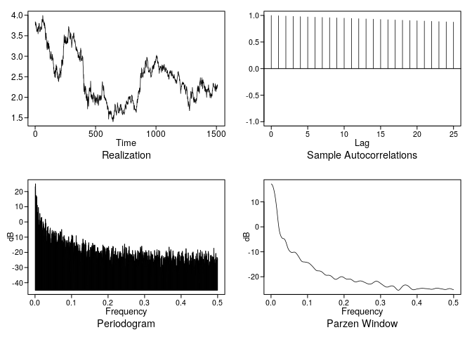
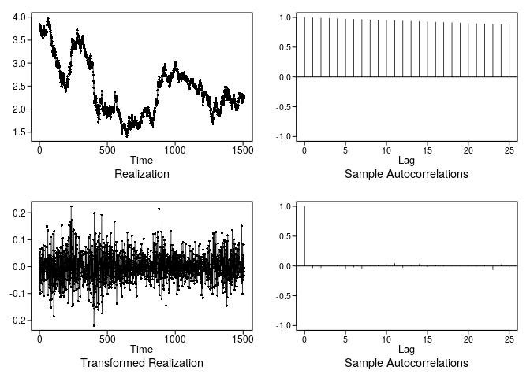

Untitled
================
Stuart Miller
March 7, 2020

Plot the series and the ACF. Then discuss your thoughts on the
stationarity of the data.

``` r
vals <- plotts.sample.wge(data$Close)
```

<!-- -->

Difference the data using artrans.wge(). Looking at the plots, are the
differenced data consistent with white noise? Is the ACF of the
differenced data consistent with white noise?

The differenced data look like white noise, and the ACF has very small
autocorrelations that are mostly all inside the limit lines.

``` r
vals <- artrans.wge(data$Close, phi.tr = 1)
```

<!-- -->

Consider again the 10-year bond rate from the 2010–2015 data set (10
Year Bond Rate 2010-2015.csv).

Use aic5.wge (and the AIC) to estimate the p and q of an ARMA model fit
to the differenced data. Is p = 0, q = 0 in the top five?

``` r
aic5.wge(vals)
```

    ## ---------WORKING... PLEASE WAIT... 
    ## 
    ## 
    ## Five Smallest Values of  aic

    ##      p    q        aic
    ## 1    0    0  -5.853517
    ## 2    0    1  -5.853260
    ## 4    1    0  -5.853195
    ## 5    1    1  -5.853110
    ## 7    2    0  -5.852798

Now let’s model the bond data as a stationary model. Use aic5.wge() on
the original data (not differenced). What model does the AIC favor?

An AR(1) is favored by AIC.

``` r
aic5.wge(data$Close)
```

    ## ---------WORKING... PLEASE WAIT... 
    ## 
    ## 
    ## Five Smallest Values of  aic

    ##       p    q        aic
    ## 4     1    0  -5.855658
    ## 5     1    1  -5.855329
    ## 7     2    0  -5.855259
    ## 8     2    1  -5.854772
    ## 10    3    0  -5.854552

Use est.ar.wge and Burg estimates to fit an AR(6) and AR(8) to the
bond-adjusted close prices, and verify that there is evidence of a (1-B)
factor.

Notice that the overfit table shows a root close to the unit circle.

``` r
vals <- est.ar.wge(data$Close, p=6, type = 'burg')
```

    ## 
    ## Coefficients of Original polynomial:  
    ## 0.9665 0.0019 0.0270 0.0154 -0.0572 0.0426 
    ## 
    ## Factor                 Roots                Abs Recip    System Freq 
    ## 1-0.9965B              1.0035               0.9965       0.0000
    ## 1+0.3041B+0.3020B^2   -0.5035+-1.7487i      0.5495       0.2946
    ## 1+0.5472B             -1.8273               0.5472       0.5000
    ## 1-0.8213B+0.2589B^2    1.5863+-1.1605i      0.5088       0.1005
    ##   
    ## 

Using Zero\_One\_Or\_TwoRootsOfOne.csv, determine if there are zero,
one, or two factors with roots of 1. Use the ACF and overfitting with
factor tables.
