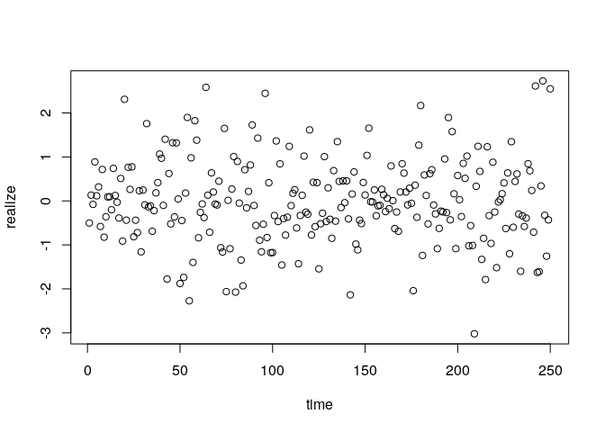
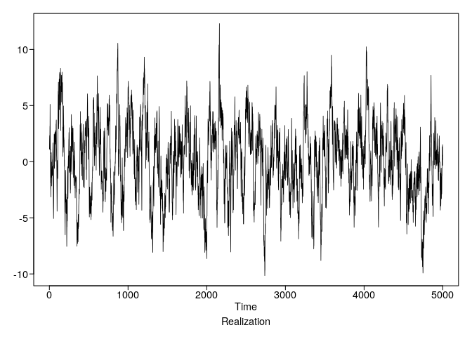
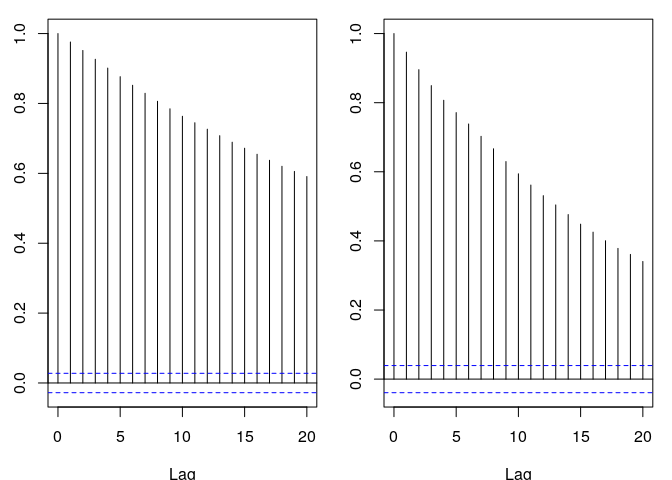
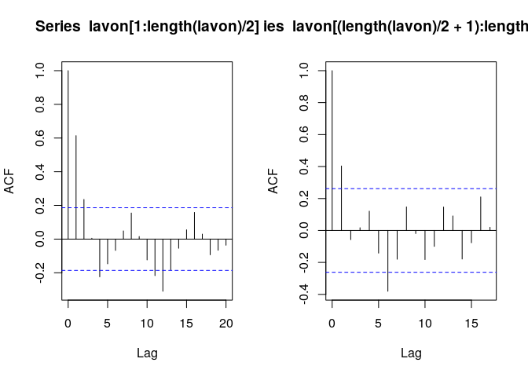
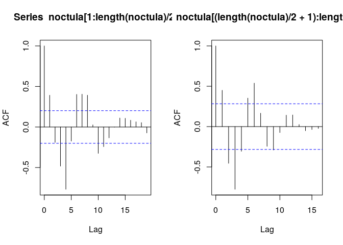
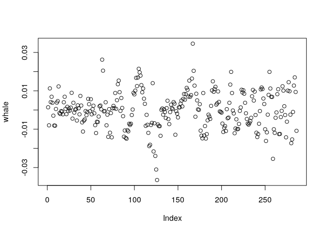
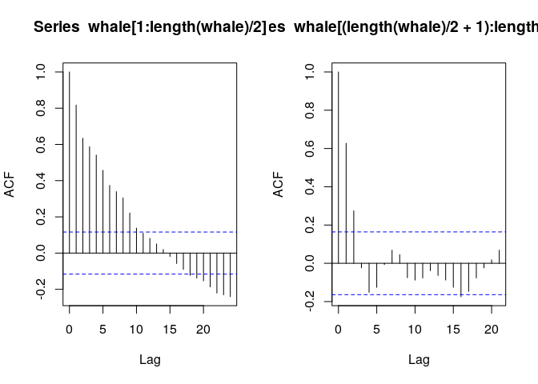
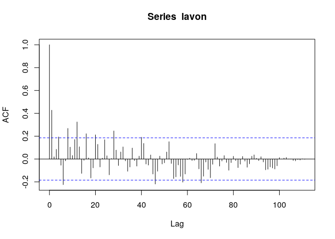

Stationarity
================
Stuart Miller
December 31, 2019

# Stationarity

This file shows how to assess stationarity visually with R.

## Conditions

Statationarity requires that three conditions are met

1.  The mean is constant
2.  The variance is constant
3.  The autocorrelation is constant

## Assessing Mean and Variance

The first two conditions can be assessed visually by ploting the signal.
The code below generates (realizes) an ARMA time series.

Based on the plot, there is insufficient evidence to suggest that the
mean or variance of the series change with time.

``` r
realize <- gen.arma.wge(n = 250, plot = F)
time <- seq_along(realize)
plot(time, realize)
```

<!-- -->

## Autocorrelation and ACF Plots

The following code generates a time series, plots the time series, and
calculates the lag(1) autocorrelation.

``` r
# Generate some data to work with
realize <- gen.arma.wge(n = 1000, plot = F)
time <- seq_along(realize)
plot(time, realize)
```

<!-- -->

``` r
# calculate autocorrelation of lag 1
acf(realize, plot = F, lag.max = 1)
```

    ## 
    ## Autocorrelations of series 'realize', by lag
    ## 
    ##     0     1 
    ## 1.000 0.005

The data set can be split into subpopulations to visually determine if
the autocorrelation is constant. This is demonstrated with the code
below. A ARMA time series is generated. The time series is split in half
and the ACF is plotted for each half.

``` r
realize <- gen.arma.wge(5000, 0.95, 0, sn = 784)
```

<!-- -->

``` r
# plot acf for first and second half of data
par(mfrow=c(1,2))
acf(realize[1:length(realize)/2], lag.max = 20)
acf(realize[(length(realize)/2+1):length(realize)], lag.max = 20)
```

<!-- -->

### Knowledge Check Question

Which data set provides the most evidence against the stationary
autocovariance condition (condition 3)?

  - noctula
  - lavon

**Answer**: Based on the ACF plots of noctula and lavon below, noctula
appears to exhibit stronger evidence against constant autocovariance.

``` r
# load the data
data("lavon")

# plot acf for first and second half of data
par(mfrow=c(1,2))
acf(lavon[1:length(lavon)/2])
acf(lavon[(length(lavon)/2+1):length(lavon)])
```

<!-- -->

``` r
# load the data
data("noctula")

# plot acf for first and second half of data
par(mfrow=c(1,2))
acf(noctula[1:length(noctula)/2])
acf(noctula[(length(noctula)/2+1):length(noctula)])
```

<!-- -->

### Knowledge Check Question

Does the whale dataset appear to be a stationary time series?

**Answer**: Based on the plots below, the assumption of constant
variance and constant autocorrelation appear to be violated.

``` r
data("whale")

# plot the time series
plot(whale)
```

<!-- -->

``` r
# plot acf for first and second half of data
par(mfrow=c(1,2))
acf(whale[1:length(whale)/2])
acf(whale[(length(whale)/2+1):length(whale)])
```

<!-- -->

## Estimation

The following sections show implementations of the [estimation
formulas](../notes/stationarity.ipynb).

### Variance

``` r
# this could be written betterz

N <- length(lavon)
gamma_0 <- var(lavon) * (N-1) / N
aut <- acf(lavon, lag.max = N-1)
```

<!-- -->

``` r
sum = 0
for (k in 1:(N-1)) {
  sum = sum + (1 - k/N) * aut$acf[k+1] * gamma_0
}

v_hat <- 2* sum/N + gamma_0 /N
```
