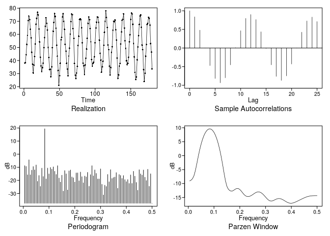
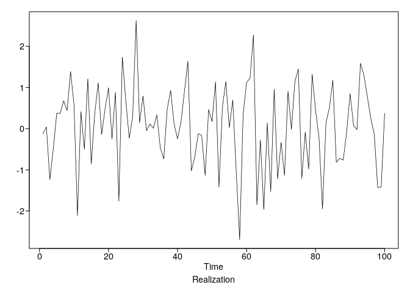
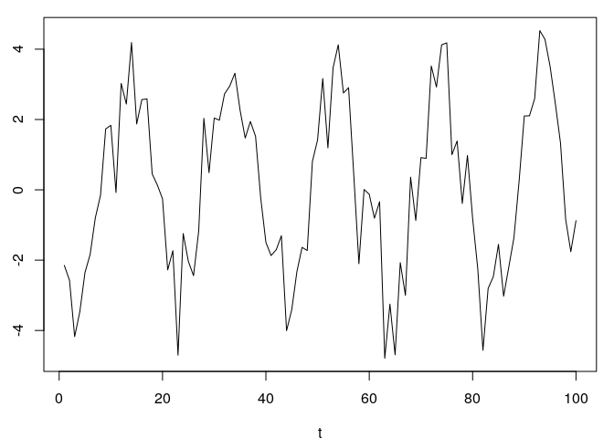
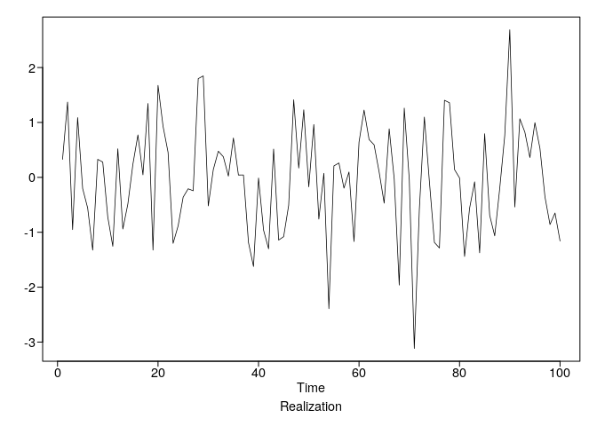
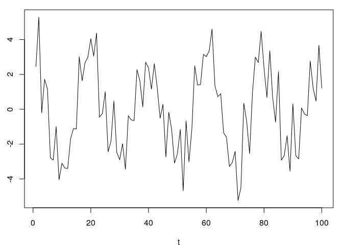

Using tswge
================
Stuart Miller

# tswge

[tswge](https://cran.r-project.org/web/packages/tswge/index.html) is a R
package for time series analysis.

``` r
# load library
library(tswge)

# load some included datasets for work
data(wtcrude) # west texas crude oil prices
data(patemp) # Pennsylvania monthly temperature data
```

## Plotting

### Creating Diagnostic Plots

#### `plotts.sample.wge`

For a quick set of diagonstic plot use `plotts.sample.wge`. This will
plot the realization, the sample autocorrelations, periodogram, and
Parzen window.

``` r
plotts.sample.wge(patemp)
```

<!-- -->

    ## $autplt
    ##  [1]  1.0000000000  0.8386381052  0.4803421817 -0.0010081916 -0.4717907055
    ##  [6] -0.8176935421 -0.9340050360 -0.7999823229 -0.4527311287  0.0089564844
    ## [11]  0.4659219410  0.7959391935  0.9002977221  0.7656850843  0.4360703243
    ## [16] -0.0098189556 -0.4511591540 -0.7618069185 -0.8701222437 -0.7482146632
    ## [21] -0.4297051103  0.0008229813  0.4253734168  0.7280472951  0.8317412380
    ## [26]  0.7119144914
    ## 
    ## $freq
    ##  [1] 0.005555556 0.011111111 0.016666667 0.022222222 0.027777778
    ##  [6] 0.033333333 0.038888889 0.044444444 0.050000000 0.055555556
    ## [11] 0.061111111 0.066666667 0.072222222 0.077777778 0.083333333
    ## [16] 0.088888889 0.094444444 0.100000000 0.105555556 0.111111111
    ## [21] 0.116666667 0.122222222 0.127777778 0.133333333 0.138888889
    ## [26] 0.144444444 0.150000000 0.155555556 0.161111111 0.166666667
    ## [31] 0.172222222 0.177777778 0.183333333 0.188888889 0.194444444
    ## [36] 0.200000000 0.205555556 0.211111111 0.216666667 0.222222222
    ## [41] 0.227777778 0.233333333 0.238888889 0.244444444 0.250000000
    ## [46] 0.255555556 0.261111111 0.266666667 0.272222222 0.277777778
    ## [51] 0.283333333 0.288888889 0.294444444 0.300000000 0.305555556
    ## [56] 0.311111111 0.316666667 0.322222222 0.327777778 0.333333333
    ## [61] 0.338888889 0.344444444 0.350000000 0.355555556 0.361111111
    ## [66] 0.366666667 0.372222222 0.377777778 0.383333333 0.388888889
    ## [71] 0.394444444 0.400000000 0.405555556 0.411111111 0.416666667
    ## [76] 0.422222222 0.427777778 0.433333333 0.438888889 0.444444444
    ## [81] 0.450000000 0.455555556 0.461111111 0.466666667 0.472222222
    ## [86] 0.477777778 0.483333333 0.488888889 0.494444444 0.500000000
    ## 
    ## $db
    ##  [1]  -8.771088  -9.360721 -15.737798  -4.313122 -15.743661 -12.208996
    ##  [7]  -9.428949 -11.968248  -8.239294 -20.720590 -16.271042 -24.596701
    ## [13] -10.683798 -17.053219  19.370989 -18.932365 -10.614868 -15.091067
    ## [19] -10.156834 -11.480831  -9.680582 -13.060651 -15.499787  -8.778419
    ## [25] -18.242187 -21.294686 -16.068197 -28.197994 -12.526897 -15.017696
    ## [31] -27.314825 -12.775833 -12.091626 -17.397303 -18.024097 -21.291777
    ## [37] -14.326317 -14.271900 -20.370206 -13.669982 -17.195521 -21.862748
    ## [43] -16.728130 -17.341597 -13.898914 -24.516083 -15.624845  -8.786330
    ## [49] -16.560375 -12.010207 -14.681674 -18.916961 -18.939517 -11.225404
    ## [55] -23.024727 -31.110785 -23.696819 -24.669930 -15.468664 -21.121657
    ## [61] -11.827490 -18.590177 -17.849549 -17.487407 -14.074204 -26.044079
    ## [67] -15.560006 -16.238814 -18.521560 -16.321596 -19.433220 -20.984045
    ## [73] -19.408283 -22.352876 -15.812703 -22.318467 -13.088358 -16.828632
    ## [79] -21.554603 -27.546740 -11.872237 -15.028974 -15.998016 -12.067287
    ## [85] -17.620445 -20.127600 -11.533721 -24.526866 -14.993360 -37.462392
    ## 
    ## $dbz
    ##  [1]  -9.0635551  -8.7758339  -8.2478675  -7.1942384  -5.3394096
    ##  [6]  -2.8823656  -0.2994674   2.0866138   4.1504327   5.8649465
    ## [11]   7.2380115   8.2860937   9.0248968   9.4663558   9.6178361
    ## [16]   9.4819963   9.0567536   8.3351594   7.3051630   5.9494181
    ## [21]   4.2456923   2.1696059  -0.2950985  -3.1239353  -6.1636626
    ## [26]  -8.9851089 -10.9775927 -12.0114597 -12.5044080 -12.7146594
    ## [31] -12.6426496 -12.3321682 -11.9698923 -11.7548308 -11.7991427
    ## [36] -12.1219488 -12.6680603 -13.3227770 -13.9378706 -14.3864929
    ## [41] -14.6181580 -14.6548624 -14.5387365 -14.3010169 -13.9740804
    ## [46] -13.6107407 -13.2808100 -13.0511725 -12.9693040 -13.0578680
    ## [51] -13.3165064 -13.7254520 -14.2480344 -14.8311694 -15.4049124
    ## [56] -15.8860495 -16.1947397 -16.2866352 -16.1801305 -15.9499454
    ## [61] -15.6907757 -15.4826657 -15.3760004 -15.3915982 -15.5263162
    ## [66] -15.7590151 -16.0557111 -16.3743360 -16.6698487 -16.9003877
    ## [71] -17.0346024 -17.0585852 -16.9787680 -16.8178056 -16.6048321
    ## [76] -16.3653849 -16.1158248 -15.8636206 -15.6117067 -15.3636386
    ## [81] -15.1265440 -14.9106152 -14.7260933 -14.5798649 -14.4734506
    ## [86] -14.4030283 -14.3611201 -14.3390407 -14.3291670 -14.3264567

## Generating Data

### Simulate Sinusoids with Noise

The function *`gen.sigplusnoise.wge`* generates simulated data based on
sinusoids with noise. It can be used to generate a one- or two-component
sinusoid.

Generate a realization from the model
`x(t)=coef[1]*cos(2*pi*freq[1]*t+psi[1])+coef[2]*cos(2*pi*freq[2]*t+psi[2])+a(t)`

**Examples**

1.  **One component sinusoid**

The following code can be used to simulate 100 data points from the
following
equation:

`x(t)=3*cos(2*pi*0.05*t+2)+a(t)`

``` r
X_t = gen.sigplusnoise.wge(n = 100, coef = c(3,0), freq = c(0.05, 0), psi = c(2, 0))
```

<!-- --><!-- -->

2.  **Two component sinusoid**

The following code can be used to simulate 100 data points from the
following
equation:

`x(t)=3*cos(2*pi*0.05*t+0)+1.5*cos(2*pi*0.35*t+2)+a(t)`

``` r
X_t = gen.sigplusnoise.wge(n = 100, coef = c(3, 1.5), freq = c(0.05, 0.35), psi = c(0, 2))
```

<!-- --><!-- -->
