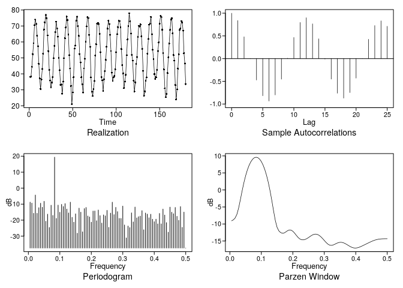
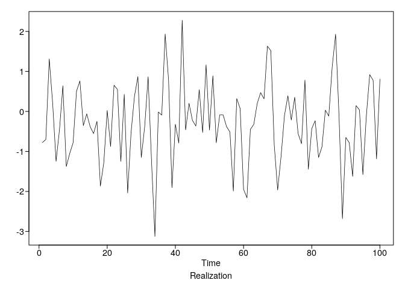
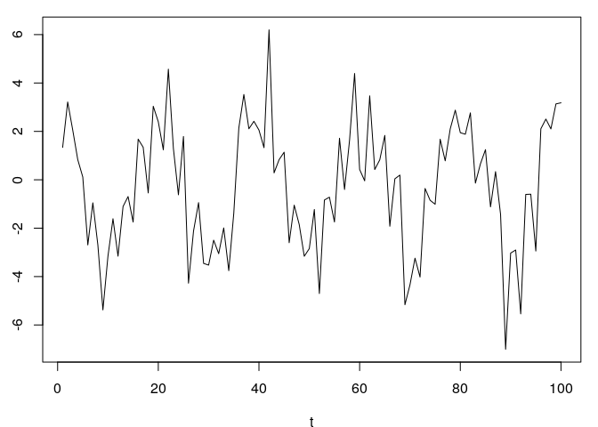
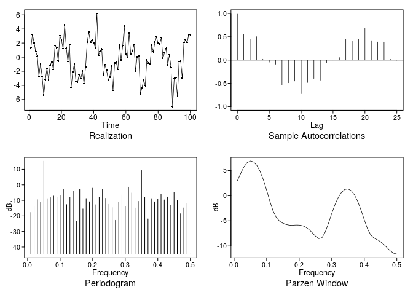

homework\_1
================
Stuart Miller
January 5, 2020

# Homework 1

## Problem 1.1

For series given in text book calculate, gamma\_0, gamma\_1, rho\_0, and
rho\_1.

\[
\bar{x} = 71.25
\]

\[
\gamma_0 = \frac{1}{N} \sum^N_{t = 1} ( x_t - \bar{x} )^2 = \frac{279.5}{8} = 34.94
\]

\[
\gamma_1 = \frac{1}{N} \sum^{N-1}_{t = 1} ( x_t - \bar{x} )( x_{t+1} - \bar{x} ) = \frac{117.94}{8} = 14.74
\]

\[
\rho_0 = \frac{\gamma_0}{\gamma_0} = 1
\]

\[
\rho_0 = \frac{\gamma_1}{\gamma_0} = \frac{14.74}{34.94} = 0.422
\]

## Problem 1.2

Load the west Texas crude oil dataset and the Pennsylvania monthly
temperatures dataset from tswge. Plot the asmple autocorrelations,
periodograms, and a Parzen window-based spectrial density estimate.
Describe the behavior of the time series.

### West Texas Crude

The line plot of the realization shows that the data exhibits a
non-cyclic behavior. The autocorrelation plot shows that there is a
strong correlation between samples that are nearby (gamma \> 0.5 for k
\<= 13). The Parzen window and Periodogram show a peak at 0 with no
indication of cyclic behavior. There is no indication of the drop after
the peak of x\_t = 100.

``` r
# load the west texas data
data(wtcrude)
# make the plots
plotts.sample.wge(wtcrude)
```

<!-- -->

    ## $autplt
    ##  [1] 1.0000000 0.9680875 0.9160532 0.8459771 0.7724321 0.6999948 0.6419989
    ##  [8] 0.6012009 0.5720853 0.5558048 0.5455630 0.5386875 0.5239727 0.5077421
    ## [15] 0.4902317 0.4720104 0.4483721 0.4282124 0.4124267 0.4012710 0.3920747
    ## [22] 0.3857370 0.3761661 0.3629215 0.3418472 0.3204255
    ## 
    ## $freq
    ##  [1] 0.008474576 0.016949153 0.025423729 0.033898305 0.042372881
    ##  [6] 0.050847458 0.059322034 0.067796610 0.076271186 0.084745763
    ## [11] 0.093220339 0.101694915 0.110169492 0.118644068 0.127118644
    ## [16] 0.135593220 0.144067797 0.152542373 0.161016949 0.169491525
    ## [21] 0.177966102 0.186440678 0.194915254 0.203389831 0.211864407
    ## [26] 0.220338983 0.228813559 0.237288136 0.245762712 0.254237288
    ## [31] 0.262711864 0.271186441 0.279661017 0.288135593 0.296610169
    ## [36] 0.305084746 0.313559322 0.322033898 0.330508475 0.338983051
    ## [41] 0.347457627 0.355932203 0.364406780 0.372881356 0.381355932
    ## [46] 0.389830508 0.398305085 0.406779661 0.415254237 0.423728814
    ## [51] 0.432203390 0.440677966 0.449152542 0.457627119 0.466101695
    ## [56] 0.474576271 0.483050847 0.491525424 0.500000000
    ## 
    ## $db
    ##  [1]  15.8836922   5.8893485   4.7258557   3.8214785   1.4642490
    ##  [6]   2.0018715   1.6045258   0.9020399   1.5032278   2.2448431
    ## [11]  -1.7469156  -8.0591372  -9.7586717 -11.0839579 -11.3157758
    ## [16]  -8.9218139 -12.6463833 -11.3269115 -19.9617557 -16.0793744
    ## [21] -14.0745330 -10.8525198 -20.1265359 -12.8820102 -17.9476712
    ## [26] -18.2596929 -20.3598459 -14.9946031 -23.0872701 -19.0906270
    ## [31] -12.9016842 -10.9904647 -21.4757421 -14.3554878 -16.8686457
    ## [36] -21.2128051 -16.7994413 -17.1902498 -17.6943734 -15.6829043
    ## [41] -23.3397986 -19.1318435 -19.0358382 -23.5949904 -17.7081535
    ## [46] -25.1005021 -17.2286803 -18.8192620 -19.8276817 -26.3397426
    ## [51] -16.8401683 -14.4129384 -15.6843059 -17.2434860 -14.8511599
    ## [56] -13.9073624 -17.9584781 -25.6236551 -29.1808167
    ## 
    ## $dbz
    ##  [1]  10.5819754  10.0624863   9.2075283   8.0415104   6.6164330
    ##  [6]   5.0288774   3.4245625   1.9558889   0.6896967  -0.4402192
    ## [11]  -1.5650047  -2.7816592  -4.1123407  -5.5204077  -6.9556417
    ## [16]  -8.3968913  -9.8513687 -11.3012735 -12.6484630 -13.7413003
    ## [21] -14.5081742 -15.0365109 -15.4674900 -15.8658785 -16.2080980
    ## [26] -16.4502708 -16.5850733 -16.6378358 -16.6356417 -16.6035602
    ## [31] -16.5841746 -16.6412529 -16.8349603 -17.1896987 -17.6753919
    ## [36] -18.2126800 -18.7092522 -19.1138894 -19.4399472 -19.7314363
    ## [41] -20.0124827 -20.2690812 -20.4664871 -20.5744360 -20.5749223
    ## [46] -20.4554742 -20.2102717 -19.8545040 -19.4317949 -19.0016222
    ## [51] -18.6194933 -18.3266638 -18.1507205 -18.1082621 -18.2020451
    ## [56] -18.4107730 -18.6766253 -18.9048807 -18.9958037

### Pennsylvania Month Temperature

The data exhibits cyclic behavior with a peak at about 0.08 on the
periodogram and Parzen window. We would expect to see a cyclic behavior
over the year (lambda = 1/12 = 0.0.83). The autocorrelations appear to
be slowly damped with a period of 12.

``` r
# load the west penn temperature data
data(patemp)
# make the plots
plotts.sample.wge(patemp)
```

<!-- -->

    ## $autplt
    ##  [1]  1.0000000000  0.8386381052  0.4803421817 -0.0010081916 -0.4717907055
    ##  [6] -0.8176935421 -0.9340050360 -0.7999823229 -0.4527311287  0.0089564844
    ## [11]  0.4659219410  0.7959391935  0.9002977221  0.7656850843  0.4360703243
    ## [16] -0.0098189556 -0.4511591540 -0.7618069185 -0.8701222437 -0.7482146632
    ## [21] -0.4297051103  0.0008229813  0.4253734168  0.7280472951  0.8317412380
    ## [26]  0.7119144914
    ## 
    ## $freq
    ##  [1] 0.005555556 0.011111111 0.016666667 0.022222222 0.027777778
    ##  [6] 0.033333333 0.038888889 0.044444444 0.050000000 0.055555556
    ## [11] 0.061111111 0.066666667 0.072222222 0.077777778 0.083333333
    ## [16] 0.088888889 0.094444444 0.100000000 0.105555556 0.111111111
    ## [21] 0.116666667 0.122222222 0.127777778 0.133333333 0.138888889
    ## [26] 0.144444444 0.150000000 0.155555556 0.161111111 0.166666667
    ## [31] 0.172222222 0.177777778 0.183333333 0.188888889 0.194444444
    ## [36] 0.200000000 0.205555556 0.211111111 0.216666667 0.222222222
    ## [41] 0.227777778 0.233333333 0.238888889 0.244444444 0.250000000
    ## [46] 0.255555556 0.261111111 0.266666667 0.272222222 0.277777778
    ## [51] 0.283333333 0.288888889 0.294444444 0.300000000 0.305555556
    ## [56] 0.311111111 0.316666667 0.322222222 0.327777778 0.333333333
    ## [61] 0.338888889 0.344444444 0.350000000 0.355555556 0.361111111
    ## [66] 0.366666667 0.372222222 0.377777778 0.383333333 0.388888889
    ## [71] 0.394444444 0.400000000 0.405555556 0.411111111 0.416666667
    ## [76] 0.422222222 0.427777778 0.433333333 0.438888889 0.444444444
    ## [81] 0.450000000 0.455555556 0.461111111 0.466666667 0.472222222
    ## [86] 0.477777778 0.483333333 0.488888889 0.494444444 0.500000000
    ## 
    ## $db
    ##  [1]  -8.771088  -9.360721 -15.737798  -4.313122 -15.743661 -12.208996
    ##  [7]  -9.428949 -11.968248  -8.239294 -20.720590 -16.271042 -24.596701
    ## [13] -10.683798 -17.053219  19.370989 -18.932365 -10.614868 -15.091067
    ## [19] -10.156834 -11.480831  -9.680582 -13.060651 -15.499787  -8.778419
    ## [25] -18.242187 -21.294686 -16.068197 -28.197994 -12.526897 -15.017696
    ## [31] -27.314825 -12.775833 -12.091626 -17.397303 -18.024097 -21.291777
    ## [37] -14.326317 -14.271900 -20.370206 -13.669982 -17.195521 -21.862748
    ## [43] -16.728130 -17.341597 -13.898914 -24.516083 -15.624845  -8.786330
    ## [49] -16.560375 -12.010207 -14.681674 -18.916961 -18.939517 -11.225404
    ## [55] -23.024727 -31.110785 -23.696819 -24.669930 -15.468664 -21.121657
    ## [61] -11.827490 -18.590177 -17.849549 -17.487407 -14.074204 -26.044079
    ## [67] -15.560006 -16.238814 -18.521560 -16.321596 -19.433220 -20.984045
    ## [73] -19.408283 -22.352876 -15.812703 -22.318467 -13.088358 -16.828632
    ## [79] -21.554603 -27.546740 -11.872237 -15.028974 -15.998016 -12.067287
    ## [85] -17.620445 -20.127600 -11.533721 -24.526866 -14.993360 -37.462392
    ## 
    ## $dbz
    ##  [1]  -9.0635551  -8.7758339  -8.2478675  -7.1942384  -5.3394096
    ##  [6]  -2.8823656  -0.2994674   2.0866138   4.1504327   5.8649465
    ## [11]   7.2380115   8.2860937   9.0248968   9.4663558   9.6178361
    ## [16]   9.4819963   9.0567536   8.3351594   7.3051630   5.9494181
    ## [21]   4.2456923   2.1696059  -0.2950985  -3.1239353  -6.1636626
    ## [26]  -8.9851089 -10.9775927 -12.0114597 -12.5044080 -12.7146594
    ## [31] -12.6426496 -12.3321682 -11.9698923 -11.7548308 -11.7991427
    ## [36] -12.1219488 -12.6680603 -13.3227770 -13.9378706 -14.3864929
    ## [41] -14.6181580 -14.6548624 -14.5387365 -14.3010169 -13.9740804
    ## [46] -13.6107407 -13.2808100 -13.0511725 -12.9693040 -13.0578680
    ## [51] -13.3165064 -13.7254520 -14.2480344 -14.8311694 -15.4049124
    ## [56] -15.8860495 -16.1947397 -16.2866352 -16.1801305 -15.9499454
    ## [61] -15.6907757 -15.4826657 -15.3760004 -15.3915982 -15.5263162
    ## [66] -15.7590151 -16.0557111 -16.3743360 -16.6698487 -16.9003877
    ## [71] -17.0346024 -17.0585852 -16.9787680 -16.8178056 -16.6048321
    ## [76] -16.3653849 -16.1158248 -15.8636206 -15.6117067 -15.3636386
    ## [81] -15.1265440 -14.9106152 -14.7260933 -14.5798649 -14.4734506
    ## [86] -14.4030283 -14.3611201 -14.3390407 -14.3291670 -14.3264567

## Problem 1.4

Realization 1 \* autocorrelation: the time series exhibits wandering
behavior, which corresponds to strong positive autocorrelations starting
from 0 (d). \* spectral density: the time series exhibits wandering
behavior, which corresponds a peak at 0 and exponentially approaching 0
as the frequency increases (a).

Realization 2 \* autocorrelation: the time series appears to have little
structure, which corresponds to a no autocorrelations (a) \* spectral
density: the time series appears to have little structure, which
corresponds to a flat spectrum line (d)

Realization 3 \* autocorrelation: the time series exhibits cyclic
behavior with a period of about 10, which matches the periodic
autocorrelations in (b). \* spectral density: the time series exhibits
cyclic behavior with a period of about 10, which matches the spectral
density with a peak near 0.1 (c)

Realization 4 \* autocorrelation: the time series exhibits cyclic
behavior with more than one frequency, matching autocorrelation plot
(c), which shows osciallations in the main periodic correlations \*
spectral density: the time series exhibits cyclic behavior with more
than one frequency, matching the spectral density plot (b), which has
two peaks

## Problem 1.6

Generate a realization of the following equation of length 100. Discuss
the plots that show the periodic behavior.

\[
X_t = 3cos(2\pi(0.05)t) + 1.5cos(2\pi(0.35)t) + 2) + N(0,1)
\]

The sample autocorrelation plot shows the dominant frequency well with
the period of 20 visible (0.05). The Parzen window and the periodogram
both suggest a frequeny at 0.05 and
0.35.

``` r
X_t = gen.sigplusnoise.wge(n = 100, coef = c(3, 1.5), freq = c(0.05, 0.35), psi = c(0, 2))
```

<!-- --><!-- -->

``` r
plotts.sample.wge(X_t)
```

<!-- -->

    ## $autplt
    ##  [1]  1.0000000000  0.5492585727  0.4421797049  0.5031621448  0.0182671017
    ##  [6] -0.0457976609 -0.0898661324 -0.5358613270 -0.4893148497 -0.4509770657
    ## [11] -0.7239061246 -0.4834650902 -0.3956801942 -0.4333360317 -0.0538739766
    ## [16] -0.0001270973  0.0535353695  0.4422501307  0.4012031922  0.4425694411
    ## [21]  0.6790496238  0.4167455049  0.3892415520  0.3880860383  0.0155606124
    ## [26] -0.0037829455
    ## 
    ## $freq
    ##  [1] 0.01 0.02 0.03 0.04 0.05 0.06 0.07 0.08 0.09 0.10 0.11 0.12 0.13 0.14
    ## [15] 0.15 0.16 0.17 0.18 0.19 0.20 0.21 0.22 0.23 0.24 0.25 0.26 0.27 0.28
    ## [29] 0.29 0.30 0.31 0.32 0.33 0.34 0.35 0.36 0.37 0.38 0.39 0.40 0.41 0.42
    ## [43] 0.43 0.44 0.45 0.46 0.47 0.48 0.49 0.50
    ## 
    ## $db
    ##  [1] -17.705637 -13.558772  -9.468562 -11.243023  15.309565  -8.782492
    ##  [7]  -8.181571  -7.163985  -7.721421  -6.954998  -2.890827 -12.663631
    ## [13]  -7.986549  -4.046350 -23.449796  -2.967119 -15.462069  -8.763814
    ## [19] -10.865558  -2.127154 -12.726509  -8.001878  -2.765133  -8.601403
    ## [25] -12.430273 -14.509344 -22.801436 -11.040660  -6.320328 -13.806192
    ## [31]  -1.440288  -5.150858 -14.787239 -10.559914   9.221117  -7.993788
    ## [37] -21.884564  -8.836222 -10.906903  -8.994526  -6.030729  -9.657512
    ## [43]  -7.786285 -13.070932  -4.745478 -10.091451 -18.541992 -14.775711
    ## [49] -11.656331 -44.519091
    ## 
    ## $dbz
    ##  [1]   2.9505419   4.3885151   5.7001174   6.5557047   6.8893330
    ##  [6]   6.7021968   6.0044844   4.8075589   3.1388606   1.0844621
    ## [11]  -1.1289057  -3.0803785  -4.3839370  -5.0830691  -5.4797933
    ## [16]  -5.7366456  -5.8640674  -5.8739919  -5.8382708  -5.8470333
    ## [21]  -5.9696297  -6.2520645  -6.7198218  -7.3581699  -8.0588614
    ## [26]  -8.5400870  -8.3572153  -7.2505433  -5.4858145  -3.5502266
    ## [31]  -1.7839707  -0.3551705   0.6617625   1.2337629   1.3444061
    ## [36]   0.9838518   0.1478441  -1.1524946  -2.8595382  -4.7990795
    ## [41]  -6.5998332  -7.8258044  -8.4246631  -8.7592408  -9.1486252
    ## [46]  -9.6914728 -10.3380844 -10.9680168 -11.4346209 -11.6081934
