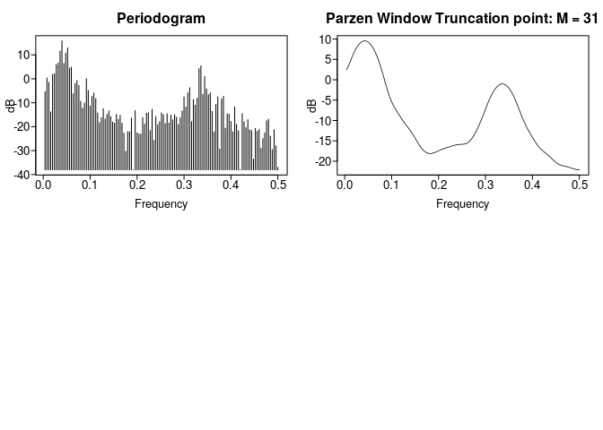
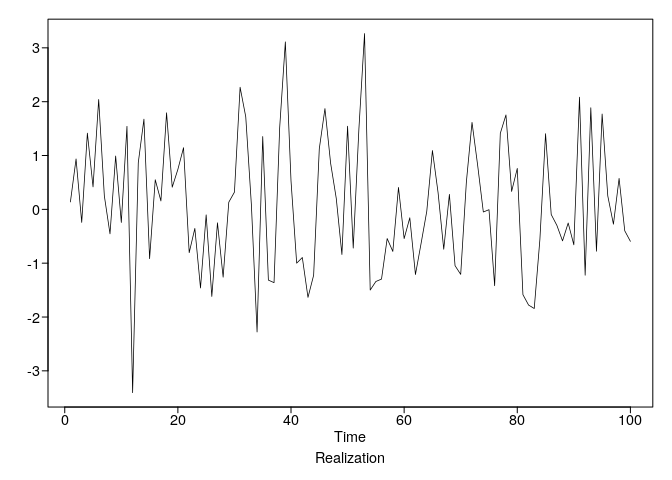
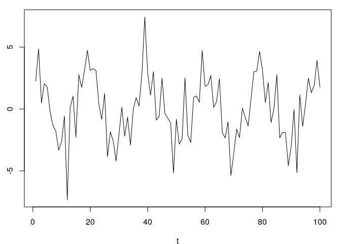
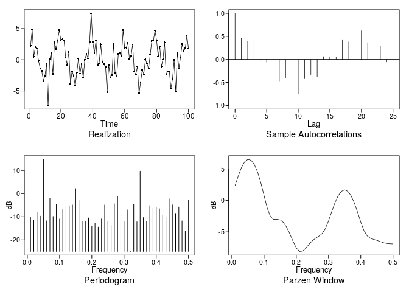

homework\_2
================
Stuart Miller
January 10, 2020

# Homework 2

## Problem 1.5

``` r
dbplot = FALSE
data("fig1.21a")
plotts.parzen.wge(fig1.21a)
```

    ## $freq
    ##   [1] 0.004 0.008 0.012 0.016 0.020 0.024 0.028 0.032 0.036 0.040 0.044
    ##  [12] 0.048 0.052 0.056 0.060 0.064 0.068 0.072 0.076 0.080 0.084 0.088
    ##  [23] 0.092 0.096 0.100 0.104 0.108 0.112 0.116 0.120 0.124 0.128 0.132
    ##  [34] 0.136 0.140 0.144 0.148 0.152 0.156 0.160 0.164 0.168 0.172 0.176
    ##  [45] 0.180 0.184 0.188 0.192 0.196 0.200 0.204 0.208 0.212 0.216 0.220
    ##  [56] 0.224 0.228 0.232 0.236 0.240 0.244 0.248 0.252 0.256 0.260 0.264
    ##  [67] 0.268 0.272 0.276 0.280 0.284 0.288 0.292 0.296 0.300 0.304 0.308
    ##  [78] 0.312 0.316 0.320 0.324 0.328 0.332 0.336 0.340 0.344 0.348 0.352
    ##  [89] 0.356 0.360 0.364 0.368 0.372 0.376 0.380 0.384 0.388 0.392 0.396
    ## [100] 0.400 0.404 0.408 0.412 0.416 0.420 0.424 0.428 0.432 0.436 0.440
    ## [111] 0.444 0.448 0.452 0.456 0.460 0.464 0.468 0.472 0.476 0.480 0.484
    ## [122] 0.488 0.492 0.496 0.500
    ## 
    ## $db
    ##   [1]  -5.362312707   0.366344961  -1.445886425 -13.809003067   1.755220457
    ##   [6]   2.136580888   5.936583112   6.662282082  11.633264536  15.864548847
    ##  [11]   6.412292167  10.721737397  12.925575058   4.506746570   4.871962095
    ##  [16]  -6.250836639  -1.950216175  -0.696705587  -2.804391698  -9.424665488
    ##  [21] -12.290523789 -10.215409905   0.007140881  -4.862115410 -11.332925724
    ##  [26]  -7.329364970  -5.908992276  -8.317573572 -14.238661544 -18.286172715
    ##  [31] -16.217916136 -12.477398194 -16.758288217 -14.838345694 -13.449731786
    ##  [36] -15.782901152 -18.072932375 -18.540945864 -14.875312445 -17.028468289
    ##  [41] -15.228060322 -18.557564803 -22.745958312 -30.301757348 -22.076541889
    ##  [46] -22.140287349 -16.389109856 -38.058461974 -13.253167879 -22.582597618
    ##  [51] -23.084919320 -23.069973979 -16.136714989 -18.935207786 -14.296452908
    ##  [56] -14.212188935 -21.577190665 -12.729012394 -25.772327749 -15.803365923
    ##  [61] -19.194102290 -17.900661731 -14.286589327 -14.951488394 -18.705308996
    ##  [66] -14.567921028 -18.397006217 -15.243238171 -17.117926722 -14.973674888
    ##  [71] -16.023098198 -19.125032348 -16.262081660 -13.449776335  -7.579424886
    ##  [76] -11.805920794  -5.895635890  -3.709221039 -17.897968262  -8.659598300
    ##  [81] -10.997039955  -8.101915888   4.254491199   5.393082003  -6.448033009
    ##  [86]   0.965411687  -4.226333744  -6.643925007  -5.811660689 -13.640826479
    ##  [91] -22.193602483 -10.675283870  -7.542870043 -29.376537632  -8.376263090
    ##  [96]  -7.321382742 -20.639950914 -14.585415495 -14.840057936 -17.813610711
    ## [101] -22.140984549 -11.765936789 -18.985384999 -21.747733179 -38.007500586
    ## [106] -14.506798616 -18.002933123 -20.418280098 -17.084519747 -21.311114539
    ## [111] -21.620138444 -33.556026703 -20.750195444 -21.930100114 -21.130826243
    ## [116] -29.022558217 -24.985482468 -22.582047856 -17.533565589 -16.871552927
    ## [121] -24.006657999 -29.547956056 -21.326562732 -27.991855314 -36.997336287
    ## 
    ## $dbz
    ##   [1]   2.5317768   3.4146229   4.5418152   5.6884356   6.7368601
    ##   [6]   7.6364732   8.3681506   8.9257365   9.3078646   9.5145799
    ##  [11]   9.5459980   9.4018104   9.0811641   8.5827581   7.9051540
    ##  [16]   7.0474064   6.0102369   4.7981374   3.4229798   1.9097481
    ##  [21]   0.3042602  -1.3202200  -2.8666529  -4.2403146  -5.3923875
    ##  [26]  -6.3442276  -7.1638507  -7.9191673  -8.6483811  -9.3579331
    ##  [31] -10.0374865 -10.6793036 -11.2913106 -11.8975298 -12.5278666
    ##  [36] -13.2049836 -13.9346241 -14.7015386 -15.4712074 -16.1975396
    ##  [41] -16.8353243 -17.3523463 -17.7342889 -17.9808581 -18.0993148
    ##  [46] -18.1021087 -18.0085820 -17.8456639 -17.6441997 -17.4324350
    ##  [51] -17.2303807 -17.0473945 -16.8831485 -16.7310556 -16.5829651
    ##  [56] -16.4337953 -16.2846543 -16.1433021 -16.0216655 -15.9310664
    ##  [61] -15.8762783 -15.8495409 -15.8259809 -15.7631015 -15.6081113
    ##  [66] -15.3142608 -14.8587425 -14.2482664 -13.5070008 -12.6580717
    ##  [71] -11.7137283 -10.6791826  -9.5642035  -8.3922825  -7.2008333
    ##  [76]  -6.0338538  -4.9332347  -3.9333244  -3.0594519  -2.3289382
    ##  [81]  -1.7530065  -1.3386556  -1.0901291  -1.0099166  -1.0993240
    ##  [86]  -1.3586543  -1.7869965  -2.3815603  -3.1364288  -4.0405713
    ##  [91]  -5.0750511  -6.2098010  -7.4014214  -8.5951105  -9.7344059
    ##  [96] -10.7783016 -11.7163266 -12.5686441 -13.3692514 -14.1441557
    ## [101] -14.8972193 -15.6089489 -16.2481456 -16.7917916 -17.2419801
    ## [106] -17.6278191 -17.9916044 -18.3703840 -18.7832394 -19.2269116
    ## [111] -19.6782813 -20.1024656 -20.4653700 -20.7468778 -20.9481644
    ## [116] -21.0890412 -21.1980392 -21.3018355 -21.4184502 -21.5546109
    ## [121] -21.7058137 -21.8579758 -21.9905897 -22.0816957 -22.1142219
    ## 
    ## $dbz1
    ##   [1]   2.5317768   3.4146229   4.5418152   5.6884356   6.7368601
    ##   [6]   7.6364732   8.3681506   8.9257365   9.3078646   9.5145799
    ##  [11]   9.5459980   9.4018104   9.0811641   8.5827581   7.9051540
    ##  [16]   7.0474064   6.0102369   4.7981374   3.4229798   1.9097481
    ##  [21]   0.3042602  -1.3202200  -2.8666529  -4.2403146  -5.3923875
    ##  [26]  -6.3442276  -7.1638507  -7.9191673  -8.6483811  -9.3579331
    ##  [31] -10.0374865 -10.6793036 -11.2913106 -11.8975298 -12.5278666
    ##  [36] -13.2049836 -13.9346241 -14.7015386 -15.4712074 -16.1975396
    ##  [41] -16.8353243 -17.3523463 -17.7342889 -17.9808581 -18.0993148
    ##  [46] -18.1021087 -18.0085820 -17.8456639 -17.6441997 -17.4324350
    ##  [51] -17.2303807 -17.0473945 -16.8831485 -16.7310556 -16.5829651
    ##  [56] -16.4337953 -16.2846543 -16.1433021 -16.0216655 -15.9310664
    ##  [61] -15.8762783 -15.8495409 -15.8259809 -15.7631015 -15.6081113
    ##  [66] -15.3142608 -14.8587425 -14.2482664 -13.5070008 -12.6580717
    ##  [71] -11.7137283 -10.6791826  -9.5642035  -8.3922825  -7.2008333
    ##  [76]  -6.0338538  -4.9332347  -3.9333244  -3.0594519  -2.3289382
    ##  [81]  -1.7530065  -1.3386556  -1.0901291  -1.0099166  -1.0993240
    ##  [86]  -1.3586543  -1.7869965  -2.3815603  -3.1364288  -4.0405713
    ##  [91]  -5.0750511  -6.2098010  -7.4014214  -8.5951105  -9.7344059
    ##  [96] -10.7783016 -11.7163266 -12.5686441 -13.3692514 -14.1441557
    ## [101] -14.8972193 -15.6089489 -16.2481456 -16.7917916 -17.2419801
    ## [106] -17.6278191 -17.9916044 -18.3703840 -18.7832394 -19.2269116
    ## [111] -19.6782813 -20.1024656 -20.4653700 -20.7468778 -20.9481644
    ## [116] -21.0890412 -21.1980392 -21.3018355 -21.4184502 -21.5546109
    ## [121] -21.7058137 -21.8579758 -21.9905897 -22.0816957 -22.1142219
    ## 
    ## $dbz2
    ##   [1]   2.5317768   3.4146229   4.5418152   5.6884356   6.7368601
    ##   [6]   7.6364732   8.3681506   8.9257365   9.3078646   9.5145799
    ##  [11]   9.5459980   9.4018104   9.0811641   8.5827581   7.9051540
    ##  [16]   7.0474064   6.0102369   4.7981374   3.4229798   1.9097481
    ##  [21]   0.3042602  -1.3202200  -2.8666529  -4.2403146  -5.3923875
    ##  [26]  -6.3442276  -7.1638507  -7.9191673  -8.6483811  -9.3579331
    ##  [31] -10.0374865 -10.6793036 -11.2913106 -11.8975298 -12.5278666
    ##  [36] -13.2049836 -13.9346241 -14.7015386 -15.4712074 -16.1975396
    ##  [41] -16.8353243 -17.3523463 -17.7342889 -17.9808581 -18.0993148
    ##  [46] -18.1021087 -18.0085820 -17.8456639 -17.6441997 -17.4324350
    ##  [51] -17.2303807 -17.0473945 -16.8831485 -16.7310556 -16.5829651
    ##  [56] -16.4337953 -16.2846543 -16.1433021 -16.0216655 -15.9310664
    ##  [61] -15.8762783 -15.8495409 -15.8259809 -15.7631015 -15.6081113
    ##  [66] -15.3142608 -14.8587425 -14.2482664 -13.5070008 -12.6580717
    ##  [71] -11.7137283 -10.6791826  -9.5642035  -8.3922825  -7.2008333
    ##  [76]  -6.0338538  -4.9332347  -3.9333244  -3.0594519  -2.3289382
    ##  [81]  -1.7530065  -1.3386556  -1.0901291  -1.0099166  -1.0993240
    ##  [86]  -1.3586543  -1.7869965  -2.3815603  -3.1364288  -4.0405713
    ##  [91]  -5.0750511  -6.2098010  -7.4014214  -8.5951105  -9.7344059
    ##  [96] -10.7783016 -11.7163266 -12.5686441 -13.3692514 -14.1441557
    ## [101] -14.8972193 -15.6089489 -16.2481456 -16.7917916 -17.2419801
    ## [106] -17.6278191 -17.9916044 -18.3703840 -18.7832394 -19.2269116
    ## [111] -19.6782813 -20.1024656 -20.4653700 -20.7468778 -20.9481644
    ## [116] -21.0890412 -21.1980392 -21.3018355 -21.4184502 -21.5546109
    ## [121] -21.7058137 -21.8579758 -21.9905897 -22.0816957 -22.1142219

<!-- -->

## Problem 1.6

Generate a realization of the following equation of length 100. Discuss
the plots that show the periodic behavior.

\[
X_t = 3cos(2\pi(0.05)t) + 1.5cos(2\pi(0.35)t) + 2) + N(0,1)
\]

The sample autocorrelation plot shows the dominant frequency well with
the period of 20 visible (0.05). The Parzen window and the periodogram
both suggest a frequeny at 0.05 and
0.35.

``` r
X_t = gen.sigplusnoise.wge(n = 100, coef = c(3, 1.5), freq = c(0.05, 0.35), psi = c(0, 2))
```

<!-- --><!-- -->

``` r
plotts.sample.wge(X_t)
```

<!-- -->

    ## $autplt
    ##  [1]  1.00000000  0.46456902  0.39852568  0.45426782 -0.02615211
    ##  [6] -0.05923002 -0.06960955 -0.47096368 -0.40868692 -0.46994147
    ## [11] -0.75291256 -0.41909313 -0.32906587 -0.37531793  0.06162433
    ## [16]  0.05581549  0.04752726  0.42919920  0.38345108  0.39184368
    ## [21]  0.62228514  0.36733522  0.28431347  0.29078785 -0.05520911
    ## [26] -0.02982381
    ## 
    ## $freq
    ##  [1] 0.01 0.02 0.03 0.04 0.05 0.06 0.07 0.08 0.09 0.10 0.11 0.12 0.13 0.14
    ## [15] 0.15 0.16 0.17 0.18 0.19 0.20 0.21 0.22 0.23 0.24 0.25 0.26 0.27 0.28
    ## [29] 0.29 0.30 0.31 0.32 0.33 0.34 0.35 0.36 0.37 0.38 0.39 0.40 0.41 0.42
    ## [43] 0.43 0.44 0.45 0.46 0.47 0.48 0.49 0.50
    ## 
    ## $db
    ##  [1] -10.307934 -11.440321  -8.193374  -9.727866  14.772401 -11.734479
    ##  [7]  -2.126210  -9.868634  -4.696706 -10.954343  -6.892178  -5.553523
    ## [13]  -5.456043  -4.904964   2.171877  -2.930409 -12.135165 -12.115875
    ## [19] -10.476653 -13.986166 -12.701920 -14.444966 -10.911074  -4.919833
    ## [25] -11.871501 -13.664096  -4.371347  -1.328187  -8.446231 -12.080679
    ## [31]  -7.012372 -24.991166  -4.665974 -12.183175   9.685227 -10.333858
    ## [37] -12.075522  -5.201211  -6.257109  -5.976106  -6.516049  -9.343666
    ## [43] -10.234708  -2.240675  -4.867817  -8.538627  -5.785491 -11.756140
    ## [49] -16.293885  -2.915798
    ## 
    ## $dbz
    ##  [1]  2.3567702  3.8602322  5.2272904  6.1273797  6.4977881  6.3393926
    ##  [7]  5.6590875  4.4643349  2.7867526  0.7556490 -1.2520873 -2.5985047
    ## [13] -3.0197125 -3.0074267 -3.0964131 -3.5072782 -4.2679768 -5.3149745
    ## [19] -6.4979848 -7.5426231 -8.1072158 -8.0466672 -7.5568814 -6.9405223
    ## [25] -6.3959133 -5.9947225 -5.6885922 -5.2865806 -4.5143996 -3.2700076
    ## [31] -1.7765766 -0.3647616  0.7398043  1.4292464  1.6616353  1.4254782
    ## [37]  0.7278032 -0.3974759 -1.8567599 -3.4390106 -4.7981641 -5.6420952
    ## [43] -6.0134467 -6.1825908 -6.3426093 -6.5313535 -6.7067435 -6.8275918
    ## [49] -6.8881162 -6.9049602
