homework\_3
================
Stuart Miller
January 19, 2020

# Problem 2.1

Create the signal and store it in
`X_t`.

``` r
X_t = gen.sigplusnoise.wge(n = 100, coef = c(3, 1.5), freq = c(0.05, 0.35), psi = c(0, 2))
```

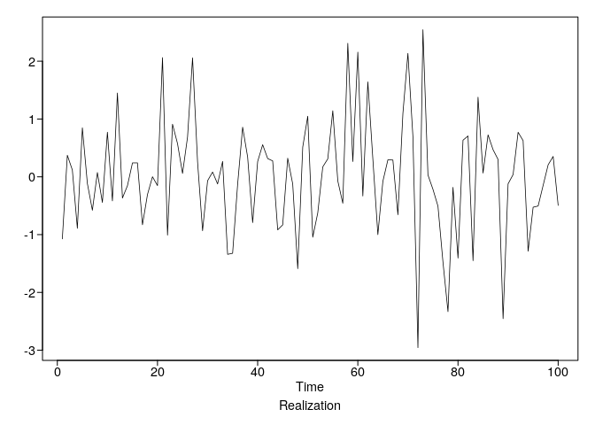<!-- -->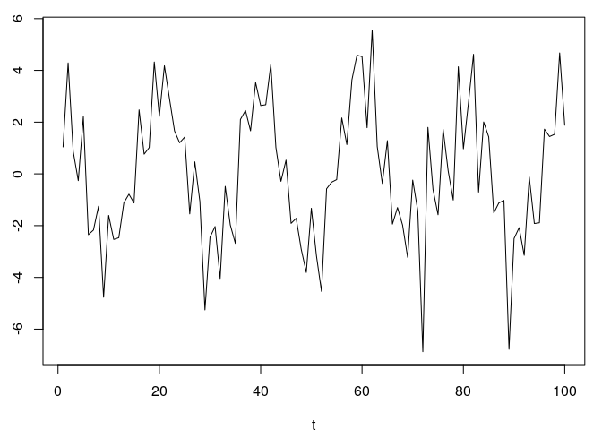<!-- -->

``` r
plotts.sample.wge(X_t)
```

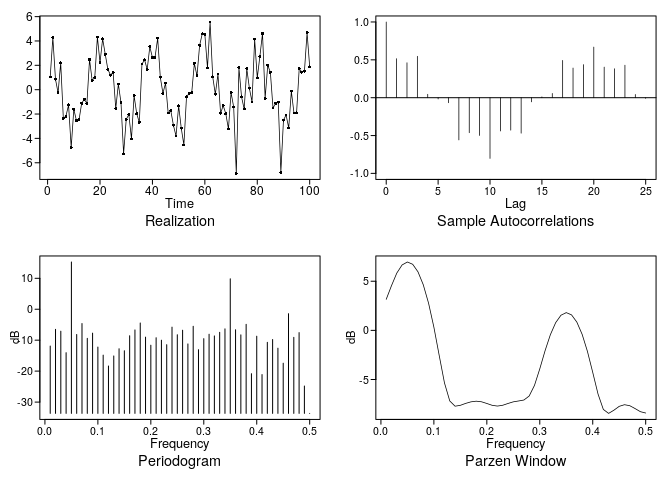<!-- -->

    ## $autplt
    ##  [1]  1.000000000  0.515390662  0.461355506  0.546589394  0.044807516
    ##  [6] -0.016760805 -0.066462593 -0.558103908 -0.462664812 -0.498855004
    ## [11] -0.802354610 -0.439977330 -0.428838915 -0.468807812 -0.054751831
    ## [16]  0.011020325  0.055840593  0.492095081  0.391756185  0.436735207
    ## [21]  0.668502116  0.403841542  0.382571121  0.429277192  0.042108161
    ## [26] -0.008825045
    ## 
    ## $freq
    ##  [1] 0.01 0.02 0.03 0.04 0.05 0.06 0.07 0.08 0.09 0.10 0.11 0.12 0.13 0.14
    ## [15] 0.15 0.16 0.17 0.18 0.19 0.20 0.21 0.22 0.23 0.24 0.25 0.26 0.27 0.28
    ## [29] 0.29 0.30 0.31 0.32 0.33 0.34 0.35 0.36 0.37 0.38 0.39 0.40 0.41 0.42
    ## [43] 0.43 0.44 0.45 0.46 0.47 0.48 0.49 0.50
    ## 
    ## $db
    ##  [1] -11.892888  -6.500262  -7.098691 -14.042674  15.269911  -8.164086
    ##  [7]  -4.618175  -9.410105  -7.722831 -12.228361 -14.828804 -18.341358
    ## [13] -15.096950 -12.768833 -13.413590  -8.570112  -6.683158  -4.444625
    ## [19]  -9.011618 -11.630626  -9.207895 -10.006416 -11.457844  -5.786082
    ## [25]  -8.241057  -6.785125 -11.207749  -5.513654 -13.069602  -9.501851
    ## [31]  -8.078922  -8.618152  -7.458805  -6.338502   9.839226  -6.628358
    ## [37]  -8.279830  -4.874211 -20.832340  -8.717905 -21.106945 -10.693570
    ## [43]  -9.781275 -12.585973 -17.441698  -1.436914  -9.088317  -7.542316
    ## [49] -24.813965 -33.655256
    ## 
    ## $dbz
    ##  [1]  3.1568580  4.5542747  5.8315709  6.6567530  6.9562731  6.7225226
    ##  [7]  5.9529216  4.6363381  2.7574335  0.3242010 -2.5373516 -5.3454334
    ## [13] -7.1823584 -7.7167076 -7.6266323 -7.4310321 -7.2734948 -7.2060918
    ## [19] -7.2674444 -7.4393178 -7.6254791 -7.7033318 -7.6207657 -7.4392464
    ## [25] -7.2724977 -7.1842169 -7.0877589 -6.6761022 -5.5985192 -3.9149922
    ## [31] -2.0688273 -0.4411708  0.7839106  1.5396848  1.8054734  1.5736899
    ## [37]  0.8381681 -0.4052829 -2.1416913 -4.2765709 -6.4794473 -8.0431958
    ## [43] -8.4478866 -8.1230802 -7.7302986 -7.5641227 -7.6671562 -7.9594318
    ## [49] -8.2740713 -8.4112172

For the following plot the realization, sample autocorrelations, and
parzen window. Discuss the cyclic behavior.

1.  Apply a third order low-pass Butterworth filter with cut off at 0.2
2.  Apply a third order high-pass Butterworth filter with cut off at 0.2
3.  Apply a third order high-pass Butterworth filter with cut off at 0.2
    and a third order low-pass Butterworth filter with cut off at
0.2

<!-- end list -->

``` r
X_t.lowpass <- butterworth.wge(X_t, order = 3, cutoff = 0.2, type = "low")
```

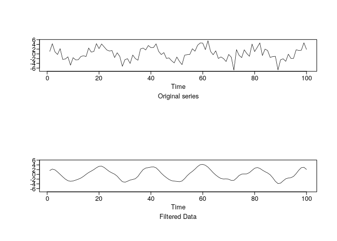<!-- -->

``` r
X_t.highpass <- butterworth.wge(X_t, order = 3, cutoff = 0.2, type = "high")
```

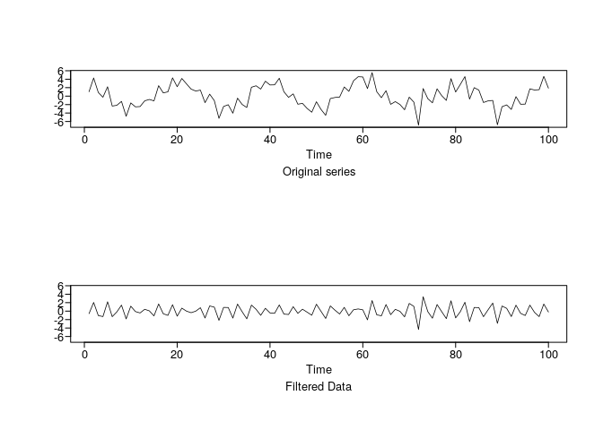<!-- -->

``` r
X_t.bandpass <- butterworth.wge(X_t.lowpass$x.filt, order = 3, cutoff = 0.2, type = "high")
```

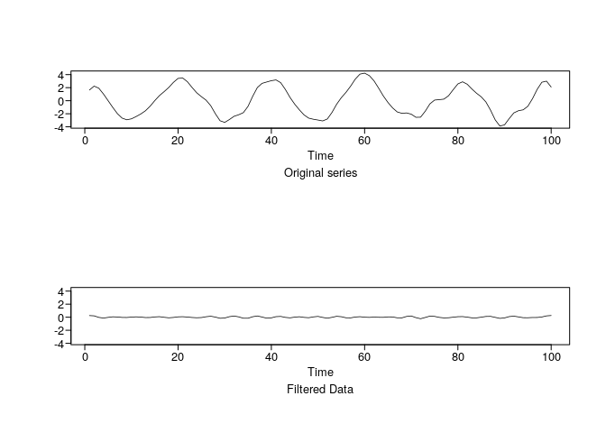<!-- -->

## Part A

Compared to the original data, the low-pass filter as removed the high
frequency (the oscillations characterized by frequencies above 0.2). The
realization appears to be a low freuqnecy signal.

``` r
plotts.sample.wge(X_t.lowpass$x.filt)
```

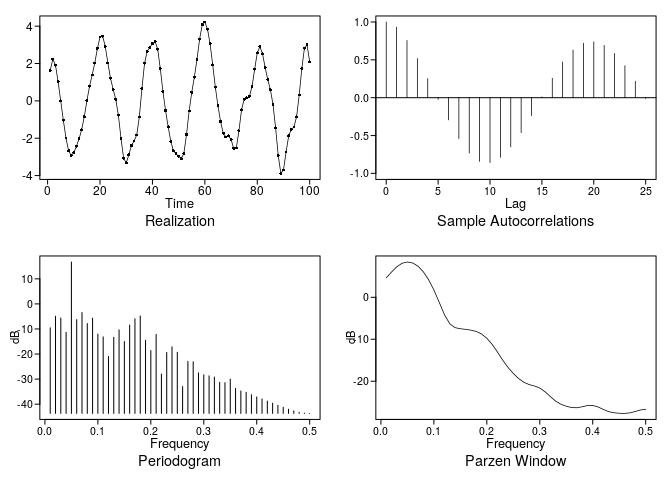<!-- -->

    ## $autplt
    ##  [1]  1.00000000  0.93199867  0.75614874  0.51764193  0.25243660
    ##  [6] -0.02202850 -0.29337017 -0.54019257 -0.73210526 -0.84188800
    ## [11] -0.85813308 -0.78821985 -0.65035191 -0.46219060 -0.23700525
    ## [16]  0.01010654  0.25579382  0.47080555  0.62962176  0.71903452
    ## [21]  0.73820657  0.69175521  0.58457639  0.42274246  0.21767199
    ## [26] -0.01112018
    ## 
    ## $freq
    ##  [1] 0.01 0.02 0.03 0.04 0.05 0.06 0.07 0.08 0.09 0.10 0.11 0.12 0.13 0.14
    ## [15] 0.15 0.16 0.17 0.18 0.19 0.20 0.21 0.22 0.23 0.24 0.25 0.26 0.27 0.28
    ## [29] 0.29 0.30 0.31 0.32 0.33 0.34 0.35 0.36 0.37 0.38 0.39 0.40 0.41 0.42
    ## [43] 0.43 0.44 0.45 0.46 0.47 0.48 0.49 0.50
    ## 
    ## $db
    ##  [1]  -9.539794  -4.925003  -5.629361 -11.384284  16.712419  -6.272382
    ##  [7]  -3.450577  -7.815301  -5.713439 -12.052742 -13.157289 -20.972317
    ## [13] -13.303864 -10.391158 -14.993072  -8.457764  -5.933711  -4.808489
    ## [19] -14.493287 -18.615175 -12.180730 -28.005375 -19.366612 -17.106860
    ## [25] -19.286329 -32.989123 -22.939516 -23.067624 -27.498618 -28.304495
    ## [31] -28.698230 -29.185772 -31.297043 -31.390377 -30.020201 -33.676031
    ## [37] -34.716578 -35.260858 -36.222376 -37.092231 -37.910364 -38.757972
    ## [43] -39.600915 -40.437840 -41.242448 -41.998397 -42.666198 -43.199772
    ## [49] -43.548020 -43.669491
    ## 
    ## $dbz
    ##  [1]   4.626196   6.021009   7.296308   8.120078   8.418443   8.183468
    ##  [7]   7.412099   6.092182   4.205654   1.752193  -1.168753  -4.143705
    ## [13]  -6.311829  -7.231906  -7.494508  -7.638838  -7.824243  -8.145500
    ## [19]  -8.745937  -9.754002 -11.212415 -13.031273 -14.965183 -16.714463
    ## [25] -18.161245 -19.362008 -20.273247 -20.802888 -21.134943 -21.637295
    ## [31] -22.516170 -23.673754 -24.762636 -25.502663 -25.963331 -26.273644
    ## [37] -26.335598 -26.092202 -25.797967 -25.775435 -26.134060 -26.724109
    ## [43] -27.247250 -27.525834 -27.637106 -27.670751 -27.552560 -27.226849
    ## [49] -26.858847 -26.699817

## Part B

Compared to the original data, the high-pass filter as removed the low
frequency (the oscillations characterized by frequencies low 0.2). The
realization appears to be a high freuqnecy signal.

``` r
plotts.sample.wge(X_t.highpass$x.filt)
```

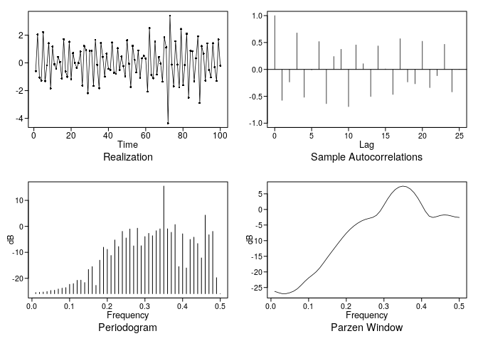<!-- -->

    ## $autplt
    ##  [1]  1.000000000 -0.575440465 -0.234494901  0.678243909 -0.518490806
    ##  [6] -0.008628752  0.517704913 -0.637192044  0.240072266  0.374254209
    ## [11] -0.692493670  0.455144175  0.106133930 -0.504568047  0.436637401
    ## [16]  0.008606156 -0.466072455  0.570631026 -0.234095472 -0.267896299
    ## [21]  0.523691666 -0.339050931 -0.117142162  0.467158434 -0.418707138
    ## [26]  0.003700992
    ## 
    ## $freq
    ##  [1] 0.01 0.02 0.03 0.04 0.05 0.06 0.07 0.08 0.09 0.10 0.11 0.12 0.13 0.14
    ## [15] 0.15 0.16 0.17 0.18 0.19 0.20 0.21 0.22 0.23 0.24 0.25 0.26 0.27 0.28
    ## [29] 0.29 0.30 0.31 0.32 0.33 0.34 0.35 0.36 0.37 0.38 0.39 0.40 0.41 0.42
    ## [43] 0.43 0.44 0.45 0.46 0.47 0.48 0.49 0.50
    ## 
    ## $db
    ##  [1] -25.4709649 -25.3978587 -25.2739320 -25.0980884 -24.6821916
    ##  [6] -24.5860949 -24.1122485 -23.7844466 -23.5688384 -22.3077620
    ## [11] -22.0516116 -20.7701246 -20.6972355 -21.6309490 -16.5987536
    ## [16] -15.5007515 -22.7148962 -13.0235330  -8.0509671  -8.8572503
    ## [21] -11.2214289  -5.2460558  -7.7839218  -1.9449714  -4.4901411
    ## [26]  -1.0333127  -7.5267874  -0.7223281  -7.4797607  -3.9411112
    ## [31]  -2.7038481  -3.6204269  -1.7034159  -0.9763092  15.4720192
    ## [36]  -0.9574327  -2.3019761   0.6810831 -15.4896694  -2.8803284
    ## [41] -16.0192489  -5.0380977  -4.1820634  -6.6300556 -12.1527909
    ## [46]   4.2925614  -3.2409837  -1.9551985 -19.7491524 -25.9032892
    ## 
    ## $dbz
    ##  [1] -26.2356904 -26.6493847 -26.9701346 -26.9591571 -26.6688139
    ##  [6] -26.1833052 -25.3969285 -24.2655020 -23.0225433 -21.9254443
    ## [11] -20.9859244 -19.9705199 -18.6453459 -17.0453536 -15.3745973
    ## [16] -13.7506696 -12.1639990 -10.5849235  -9.0445584  -7.6180437
    ## [21]  -6.3652192  -5.3034237  -4.4235982  -3.7217891  -3.2091575
    ## [26]  -2.8691185  -2.5518791  -1.8876775  -0.5222906   1.4006133
    ## [31]   3.3962621   5.1082125   6.3831769   7.1727528   7.4656278
    ## [36]   7.2591375   6.5502504   5.3376730   3.6399267   1.5546294
    ## [41]  -0.5945465  -2.1353224  -2.5706138  -2.2869976  -1.9154127
    ## [46]  -1.7521558  -1.8475418  -2.1277943  -2.4314916  -2.5641225

## Part C

Compared to the original data, the band-pass filter as removed most of
the oscillation (the oscillations characterized by frequencies low and
above 0.2). The realization appears to be relatively flat with some
noise.

``` r
plotts.sample.wge(X_t.bandpass$x.filt)
```

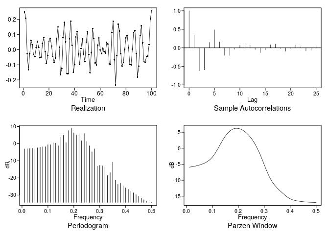<!-- -->

    ## $autplt
    ##  [1]  1.00000000  0.34181489 -0.61903766 -0.59344877  0.14816900
    ##  [6]  0.48674058  0.16057934 -0.20144484 -0.20431235 -0.03877884
    ## [11]  0.06764032  0.10962219  0.07807675 -0.04395340 -0.12860443
    ## [16] -0.05620354  0.08176769  0.09970514 -0.01927334 -0.09174934
    ## [21] -0.01217453  0.07865263  0.02743711 -0.08291955 -0.06715784
    ## [26]  0.06055398
    ## 
    ## $freq
    ##  [1] 0.01 0.02 0.03 0.04 0.05 0.06 0.07 0.08 0.09 0.10 0.11 0.12 0.13 0.14
    ## [15] 0.15 0.16 0.17 0.18 0.19 0.20 0.21 0.22 0.23 0.24 0.25 0.26 0.27 0.28
    ## [29] 0.29 0.30 0.31 0.32 0.33 0.34 0.35 0.36 0.37 0.38 0.39 0.40 0.41 0.42
    ## [43] 0.43 0.44 0.45 0.46 0.47 0.48 0.49 0.50
    ## 
    ## $db
    ##  [1]  -3.0451010  -2.9942634  -2.9074787  -2.7838284  -2.4290278
    ##  [6]  -2.4239805  -2.0387248  -1.8299270  -1.8001435  -0.6396159
    ## [11]  -0.6418563   0.4908615   0.2833687  -1.2281190   3.8460594
    ## [16]   4.9194112   0.5967347   7.6408725   8.9777766   6.2974370
    ## [21]   5.0171882   5.7683552   1.6303207   5.8878472   1.2815985
    ## [26]  -1.2515071  -4.7505425  -2.9998789 -13.1496029 -12.6681054
    ## [31] -12.9560989 -13.5270119 -18.6205010 -16.9367246 -10.7726426
    ## [36] -21.4094031 -23.7736423 -23.0492667 -24.6610433 -25.8272534
    ## [41] -26.6468742 -27.6738935 -28.6926660 -29.7554497 -30.7842801
    ## [46] -31.8056504 -32.7514904 -33.5488807 -34.0947469 -34.2906391
    ## 
    ## $dbz
    ##  [1]  -5.9127308  -5.8098817  -5.6577498  -5.4705121  -5.2493547
    ##  [6]  -4.9804066  -4.6392980  -4.1921063  -3.5868874  -2.7539148
    ## [11]  -1.6456731  -0.2986253   1.1601677   2.5761164   3.8269041
    ## [16]   4.8394478   5.5809956   6.0459187   6.2458800   6.2031564
    ## [21]   5.9448748   5.4964258   4.8741062   4.0792651   3.0971387
    ## [26]   1.9019971   0.4678212  -1.2165592  -3.1268947  -5.1772328
    ## [31]  -7.2025816  -8.9971404 -10.4332095 -11.5434739 -12.4500800
    ## [36] -13.2546728 -14.0053378 -14.7062511 -15.3261286 -15.8163487
    ## [41] -16.1518686 -16.3602906 -16.5001811 -16.6153177 -16.7162903
    ## [46] -16.7968215 -16.8554107 -16.8980063 -16.9271345 -16.9380549

# Problem 2.3

Apply a 1st order difference filter to the time series.

Like the butterworth high-pass filter, the differencing filter
suppresses the low frequency. However, the supression from the
difference filter is not as strong - there is still evidence of a
frequency at 0.05. Note that a 20(n) dB/decade roll off.

``` r
X_t.diff.filter <- artrans.wge(X_t, 1)
```

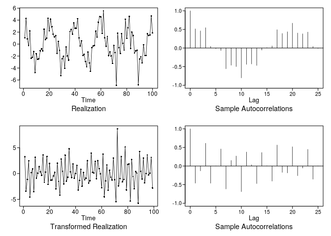<!-- -->

``` r
plotts.sample.wge(X_t.diff.filter)
```

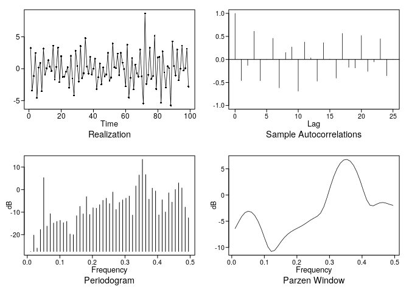<!-- -->

    ## $autplt
    ##  [1]  1.000000000 -0.460438754 -0.130310245  0.611854005 -0.462036005
    ##  [6]  0.005192148  0.458930113 -0.616529211  0.150918802  0.269685274
    ## [11] -0.689125562  0.377116937  0.034486463 -0.471925744  0.363478926
    ## [16]  0.007714312 -0.405649235  0.564856085 -0.171431112 -0.185398854
    ## [21]  0.517812752 -0.259965302 -0.053872017  0.448260880 -0.354285399
    ## [26]  0.005094243
    ## 
    ## $freq
    ##  [1] 0.01010101 0.02020202 0.03030303 0.04040404 0.05050505 0.06060606
    ##  [7] 0.07070707 0.08080808 0.09090909 0.10101010 0.11111111 0.12121212
    ## [13] 0.13131313 0.14141414 0.15151515 0.16161616 0.17171717 0.18181818
    ## [19] 0.19191919 0.20202020 0.21212121 0.22222222 0.23232323 0.24242424
    ## [25] 0.25252525 0.26262626 0.27272727 0.28282828 0.29292929 0.30303030
    ## [31] 0.31313131 0.32323232 0.33333333 0.34343434 0.35353535 0.36363636
    ## [37] 0.37373737 0.38383838 0.39393939 0.40404040 0.41414141 0.42424242
    ## [43] 0.43434343 0.44444444 0.45454545 0.46464646 0.47474747 0.48484848
    ## [49] 0.49494949
    ## 
    ## $db
    ##  [1] -27.45485291 -20.21074610 -25.97258274 -17.71511081   5.32393471
    ##  [6] -16.21704118 -10.71332631 -14.83915561 -14.13538912 -13.64532657
    ## [11] -14.69634492 -14.11911912 -19.72717803 -20.02852257 -11.59998883
    ## [16]  -7.46471554 -10.78422500  -3.14061490 -11.04438501  -8.07425193
    ## [21]  -8.26283771  -6.71083028  -4.76043005  -3.84133257  -6.21615017
    ## [26]  -1.08383606  -8.82658098  -5.69806026  -4.55839339  -3.81266552
    ## [31]  -2.87704185 -11.33693131   1.61621907   6.45922292  13.42047527
    ## [36]   6.66606736  -4.26279176   0.62543619  -0.61983666 -11.23571552
    ## [41]  -4.53356524  -9.94276755  -1.43397080  -5.55815587   0.04165039
    ## [46]   2.95831611   0.72865911  -7.78507741 -12.51576495
    ## 
    ## $dbz
    ##  [1]  -6.4100135  -5.2412716  -4.1238088  -3.3772668  -3.0910206
    ##  [6]  -3.2771834  -3.9283346  -5.0275966  -6.5285678  -8.2866685
    ## [11]  -9.9185971 -10.7870414 -10.5968259  -9.7907043  -8.8863095
    ## [16]  -8.1060145  -7.4897301  -7.0143661  -6.6402233  -6.3190726
    ## [21]  -5.9943500  -5.6185774  -5.1895797  -4.7636716  -4.4014266
    ## [26]  -4.0523712  -3.4470998  -2.2226503  -0.3766001   1.6767022
    ## [31]   3.5464877   5.0395295   6.0885652   6.6771701   6.8039875
    ## [36]   6.4695111   5.6739497   4.4250068   2.7660652   0.8526489
    ## [41]  -0.9137561  -1.9411532  -2.0640626  -1.7595503  -1.4906558
    ## [46]  -1.4314253  -1.5696521  -1.7979343  -1.9685704

# Additional Problem

Apply a 5-point moving average to the series you created in 2.1. How
does it compare to the difference and Butterworth filters? Specifically,
is it a low pass or high pass filter?

The 5-point moving average filter is a low-pass filter. It does not
reject the high frequency as strongly as the low-pass butterworth
filter. However, based on the realization, the moving average filter may
be practically sufficient for filtering the signal.

``` r
ma.5p <- stats::filter(X_t, rep(1,5)/5)
plotts.sample.wge(na.omit(ma.5p))
```

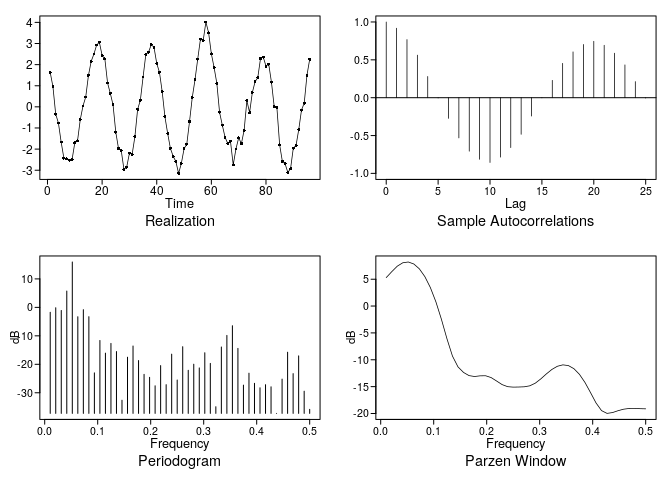<!-- -->

    ## $autplt
    ##  [1]  1.000000000  0.917637287  0.767730692  0.562063074  0.280062949
    ##  [6] -0.004013728 -0.272994938 -0.531464363 -0.706643852 -0.813647542
    ## [11] -0.855947016 -0.785084604 -0.659001268 -0.483446943 -0.242684600
    ## [16] -0.001937273  0.228811139  0.453323021  0.605260235  0.702738058
    ## [21]  0.744729237  0.692454409  0.587839398  0.433315639  0.212577105
    ## [26] -0.004900624
    ## 
    ## $freq
    ##  [1] 0.01041667 0.02083333 0.03125000 0.04166667 0.05208333 0.06250000
    ##  [7] 0.07291667 0.08333333 0.09375000 0.10416667 0.11458333 0.12500000
    ## [13] 0.13541667 0.14583333 0.15625000 0.16666667 0.17708333 0.18750000
    ## [19] 0.19791667 0.20833333 0.21875000 0.22916667 0.23958333 0.25000000
    ## [25] 0.26041667 0.27083333 0.28125000 0.29166667 0.30208333 0.31250000
    ## [31] 0.32291667 0.33333333 0.34375000 0.35416667 0.36458333 0.37500000
    ## [37] 0.38541667 0.39583333 0.40625000 0.41666667 0.42708333 0.43750000
    ## [43] 0.44791667 0.45833333 0.46875000 0.47916667 0.48958333 0.50000000
    ## 
    ## $db
    ##  [1]  -1.7394318  -0.1438164  -1.0956736   5.7237027  15.9334793
    ##  [6]  -3.2989057  -0.8231396  -3.2785638 -23.0116671 -11.6332617
    ## [11] -16.0868098 -12.6759052 -15.5289250 -32.6218345 -17.5127187
    ## [16] -13.5780817 -18.6900717 -23.5369578 -24.5821170 -27.5526204
    ## [21] -20.4570737 -27.1578902 -16.4471651 -25.5258507 -13.8228875
    ## [26] -22.1135724 -19.9725804 -21.2726584 -15.9515409 -19.6870432
    ## [31] -34.9046439 -13.9267495  -9.8665709  -6.4530739 -14.4127677
    ## [36] -27.3137042 -23.1211819 -26.6807035 -28.2513502 -27.1694484
    ## [41] -27.9105727 -37.2449721 -25.2057204 -15.7662370 -23.2829746
    ## [46] -17.0427584 -29.4509320 -35.8290068
    ## 
    ## $dbz
    ##  [1]   5.3000055   6.3964731   7.4231582   8.0588868   8.2041551
    ##  [6]   7.8326892   6.9304175   5.4760517   3.4376587   0.7833603
    ## [11]  -2.4689426  -6.0846080  -9.3171778 -11.3226637 -12.3582269
    ## [16] -12.9489706 -13.1147058 -12.9916130 -12.9741600 -13.3131437
    ## [21] -13.9600328 -14.6262329 -15.0097253 -15.0935709 -15.0726885
    ## [26] -15.0323902 -14.8504010 -14.3591510 -13.5622316 -12.6421828
    ## [31] -11.8078274 -11.2100398 -10.9459586 -11.0809450 -11.6606831
    ## [36] -12.7113424 -14.2229768 -16.0965655 -18.0307218 -19.4636923
    ## [41] -19.9826723 -19.8280028 -19.4795165 -19.2011596 -19.0665919
    ## [46] -19.0574098 -19.1063677 -19.1347366

# Problem 3.4

Generate an AR(1) process with n = 100, phi = +/- 0.9, +/- 0.5, and
sigma^2\_a = 1.

1.  plot the true autocorrelations  
2.  plot the true spectral density

<!-- end list -->

``` r
plotts.true.wge(n = 200, phi = 0.9)
```

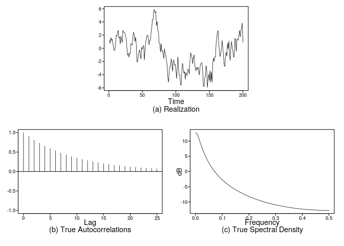<!-- -->

    ## $data
    ## Time Series:
    ## Start = 1 
    ## End = 200 
    ## Frequency = 1 
    ##   [1]  1.24274792  0.75589503  1.60840115  1.18649851  1.40822129
    ##   [6]  0.73570410  0.12114879 -0.32194165 -0.28931919  0.56501149
    ##  [11]  1.94208076  1.83965450  2.40446908  2.74376053  1.59498842
    ##  [16]  1.71319311  0.65262530  1.84330845  1.45879307  0.86398393
    ##  [21]  2.71304848  2.43057650  2.41039112  2.25832140  1.79406406
    ##  [26]  1.37989725  0.11735092 -1.04911286 -0.79685082 -1.33481281
    ##  [31] -0.70967784 -0.80914316  0.73271971  0.52226176  0.54111825
    ##  [36]  1.88058499  2.42299349  1.89109656  1.04833826  1.67623434
    ##  [41]  0.46598604 -2.06717408 -2.05818823 -1.05445190 -0.56175450
    ##  [46] -0.20358661 -1.25438013 -1.58083968  0.12692846 -0.12004517
    ##  [51]  0.35621892  0.38401721 -1.76585681 -0.27191066  1.02376484
    ##  [56]  1.43802740  2.00727705  1.95563483  1.42482786  0.51930098
    ##  [61]  1.23785173  1.22098664  2.40977236  3.06144424  4.34407488
    ##  [66]  4.32956845  5.77159399  5.86584555  5.37090223  5.56901497
    ##  [71]  3.45175474  4.04504399  2.65178756  2.55076443  0.82775018
    ##  [76]  0.73310017 -0.56557815  0.68695722 -0.42725732 -0.32983441
    ##  [81] -0.94453601 -1.53920745 -0.05638439 -0.81839913 -0.99996427
    ##  [86] -1.83733617 -2.58190295 -4.44427704 -5.13936468 -3.66047056
    ##  [91] -2.78856192 -2.75959386 -1.59541950 -2.22907502 -3.49845493
    ##  [96] -2.00437465 -1.77336747 -2.55824634 -2.44614307 -3.24208784
    ## [101] -4.57886444 -3.07710271 -1.29048848 -3.23998069 -4.03669551
    ## [106] -4.01540082 -5.55262471 -5.55243784 -3.11164826 -2.25523797
    ## [111] -3.15790673 -3.77422482 -3.53484523 -4.68341935 -3.66780573
    ## [116] -4.09053990 -4.06314929 -3.13412783 -3.28152383 -3.89483912
    ## [121] -1.91450336 -0.67119570 -1.12940470 -1.39116720 -2.34810368
    ## [126] -1.42780045 -0.98663039 -2.25530938 -3.24788269 -3.38783683
    ## [131] -2.85218538 -3.20591760 -2.89736474 -3.39596833 -4.03850984
    ## [136] -2.84939908 -2.37137394 -2.23144763 -2.20059257 -3.67561580
    ## [141] -5.63415945 -5.81390295 -4.44788732 -4.19113447 -2.61436342
    ## [146] -3.28148171 -5.92888901 -4.59989761 -3.95192088 -4.90283240
    ## [151] -3.36431206 -5.16725363 -3.61944648 -5.10585983 -2.20437437
    ## [156] -1.48267183 -1.99697351 -1.35285354 -1.38267011  0.71168975
    ## [161]  1.68129231  2.56986174  2.65568806  0.63347623 -0.38343881
    ## [166] -1.28281590 -0.68152127  0.10746567  1.18831721  0.15822758
    ## [171] -1.16468351 -2.50838293 -2.77542834 -0.99112903 -0.60286432
    ## [176] -1.18702663  0.79060663 -0.05718301  1.08860359 -0.85941244
    ## [181] -1.82987202  0.20570598  1.02249121  0.03492086 -0.41535950
    ## [186] -1.37158715 -1.16737501  1.50222089  1.47089713 -0.46815175
    ## [191]  1.32223239  1.38076537  1.20418930  1.96580128  2.73406102
    ## [196]  1.74150511  2.63935304  3.19167797  3.82515600  0.90575692
    ## 
    ## $aut1
    ##  [1] 1.00000000 0.90000000 0.81000000 0.72900000 0.65610000 0.59049000
    ##  [7] 0.53144100 0.47829690 0.43046721 0.38742049 0.34867844 0.31381060
    ## [13] 0.28242954 0.25418658 0.22876792 0.20589113 0.18530202 0.16677182
    ## [19] 0.15009464 0.13508517 0.12157665 0.10941899 0.09847709 0.08862938
    ## [25] 0.07976644 0.07178980
    ## 
    ## $acv
    ##  [1] 5.2631579 4.7368421 4.2631579 3.8368421 3.4531579 3.1078421 2.7970579
    ##  [8] 2.5173521 2.2656169 2.0390552 1.8351497 1.6516347 1.4864712 1.3378241
    ## [15] 1.2040417 1.0836375 0.9752738 0.8777464 0.7899718 0.7109746 0.6398771
    ## [22] 0.5758894 0.5183005 0.4664704 0.4198234 0.3778410
    ## 
    ## $spec
    ##   [1]  12.78753601  12.72624838  12.54741922  12.26484959  11.89785949
    ##   [6]  11.46753771  10.99374771  10.49340466   9.97989320   9.46322392
    ##  [11]   8.95054224   8.44673014   7.95496472   7.47718141   7.01443394
    ##  [16]   6.56716351   6.13539470   5.71887573   5.31717757   4.92976312
    ##  [21]   4.55603518   4.19536921   3.84713541   3.51071337   3.18550144
    ##  [26]   2.87092249   2.56642711   2.27149510   1.98563589   1.70838802
    ##  [31]   1.43931827   1.17802039   0.92411374   0.67724177   0.43707052
    ##  [36]   0.20328716  -0.02440146  -0.24627017  -0.46257676  -0.67356321
    ##  [41]  -0.87945677  -1.08047111  -1.27680716  -1.46865414  -1.65619030
    ##  [46]  -1.83958374  -2.01899310  -2.19456821  -2.36645072  -2.53477461
    ##  [51]  -2.69966676  -2.86124739  -3.01963049  -3.17492423  -3.32723137
    ##  [56]  -3.47664956  -3.62327166  -3.76718608  -3.90847699  -4.04722464
    ##  [61]  -4.18350555  -4.31739275  -4.44895598  -4.57826186  -4.70537411
    ##  [66]  -4.83035368  -4.95325891  -5.07414566  -5.19306748  -5.31007572
    ##  [71]  -5.42521962  -5.53854645  -5.65010160  -5.75992868  -5.86806961
    ##  [76]  -5.97456470  -6.07945273  -6.18277103  -6.28455556  -6.38484095
    ##  [81]  -6.48366056  -6.58104659  -6.67703007  -6.77164095  -6.86490815
    ##  [86]  -6.95685958  -7.04752222  -7.13692214  -7.22508452  -7.31203374
    ##  [91]  -7.39779336  -7.48238619  -7.56583431  -7.64815910  -7.72938126
    ##  [96]  -7.80952087  -7.88859735  -7.96662957  -8.04363580  -8.11963377
    ## [101]  -8.19464069  -8.26867324  -8.34174765  -8.41387964  -8.48508451
    ## [106]  -8.55537710  -8.62477184  -8.69328276  -8.76092349  -8.82770730
    ## [111]  -8.89364706  -8.95875534  -9.02304433  -9.08652592  -9.14921166
    ## [116]  -9.21111282  -9.27224035  -9.33260494  -9.39221699  -9.45108662
    ## [121]  -9.50922372  -9.56663791  -9.62333857  -9.67933485  -9.73463567
    ## [126]  -9.78924974  -9.84318554  -9.89645134  -9.94905523 -10.00100510
    ## [131] -10.05230863 -10.10297334 -10.15300656 -10.20241544 -10.25120699
    ## [136] -10.29938803 -10.34696522 -10.39394509 -10.44033400 -10.48613816
    ## [141] -10.53136366 -10.57601642 -10.62010227 -10.66362686 -10.70659575
    ## [146] -10.74901436 -10.79088798 -10.83222181 -10.87302091 -10.91329023
    ## [151] -10.95303464 -10.99225885 -11.03096752 -11.06916518 -11.10685628
    ## [156] -11.14404514 -11.18073601 -11.21693307 -11.25264036 -11.28786187
    ## [161] -11.32260149 -11.35686303 -11.39065022 -11.42396671 -11.45681606
    ## [166] -11.48920177 -11.52112726 -11.55259588 -11.58361089 -11.61417551
    ## [171] -11.64429286 -11.67396602 -11.70319799 -11.73199171 -11.76035005
    ## [176] -11.78827583 -11.81577180 -11.84284066 -11.86948504 -11.89570751
    ## [181] -11.92151061 -11.94689679 -11.97186848 -11.99642803 -12.02057775
    ## [186] -12.04431990 -12.06765668 -12.09059026 -12.11312275 -12.13525620
    ## [191] -12.15699263 -12.17833402 -12.19928228 -12.21983929 -12.24000690
    ## [196] -12.25978689 -12.27918101 -12.29819098 -12.31681846 -12.33506507
    ## [201] -12.35293241 -12.37042202 -12.38753541 -12.40427405 -12.42063938
    ## [206] -12.43663278 -12.45225563 -12.46750923 -12.48239489 -12.49691384
    ## [211] -12.51106731 -12.52485648 -12.53828250 -12.55134647 -12.56404949
    ## [216] -12.57639260 -12.58837681 -12.60000311 -12.61127246 -12.62218576
    ## [221] -12.63274391 -12.64294777 -12.65279816 -12.66229587 -12.67144169
    ## [226] -12.68023633 -12.68868051 -12.69677490 -12.70452016 -12.71191689
    ## [231] -12.71896570 -12.72566714 -12.73202174 -12.73803001 -12.74369242
    ## [236] -12.74900943 -12.75398144 -12.75860887 -12.76289206 -12.76683136
    ## [241] -12.77042708 -12.77367949 -12.77658887 -12.77915542 -12.78137937
    ## [246] -12.78326087 -12.78480008 -12.78599712 -12.78685208 -12.78736503
    ## [251] -12.78753601

``` r
plotts.true.wge(n = 200, phi = -0.9)
```

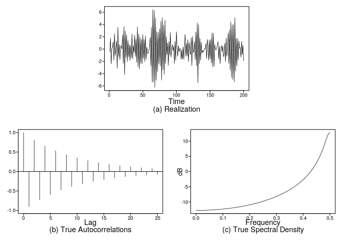<!-- -->

    ## $data
    ## Time Series:
    ## Start = 1 
    ## End = 200 
    ## Frequency = 1 
    ##   [1] -0.41806436  1.75738946 -2.41154886  0.11712900  0.24930796
    ##   [6]  1.16043222 -1.80812677  2.51002471 -1.03265947  0.10243801
    ##  [11]  1.31914416 -3.13963786  3.53612114 -1.27498703  0.74189187
    ##  [16] -1.73159996  0.50535438  0.49264163  0.02316759  2.32418360
    ##  [21] -2.33960074  3.67404683 -4.16110215  2.93667573 -1.31852541
    ##  [26]  2.32568656 -2.05700663  1.35427322 -1.24370903  0.75962561
    ##  [31] -1.83468736  0.58364481 -1.41670052  2.43894475 -1.57723247
    ##  [36]  0.57201166 -0.54722232  2.25579088 -1.19071923  1.60793075
    ##  [41] -2.15244532  3.60544299 -2.89920475  2.45244485 -3.23437821
    ##  [46]  1.93722081 -2.32749545  1.57497416 -2.38801320  2.36322888
    ##  [51] -1.49926765  1.57687603 -2.03562181  2.15642575 -1.65193474
    ##  [56]  0.32593417 -0.54856665 -0.73846651 -0.16246088  0.27269814
    ##  [61]  1.90908918 -2.73247061  3.53065223 -5.42533859  6.42730370
    ##  [66] -5.31674377  6.25995023 -6.24538676  5.11615906 -5.08136359
    ##  [71]  2.82485879 -3.67382654  2.74908264 -2.38289687  3.31907097
    ##  [76] -2.76070697  4.52928625 -5.06421085  5.10320667 -3.38601388
    ##  [81]  3.93403919 -4.11454583  4.71498122 -2.33525036  2.04076465
    ##  [86] -0.91682645  0.97674153 -2.67477594  1.26264778 -0.98187510
    ##  [91]  2.69727051 -1.31808221  0.09835634  0.73330010 -0.26300469
    ##  [96]  0.42552822 -2.33461004  1.27650519 -1.79959762  2.81778261
    ## [101]  0.26935211 -1.17763996  0.53521058 -0.43263588  0.06286765
    ## [106]  0.04925356 -1.66804929 -0.11226277 -1.64979031  0.36177734
    ## [111] -1.66814370  0.48862697  2.40455579 -1.19902265  0.96971910
    ## [116] -1.11059808  1.53891378 -2.05495693  1.04507639 -0.26882368
    ## [121] -0.95141783  1.81664348 -2.68862936  2.07106296 -0.56779025
    ## [126] -0.29628107  1.20106893 -1.69660540  2.78223895 -2.74529814
    ## [131]  4.27106166 -5.48893101  3.95917736 -2.39302210  1.74266011
    ## [136] -1.80986249  1.10397746 -0.65797940 -0.23461666 -0.47857166
    ## [141] -0.24001038  0.08050416  0.08453031  0.90441086 -1.54832485
    ## [146]  1.57048410  0.59150851 -1.82330617  1.49903140 -1.59688228
    ## [151]  1.58857441 -2.27767667  2.63046891 -2.88798646  2.56216734
    ## [156] -2.81784856  0.73839365 -0.07521490 -0.13218902  0.02381674
    ## [161]  0.92218484  1.15643306 -1.59693774  0.43101258 -2.39195825
    ## [166]  0.04035244  0.58040203 -0.38188957  0.51003858 -1.23847563
    ## [171] -0.82304686  0.95114654 -2.03890268  1.78722123 -1.18667380
    ## [176] -0.14685503  2.64752158 -2.33977467  3.15848625 -3.44147580
    ## [181]  4.43790668 -4.64246201  3.92620938 -4.95096918  4.05419921
    ## [186] -5.34461368  5.11273779 -3.59159923  1.75575334 -2.72984582
    ## [191]  1.74866232 -1.74747122  1.29546102  0.13341617  0.26666065
    ## [196] -1.33320451  1.27215214 -0.91831304  0.61806619 -1.90888332
    ## 
    ## $aut1
    ##  [1]  1.00000000 -0.90000000  0.81000000 -0.72900000  0.65610000
    ##  [6] -0.59049000  0.53144100 -0.47829690  0.43046721 -0.38742049
    ## [11]  0.34867844 -0.31381060  0.28242954 -0.25418658  0.22876792
    ## [16] -0.20589113  0.18530202 -0.16677182  0.15009464 -0.13508517
    ## [21]  0.12157665 -0.10941899  0.09847709 -0.08862938  0.07976644
    ## [26] -0.07178980
    ## 
    ## $acv
    ##  [1]  5.2631579 -4.7368421  4.2631579 -3.8368421  3.4531579 -3.1078421
    ##  [7]  2.7970579 -2.5173521  2.2656169 -2.0390552  1.8351497 -1.6516347
    ## [13]  1.4864712 -1.3378241  1.2040417 -1.0836375  0.9752738 -0.8777464
    ## [19]  0.7899718 -0.7109746  0.6398771 -0.5758894  0.5183005 -0.4664704
    ## [25]  0.4198234 -0.3778410
    ## 
    ## $spec
    ##   [1] -12.78753601 -12.78736503 -12.78685208 -12.78599712 -12.78480008
    ##   [6] -12.78326087 -12.78137937 -12.77915542 -12.77658887 -12.77367949
    ##  [11] -12.77042708 -12.76683136 -12.76289206 -12.75860887 -12.75398144
    ##  [16] -12.74900943 -12.74369242 -12.73803001 -12.73202174 -12.72566714
    ##  [21] -12.71896570 -12.71191689 -12.70452016 -12.69677490 -12.68868051
    ##  [26] -12.68023633 -12.67144169 -12.66229587 -12.65279816 -12.64294777
    ##  [31] -12.63274391 -12.62218576 -12.61127246 -12.60000311 -12.58837681
    ##  [36] -12.57639260 -12.56404949 -12.55134647 -12.53828250 -12.52485648
    ##  [41] -12.51106731 -12.49691384 -12.48239489 -12.46750923 -12.45225563
    ##  [46] -12.43663278 -12.42063938 -12.40427405 -12.38753541 -12.37042202
    ##  [51] -12.35293241 -12.33506507 -12.31681846 -12.29819098 -12.27918101
    ##  [56] -12.25978689 -12.24000690 -12.21983929 -12.19928228 -12.17833402
    ##  [61] -12.15699263 -12.13525620 -12.11312275 -12.09059026 -12.06765668
    ##  [66] -12.04431990 -12.02057775 -11.99642803 -11.97186848 -11.94689679
    ##  [71] -11.92151061 -11.89570751 -11.86948504 -11.84284066 -11.81577180
    ##  [76] -11.78827583 -11.76035005 -11.73199171 -11.70319799 -11.67396602
    ##  [81] -11.64429286 -11.61417551 -11.58361089 -11.55259588 -11.52112726
    ##  [86] -11.48920177 -11.45681606 -11.42396671 -11.39065022 -11.35686303
    ##  [91] -11.32260149 -11.28786187 -11.25264036 -11.21693307 -11.18073601
    ##  [96] -11.14404514 -11.10685628 -11.06916518 -11.03096752 -10.99225885
    ## [101] -10.95303464 -10.91329023 -10.87302091 -10.83222181 -10.79088798
    ## [106] -10.74901436 -10.70659575 -10.66362686 -10.62010227 -10.57601642
    ## [111] -10.53136366 -10.48613816 -10.44033400 -10.39394509 -10.34696522
    ## [116] -10.29938803 -10.25120699 -10.20241544 -10.15300656 -10.10297334
    ## [121] -10.05230863 -10.00100510  -9.94905523  -9.89645134  -9.84318554
    ## [126]  -9.78924974  -9.73463567  -9.67933485  -9.62333857  -9.56663791
    ## [131]  -9.50922372  -9.45108662  -9.39221699  -9.33260494  -9.27224035
    ## [136]  -9.21111282  -9.14921166  -9.08652592  -9.02304433  -8.95875534
    ## [141]  -8.89364706  -8.82770730  -8.76092349  -8.69328276  -8.62477184
    ## [146]  -8.55537710  -8.48508451  -8.41387964  -8.34174765  -8.26867324
    ## [151]  -8.19464069  -8.11963377  -8.04363580  -7.96662957  -7.88859735
    ## [156]  -7.80952087  -7.72938126  -7.64815910  -7.56583431  -7.48238619
    ## [161]  -7.39779336  -7.31203374  -7.22508452  -7.13692214  -7.04752222
    ## [166]  -6.95685958  -6.86490815  -6.77164095  -6.67703007  -6.58104659
    ## [171]  -6.48366056  -6.38484095  -6.28455556  -6.18277103  -6.07945273
    ## [176]  -5.97456470  -5.86806961  -5.75992868  -5.65010160  -5.53854645
    ## [181]  -5.42521962  -5.31007572  -5.19306748  -5.07414566  -4.95325891
    ## [186]  -4.83035368  -4.70537411  -4.57826186  -4.44895598  -4.31739275
    ## [191]  -4.18350555  -4.04722464  -3.90847699  -3.76718608  -3.62327166
    ## [196]  -3.47664956  -3.32723137  -3.17492423  -3.01963049  -2.86124739
    ## [201]  -2.69966676  -2.53477461  -2.36645072  -2.19456821  -2.01899310
    ## [206]  -1.83958374  -1.65619030  -1.46865414  -1.27680716  -1.08047111
    ## [211]  -0.87945677  -0.67356321  -0.46257676  -0.24627017  -0.02440146
    ## [216]   0.20328716   0.43707052   0.67724177   0.92411374   1.17802039
    ## [221]   1.43931827   1.70838802   1.98563589   2.27149510   2.56642711
    ## [226]   2.87092249   3.18550144   3.51071337   3.84713541   4.19536921
    ## [231]   4.55603518   4.92976312   5.31717757   5.71887573   6.13539470
    ## [236]   6.56716351   7.01443394   7.47718141   7.95496472   8.44673014
    ## [241]   8.95054224   9.46322392   9.97989320  10.49340466  10.99374771
    ## [246]  11.46753771  11.89785949  12.26484959  12.54741922  12.72624838
    ## [251]  12.78753601

``` r
plotts.true.wge(n = 200, phi = 0.5)
```

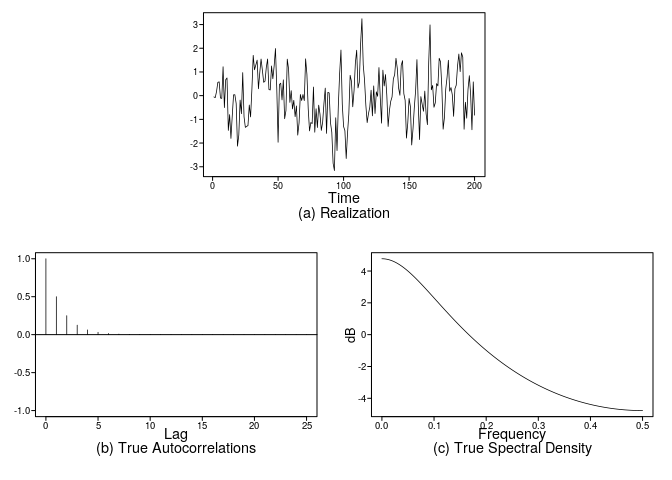<!-- -->

    ## $data
    ## Time Series:
    ## Start = 1 
    ## End = 200 
    ## Frequency = 1 
    ##   [1] -0.05243753 -0.08331084  0.17356285  0.56108403  0.58293189
    ##   [6] -0.09961481 -0.11575490  1.21850494 -0.50334895  0.67136824
    ##  [11]  0.74688321 -1.46548764 -0.79954794 -1.80384039 -0.85796781
    ##  [16]  0.03546677  0.03712023 -0.33457864 -2.13006792 -1.66411044
    ##  [21] -0.18748888 -0.76258073  0.97164066 -0.89031962 -1.33845458
    ##  [26] -1.29679367 -1.26287934 -0.39563575 -0.89708099  0.26832525
    ##  [31]  1.69949463  1.09055616  1.29351536  1.49762229  0.29009620
    ##  [36]  0.96778663  1.54381636  1.07356367  0.56287849  0.60929417
    ##  [41]  1.19166256  1.54534830  0.26008057  0.23817701  1.25133280
    ##  [46]  0.71405045  1.25973188  1.98797878  0.29165178 -1.96650059
    ##  [51]  0.46908444  0.52560801 -0.17863565  0.66759694 -0.97193969
    ##  [56] -0.62851545  1.54037908  1.12102433 -0.28470861  0.21081268
    ##  [61] -0.55895854 -0.19870282 -0.88593002 -0.43346491 -1.66473954
    ##  [66] -1.15264132  0.04814018 -0.20546935  0.04816460 -0.20850226
    ##  [71]  1.55300002  0.90206195 -0.55519904 -1.48629864 -1.13422895
    ##  [76] -1.17676640  0.36320073 -1.54228891 -0.55327833 -1.34434105
    ##  [81] -0.40208671 -0.78203705 -1.46578193 -1.12507200 -0.33304675
    ##  [86]  0.31776645 -1.59216568  0.13845488  0.11507684 -1.14196210
    ##  [91] -1.54083320 -2.85194821 -3.16012658 -0.93303804 -2.31746547
    ##  [96] -0.39717446  0.94858598  1.92350665 -0.36332234 -1.30332449
    ## [101] -1.47704891 -2.65154097 -1.59107897 -0.76756364  0.85847586
    ## [106]  0.60369324 -0.47057445  0.21806847  1.38136735  1.91562753
    ## [111]  0.32666289  0.56625580  2.18732849  3.24423670  1.29768641
    ## [116]  0.64913196 -0.40320195 -1.13641692 -0.76059359 -0.49110421
    ## [121]  0.22959201 -0.85111475  0.41059845 -0.75237188  0.15996916
    ## [126] -0.02669487  1.18564010 -0.08771898 -1.15988397  1.07644026
    ## [131]  0.40838585  0.88929512  0.01661176 -1.30061618 -0.62269326
    ## [136] -0.23990177 -0.05466290  0.70710137  0.88394831  1.57626056
    ## [141]  1.15202472  0.31991017  0.01640620  1.27698984  1.47574226
    ## [146]  0.08290422 -0.19715747 -1.79006779 -1.15871853 -0.11839284
    ## [151] -0.45957282 -2.08128399 -1.40318686 -0.49725213  0.21531717
    ## [156]  1.51926455 -0.36105074 -1.85160445 -0.04072934 -0.36460722
    ## [161] -0.65858843  0.19202101 -0.76606661 -1.22337163  1.42276974
    ## [166]  2.98475695  0.24729130  0.42874966 -0.48983075 -0.30597953
    ## [171]  0.50639960  0.41146276  1.57720366  1.42983104  0.36436259
    ## [176] -1.41423826 -0.92125244  0.28045308  0.77658852  1.49288713
    ## [181]  0.18749335  0.34152918  0.03756220 -0.87236311  0.29103602
    ## [186]  0.44168508  1.25634074  1.75468684  1.01319305  1.80754644
    ## [191]  1.62667691 -1.41635853 -0.27879796 -0.95094798  0.27029902
    ## [196]  0.84290288  0.04124995 -1.43867335  0.58155144 -0.82273319
    ## 
    ## $aut1
    ##  [1] 1.000000e+00 5.000000e-01 2.500000e-01 1.250000e-01 6.250000e-02
    ##  [6] 3.125000e-02 1.562500e-02 7.812500e-03 3.906250e-03 1.953125e-03
    ## [11] 9.765625e-04 4.882812e-04 2.441406e-04 1.220703e-04 6.103516e-05
    ## [16] 3.051758e-05 1.525879e-05 7.629395e-06 3.814697e-06 1.907349e-06
    ## [21] 9.536743e-07 4.768372e-07 2.384186e-07 1.192093e-07 5.960464e-08
    ## [26] 2.980232e-08
    ## 
    ## $acv
    ##  [1] 1.333333e+00 6.666667e-01 3.333333e-01 1.666667e-01 8.333333e-02
    ##  [6] 4.166667e-02 2.083333e-02 1.041667e-02 5.208333e-03 2.604167e-03
    ## [11] 1.302083e-03 6.510417e-04 3.255208e-04 1.627604e-04 8.138021e-05
    ## [16] 4.069010e-05 2.034505e-05 1.017253e-05 5.086263e-06 2.543132e-06
    ## [21] 1.271566e-06 6.357829e-07 3.178914e-07 1.589457e-07 7.947286e-08
    ## [26] 3.973643e-08
    ## 
    ## $spec
    ##   [1]  4.77121255  4.76984116  4.76572982  4.75888693  4.74932648
    ##   [6]  4.73706789  4.72213593  4.70456055  4.68437667  4.66162401
    ##  [11]  4.63634678  4.60859349  4.57841658  4.54587221  4.51101987
    ##  [16]  4.47392209  4.43464414  4.39325363  4.34982024  4.30441538
    ##  [21]  4.25711183  4.20798350  4.15710505  4.10455168  4.05039878
    ##  [26]  3.99472172  3.93759560  3.87909500  3.81929380  3.75826498
    ##  [31]  3.69608044  3.63281085  3.56852552  3.50329225  3.43717728
    ##  [36]  3.37024512  3.30255857  3.23417857  3.16516423  3.09557271
    ##  [41]  3.02545929  2.95487727  2.88387803  2.81251098  2.74082361
    ##  [46]  2.66886150  2.59666833  2.52428591  2.45175423  2.37911148
    ##  [51]  2.30639410  2.23363684  2.16087276  2.08813333  2.01544844
    ##  [56]  1.94284646  1.87035432  1.79799750  1.72580015  1.65378510
    ##  [61]  1.58197389  1.51038690  1.43904330  1.36796117  1.29715752
    ##  [66]  1.22664832  1.15644860  1.08657242  1.01703297  0.94784258
    ##  [71]  0.87901278  0.81055434  0.74247725  0.67479086  0.60750382
    ##  [76]  0.54062415  0.47415928  0.40811608  0.34250086  0.27731943
    ##  [81]  0.21257711  0.14827877  0.08442884  0.02103133 -0.04191013
    ##  [86] -0.10439229 -0.16641221 -0.22796734 -0.28905538 -0.34967437
    ##  [91] -0.40982259 -0.46949859 -0.52870119 -0.58742940 -0.64568248
    ##  [96] -0.70345988 -0.76076124 -0.81758637 -0.87393528 -0.92980811
    ## [101] -0.98520517 -1.04012688 -1.09457381 -1.14854665 -1.20204621
    ## [106] -1.25507339 -1.30762919 -1.35971472 -1.41133115 -1.46247975
    ## [111] -1.51316185 -1.56337885 -1.61313222 -1.66242347 -1.71125419
    ## [116] -1.75962599 -1.80754054 -1.85499955 -1.90200476 -1.94855795
    ## [121] -1.99466093 -2.04031552 -2.08552359 -2.13028701 -2.17460767
    ## [126] -2.21848750 -2.26192840 -2.30493233 -2.34750121 -2.38963701
    ## [131] -2.43134168 -2.47261719 -2.51346548 -2.55388853 -2.59388830
    ## [136] -2.63346674 -2.67262581 -2.71136747 -2.74969365 -2.78760629
    ## [141] -2.82510732 -2.86219865 -2.89888221 -2.93515989 -2.97103357
    ## [146] -3.00650513 -3.04157644 -3.07624934 -3.11052566 -3.14440723
    ## [151] -3.17789586 -3.21099333 -3.24370141 -3.27602186 -3.30795644
    ## [156] -3.33950684 -3.37067480 -3.40146198 -3.43187007 -3.46190072
    ## [161] -3.49155556 -3.52083621 -3.54974426 -3.57828130 -3.60644888
    ## [166] -3.63424854 -3.66168181 -3.68875019 -3.71545517 -3.74179819
    ## [171] -3.76778072 -3.79340416 -3.81866994 -3.84357943 -3.86813399
    ## [176] -3.89233499 -3.91618373 -3.93968154 -3.96282968 -3.98562945
    ## [181] -4.00808207 -4.03018879 -4.05195081 -4.07336931 -4.09444548
    ## [186] -4.11518046 -4.13557538 -4.15563136 -4.17534948 -4.19473083
    ## [191] -4.21377646 -4.23248740 -4.25086468 -4.26890928 -4.28662219
    ## [196] -4.30400438 -4.32105677 -4.33778031 -4.35417588 -4.37024438
    ## [201] -4.38598668 -4.40140362 -4.41649604 -4.43126475 -4.44571054
    ## [206] -4.45983420 -4.47363648 -4.48711813 -4.50027986 -4.51312239
    ## [211] -4.52564640 -4.53785257 -4.54974154 -4.56131395 -4.57257042
    ## [216] -4.58351156 -4.59413794 -4.60445013 -4.61444869 -4.62413414
    ## [221] -4.63350700 -4.64256777 -4.65131693 -4.65975494 -4.66788226
    ## [226] -4.67569931 -4.68320650 -4.69040425 -4.69729292 -4.70387289
    ## [231] -4.71014449 -4.71610807 -4.72176393 -4.72711238 -4.73215370
    ## [236] -4.73688815 -4.74131599 -4.74543745 -4.74925275 -4.75276208
    ## [241] -4.75596563 -4.75886357 -4.76145606 -4.76374323 -4.76572520
    ## [246] -4.76740207 -4.76877394 -4.76984087 -4.77060293 -4.77106014
    ## [251] -4.77121255

``` r
plotts.true.wge(n = 200, phi = -0.5)
```

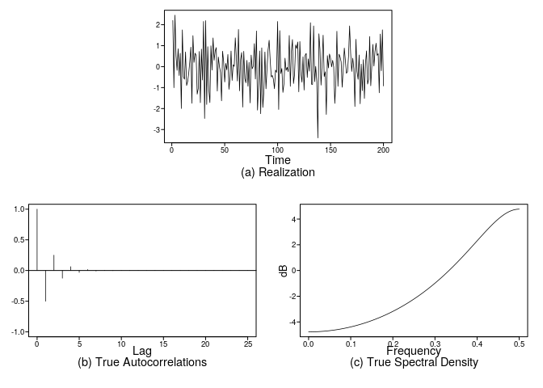<!-- -->

    ## $data
    ## Time Series:
    ## Start = 1 
    ## End = 200 
    ## Frequency = 1 
    ##   [1]  2.203402622 -1.005142869  2.456589221  0.514387385 -0.178032360
    ##   [6]  0.852945263 -0.425075831  0.637162414 -1.997472498  1.752896235
    ##  [11] -0.491803252 -0.599264722  0.699180364 -0.898439182 -0.709320766
    ##  [16] -0.319785404  0.235173684  0.928930772 -1.747169561  1.479963041
    ##  [21]  0.202985641  0.641478827  0.544252023 -1.311040363 -1.052621256
    ##  [26]  0.722442262 -1.719008380  0.835515758 -0.639597042  2.155648735
    ##  [31] -2.473064539  2.194896016 -1.804196319  0.951491422 -1.088801840
    ##  [36] -1.714973269  0.995338210 -0.163542815  1.368453577  0.303674740
    ##  [41]  0.746111155  0.908562457 -1.165513653  0.456684954  0.012479448
    ##  [46] -0.262418240 -1.631225880  0.736349846  0.233745821 -0.732180540
    ##  [51]  0.153420510 -0.148956517  0.580686851 -1.080758772 -0.547011478
    ##  [56]  0.744526791 -0.657923846  0.090088010  0.012694333  1.372770611
    ##  [61]  0.419499933 -0.685464511  1.773286116 -1.153430040  0.330841954
    ##  [66]  0.673550131 -1.930604342  0.731105141 -0.566287682 -0.771857535
    ##  [71]  0.300394736 -0.932338337  0.206015729 -1.729253454  0.552202929
    ##  [76] -0.102874070  0.022218584  1.096818960 -0.588743457  1.700729329
    ##  [81] -2.074152582 -0.831092652  0.748354894 -2.245669322  0.896060583
    ##  [86] -1.945591909 -1.181447237  0.698125800 -1.056188229 -0.067458133
    ##  [91]  0.814470015  1.258770888  0.290944908 -0.492312711 -0.418800046
    ##  [96] -0.597928963 -1.053272963 -0.161578318 -0.273782342  2.154400763
    ## [101] -2.042985355  1.717305229 -0.332302102 -0.089048569 -1.228688326
    ## [106] -0.806217621  0.404866511 -0.179108076 -0.032858390 -0.242618158
    ## [111]  1.485688451 -0.937406193  0.721582128  1.292902524 -0.805558426
    ## [116] -0.368036201  1.033383776  0.866367389  1.174782873 -1.201647750
    ## [121]  1.197991908 -0.325664535 -0.739197615  0.471528042 -1.116435214
    ## [126]  0.543276324  0.631399721 -0.516202071  0.367423847 -0.215691375
    ## [131]  2.096791479 -0.838352219 -0.847751783  1.941977666 -0.716770813
    ## [136]  0.009990717 -0.708557771 -3.398558800  1.567810388  0.816802295
    ## [141] -0.881503620  0.102969603  1.500556606 -0.470726232 -0.245666298
    ## [146] -2.280543594  0.526563308 -0.061747332  0.601493333  0.399785907
    ## [151] -0.009479471  0.301853595 -0.012569646 -1.753617379 -0.777378978
    ## [156]  1.687602536 -0.936046459  0.594282640  0.465171514  0.227297357
    ## [161] -0.982117006 -0.055848886  0.886965577  0.306773637 -0.315834195
    ## [166] -0.239980920  0.489483834  1.941739803  0.649337653 -0.229624994
    ## [171]  0.403890063 -0.096843778 -1.901539419  1.304550346 -0.221936530
    ## [176] -0.602535975  0.555700767 -1.771527443  0.120558867 -1.148041136
    ## [181]  0.331542219 -1.516261582  0.153617158  0.750989691 -0.831649637
    ## [186] -0.610190735  1.437998973 -0.911858866  0.048059926  1.061502744
    ## [191]  0.028261966  0.719812217  1.115401871  0.537268265  0.621811688
    ## [196] -1.246653557  1.554651417 -0.194912620  1.756563582 -0.920660650
    ## 
    ## $aut1
    ##  [1]  1.000000e+00 -5.000000e-01  2.500000e-01 -1.250000e-01  6.250000e-02
    ##  [6] -3.125000e-02  1.562500e-02 -7.812500e-03  3.906250e-03 -1.953125e-03
    ## [11]  9.765625e-04 -4.882812e-04  2.441406e-04 -1.220703e-04  6.103516e-05
    ## [16] -3.051758e-05  1.525879e-05 -7.629395e-06  3.814697e-06 -1.907349e-06
    ## [21]  9.536743e-07 -4.768372e-07  2.384186e-07 -1.192093e-07  5.960464e-08
    ## [26] -2.980232e-08
    ## 
    ## $acv
    ##  [1]  1.333333e+00 -6.666667e-01  3.333333e-01 -1.666667e-01  8.333333e-02
    ##  [6] -4.166667e-02  2.083333e-02 -1.041667e-02  5.208333e-03 -2.604167e-03
    ## [11]  1.302083e-03 -6.510417e-04  3.255208e-04 -1.627604e-04  8.138021e-05
    ## [16] -4.069010e-05  2.034505e-05 -1.017253e-05  5.086263e-06 -2.543132e-06
    ## [21]  1.271566e-06 -6.357829e-07  3.178914e-07 -1.589457e-07  7.947286e-08
    ## [26] -3.973643e-08
    ## 
    ## $spec
    ##   [1] -4.77121255 -4.77106014 -4.77060293 -4.76984087 -4.76877394
    ##   [6] -4.76740207 -4.76572520 -4.76374323 -4.76145606 -4.75886357
    ##  [11] -4.75596563 -4.75276208 -4.74925275 -4.74543745 -4.74131599
    ##  [16] -4.73688815 -4.73215370 -4.72711238 -4.72176393 -4.71610807
    ##  [21] -4.71014449 -4.70387289 -4.69729292 -4.69040425 -4.68320650
    ##  [26] -4.67569931 -4.66788226 -4.65975494 -4.65131693 -4.64256777
    ##  [31] -4.63350700 -4.62413414 -4.61444869 -4.60445013 -4.59413794
    ##  [36] -4.58351156 -4.57257042 -4.56131395 -4.54974154 -4.53785257
    ##  [41] -4.52564640 -4.51312239 -4.50027986 -4.48711813 -4.47363648
    ##  [46] -4.45983420 -4.44571054 -4.43126475 -4.41649604 -4.40140362
    ##  [51] -4.38598668 -4.37024438 -4.35417588 -4.33778031 -4.32105677
    ##  [56] -4.30400438 -4.28662219 -4.26890928 -4.25086468 -4.23248740
    ##  [61] -4.21377646 -4.19473083 -4.17534948 -4.15563136 -4.13557538
    ##  [66] -4.11518046 -4.09444548 -4.07336931 -4.05195081 -4.03018879
    ##  [71] -4.00808207 -3.98562945 -3.96282968 -3.93968154 -3.91618373
    ##  [76] -3.89233499 -3.86813399 -3.84357943 -3.81866994 -3.79340416
    ##  [81] -3.76778072 -3.74179819 -3.71545517 -3.68875019 -3.66168181
    ##  [86] -3.63424854 -3.60644888 -3.57828130 -3.54974426 -3.52083621
    ##  [91] -3.49155556 -3.46190072 -3.43187007 -3.40146198 -3.37067480
    ##  [96] -3.33950684 -3.30795644 -3.27602186 -3.24370141 -3.21099333
    ## [101] -3.17789586 -3.14440723 -3.11052566 -3.07624934 -3.04157644
    ## [106] -3.00650513 -2.97103357 -2.93515989 -2.89888221 -2.86219865
    ## [111] -2.82510732 -2.78760629 -2.74969365 -2.71136747 -2.67262581
    ## [116] -2.63346674 -2.59388830 -2.55388853 -2.51346548 -2.47261719
    ## [121] -2.43134168 -2.38963701 -2.34750121 -2.30493233 -2.26192840
    ## [126] -2.21848750 -2.17460767 -2.13028701 -2.08552359 -2.04031552
    ## [131] -1.99466093 -1.94855795 -1.90200476 -1.85499955 -1.80754054
    ## [136] -1.75962599 -1.71125419 -1.66242347 -1.61313222 -1.56337885
    ## [141] -1.51316185 -1.46247975 -1.41133115 -1.35971472 -1.30762919
    ## [146] -1.25507339 -1.20204621 -1.14854665 -1.09457381 -1.04012688
    ## [151] -0.98520517 -0.92980811 -0.87393528 -0.81758637 -0.76076124
    ## [156] -0.70345988 -0.64568248 -0.58742940 -0.52870119 -0.46949859
    ## [161] -0.40982259 -0.34967437 -0.28905538 -0.22796734 -0.16641221
    ## [166] -0.10439229 -0.04191013  0.02103133  0.08442884  0.14827877
    ## [171]  0.21257711  0.27731943  0.34250086  0.40811608  0.47415928
    ## [176]  0.54062415  0.60750382  0.67479086  0.74247725  0.81055434
    ## [181]  0.87901278  0.94784258  1.01703297  1.08657242  1.15644860
    ## [186]  1.22664832  1.29715752  1.36796117  1.43904330  1.51038690
    ## [191]  1.58197389  1.65378510  1.72580015  1.79799750  1.87035432
    ## [196]  1.94284646  2.01544844  2.08813333  2.16087276  2.23363684
    ## [201]  2.30639410  2.37911148  2.45175423  2.52428591  2.59666833
    ## [206]  2.66886150  2.74082361  2.81251098  2.88387803  2.95487727
    ## [211]  3.02545929  3.09557271  3.16516423  3.23417857  3.30255857
    ## [216]  3.37024512  3.43717728  3.50329225  3.56852552  3.63281085
    ## [221]  3.69608044  3.75826498  3.81929380  3.87909500  3.93759560
    ## [226]  3.99472172  4.05039878  4.10455168  4.15710505  4.20798350
    ## [231]  4.25711183  4.30441538  4.34982024  4.39325363  4.43464414
    ## [236]  4.47392209  4.51101987  4.54587221  4.57841658  4.60859349
    ## [241]  4.63634678  4.66162401  4.68437667  4.70456055  4.72213593
    ## [246]  4.73706789  4.74932648  4.75888693  4.76572982  4.76984116
    ## [251]  4.77121255

3.  calculate sigma^2\_X

\[
\sigma^2_X = \frac{\sigma^2_a}{1 - \phi^2} 
\]

From the equation above, the answers are as follows:

  - phi with abs value 0.9: 0.81
  - phi with abs value 0.5: 1.33

<!-- end list -->

4.  and e. plot the realizations and sample autocorrelations

<!-- end list -->

``` r
xp5 <- gen.arma.wge(n = 200, phi = 0.5, sn = 1)
```

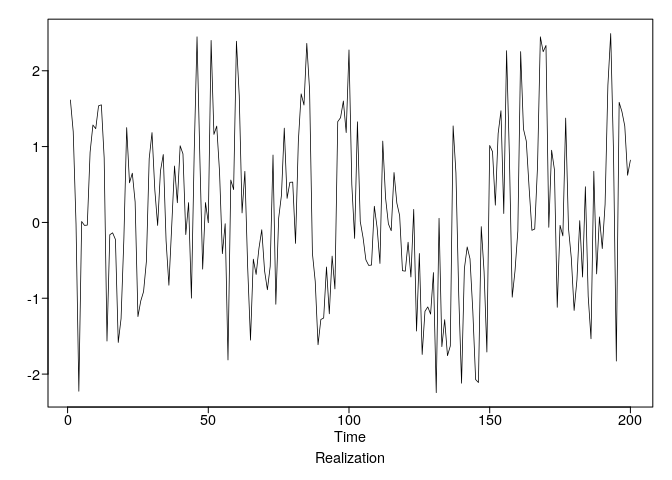<!-- -->

``` r
xm5 <- gen.arma.wge(n = 200, phi = -0.5, sn = 1)
```

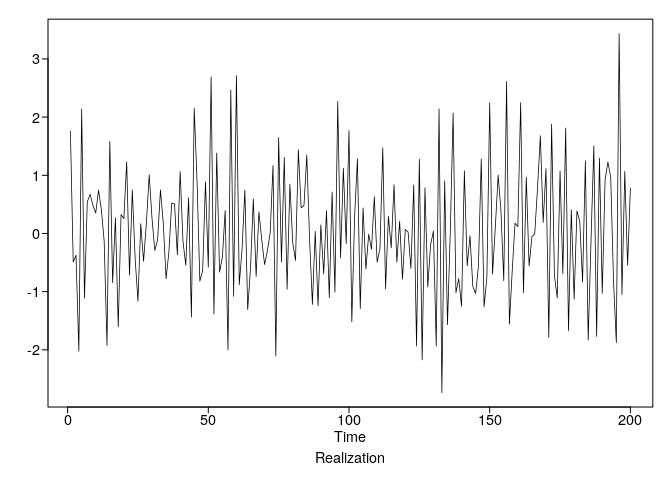<!-- -->

``` r
xp9 <- gen.arma.wge(n = 200, phi = 0.9, sn = 1)
```

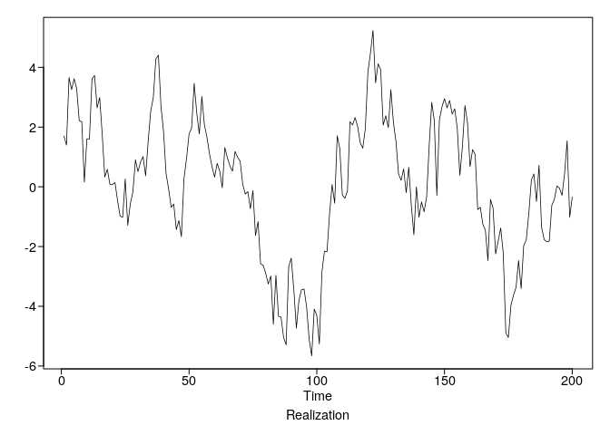<!-- -->

``` r
xm9 <- gen.arma.wge(n = 200, phi = -0.9, sn = 1)
```

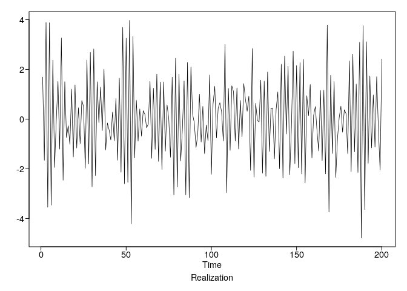<!-- -->

``` r
plotts.sample.wge(xp5)
```

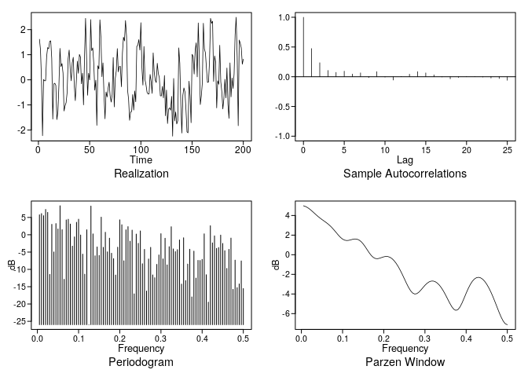<!-- -->

    ## $autplt
    ##  [1]  1.000000000  0.473999462  0.235487159  0.105846596  0.073532058
    ##  [6]  0.093559485  0.044552896  0.065081980 -0.014642504  0.085227217
    ## [11] -0.005802808 -0.055900122  0.005338981  0.043101767  0.085284063
    ## [16]  0.064260858  0.030551313 -0.003822953 -0.035813662 -0.011960280
    ## [21]  0.002444503  0.000810283 -0.005090402 -0.022343152 -0.029877839
    ## [26] -0.059862191
    ## 
    ## $freq
    ##   [1] 0.005 0.010 0.015 0.020 0.025 0.030 0.035 0.040 0.045 0.050 0.055
    ##  [12] 0.060 0.065 0.070 0.075 0.080 0.085 0.090 0.095 0.100 0.105 0.110
    ##  [23] 0.115 0.120 0.125 0.130 0.135 0.140 0.145 0.150 0.155 0.160 0.165
    ##  [34] 0.170 0.175 0.180 0.185 0.190 0.195 0.200 0.205 0.210 0.215 0.220
    ##  [45] 0.225 0.230 0.235 0.240 0.245 0.250 0.255 0.260 0.265 0.270 0.275
    ##  [56] 0.280 0.285 0.290 0.295 0.300 0.305 0.310 0.315 0.320 0.325 0.330
    ##  [67] 0.335 0.340 0.345 0.350 0.355 0.360 0.365 0.370 0.375 0.380 0.385
    ##  [78] 0.390 0.395 0.400 0.405 0.410 0.415 0.420 0.425 0.430 0.435 0.440
    ##  [89] 0.445 0.450 0.455 0.460 0.465 0.470 0.475 0.480 0.485 0.490 0.495
    ## [100] 0.500
    ## 
    ## $db
    ##   [1]   5.76746630   6.11503090   5.51239198   7.31396757   6.46615709
    ##   [6] -11.44821592   3.00912487  -4.96614279   3.22890048   1.66866826
    ##  [11]   8.37328327   1.47215571 -12.86527998   4.28190263   4.47801486
    ##  [16]   3.09729055  -3.28754123  -0.62082078   3.60197613   4.49424459
    ##  [21]  -0.06477756  -5.60256031 -11.38858383   1.44196861 -25.97165481
    ##  [26]   8.28668863   0.24525688  -6.07439123  -3.52029953  -5.96307294
    ##  [31]   5.08843043  -3.62859729   0.72140284  -4.93209660  -0.98845929
    ##  [36]  -5.33891845  -6.89333204 -11.64177200  -3.59938416   4.30995320
    ##  [41]   2.89899665  -7.51745326   1.42603662   2.34374800  -1.86256771
    ##  [46]   1.34079152 -17.06996123   0.19257748  -2.47643503   1.10753521
    ##  [51]  -8.37941289  -4.23250506 -16.25309295  -7.00636460  -3.63934024
    ##  [56] -11.60104628 -12.40381816  -8.55512161  -5.82961398   0.30793894
    ##  [61]  -6.97745931  -1.01201612  -8.70800324  -3.44304967   2.31759942
    ##  [66]  -4.08840571  -4.86900291  -4.29774779  -1.49357081 -14.25674019
    ##  [71]  -0.87529930 -13.23018207  -8.46590123  -4.18938824 -17.94785574
    ##  [76]  -4.73352470 -12.52259983  -7.39854201  -7.43027027  -7.09714454
    ##  [81]   0.26853859 -11.54568149 -19.46361392   2.60390268  -2.34666305
    ##  [86]  -0.31474803  -3.93502505  -3.69727038  -0.09880047  -2.51113759
    ##  [91]  -4.59817320  -9.72764156  -4.21369359  -0.95784927 -15.76518064
    ##  [96]  -7.32952227 -15.26792687 -14.19921853  -7.55691153 -15.53446182
    ## 
    ## $dbz
    ##   [1]  4.99050906  4.91945700  4.80563147  4.65602949  4.48034587
    ##   [6]  4.29024457  4.09781497  3.91329493  3.74263872  3.58587882
    ##  [11]  3.43711197  3.28628060  3.12215961  2.93561888  2.72241491
    ##  [16]  2.48513417  2.23409102  1.98685550  1.76585373  1.59362846
    ##  [21]  1.48635537  1.44783378  1.46693540  1.52000163  1.57683833
    ##  [26]  1.60736609  1.58670616  1.49819173  1.33493233  1.10073410
    ##  [31]  0.81071303  0.49115291  0.17732044 -0.09232111 -0.28565689
    ##  [36] -0.38706893 -0.40255286 -0.35643353 -0.28212869 -0.21265019
    ##  [41] -0.17470369 -0.18677501 -0.25974641 -0.39852236 -0.60371783
    ##  [46] -0.87294324 -1.20145143 -1.58198883 -2.00375209 -2.45052961
    ##  [51] -2.89854752 -3.31533558 -3.66182541 -3.89975584 -4.00358329
    ##  [56] -3.97110167 -3.82532552 -3.60605998 -3.35725388 -3.11727852
    ##  [61] -2.91472462 -2.76838682 -2.68916797 -2.68233630 -2.74941842
    ##  [66] -2.88950713 -3.09994087 -3.37630806 -3.71164857 -4.09465218
    ##  [71] -4.50672706 -4.91830138 -5.28603462 -5.55475300 -5.66885147
    ##  [76] -5.59290526 -5.32997769 -4.92225029 -4.43311465 -3.92555269
    ##  [81] -3.44927693 -3.03777355 -2.71069521 -2.47765178 -2.34157777
    ##  [86] -2.30122996 -2.35290312 -2.49155702 -2.71150175 -3.00671215
    ##  [91] -3.37077255 -3.79639922 -4.27445027 -4.79232889 -5.33176991
    ##  [96] -5.86629950 -6.35935623 -6.76515650 -7.03502948 -7.13002478

``` r
plotts.sample.wge(xm5)
```

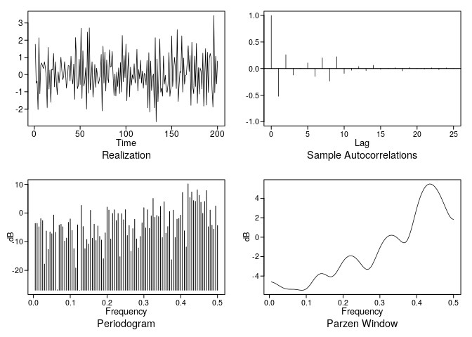<!-- -->

    ## $autplt
    ##  [1]  1.0000000000 -0.5216812828  0.2602650110 -0.1221714149  0.0025883801
    ##  [6]  0.1065166706 -0.1466058686  0.2022982512 -0.2356363302  0.2222938995
    ## [11] -0.0912561685 -0.0313563645  0.0384441686 -0.0379235743  0.0629532474
    ## [16] -0.0113241300  0.0009454965  0.0164087003 -0.0439819186  0.0192552443
    ## [21]  0.0018022349 -0.0066011405  0.0132696354 -0.0204642456  0.0135245285
    ## [26] -0.0005897407
    ## 
    ## $freq
    ##   [1] 0.005 0.010 0.015 0.020 0.025 0.030 0.035 0.040 0.045 0.050 0.055
    ##  [12] 0.060 0.065 0.070 0.075 0.080 0.085 0.090 0.095 0.100 0.105 0.110
    ##  [23] 0.115 0.120 0.125 0.130 0.135 0.140 0.145 0.150 0.155 0.160 0.165
    ##  [34] 0.170 0.175 0.180 0.185 0.190 0.195 0.200 0.205 0.210 0.215 0.220
    ##  [45] 0.225 0.230 0.235 0.240 0.245 0.250 0.255 0.260 0.265 0.270 0.275
    ##  [56] 0.280 0.285 0.290 0.295 0.300 0.305 0.310 0.315 0.320 0.325 0.330
    ##  [67] 0.335 0.340 0.345 0.350 0.355 0.360 0.365 0.370 0.375 0.380 0.385
    ##  [78] 0.390 0.395 0.400 0.405 0.410 0.415 0.420 0.425 0.430 0.435 0.440
    ##  [89] 0.445 0.450 0.455 0.460 0.465 0.470 0.475 0.480 0.485 0.490 0.495
    ## [100] 0.500
    ## 
    ## $db
    ##   [1]  -3.6483374  -3.6004235  -4.8134917  -1.9648076  -2.6556380
    ##   [6] -17.8161663  -6.2817571 -12.6869623  -6.6000033  -7.2428970
    ##  [11]  -0.7106436  -6.7088105 -26.7942824  -4.2411915  -3.9449775
    ##  [16]  -4.8145325  -9.7928511  -8.7556718  -3.2645443  -2.0771792
    ##  [21]  -6.0857838 -12.4340159 -19.1957898  -4.1383354 -26.9317565
    ##  [26]   2.6572419  -4.7321909 -12.4390333  -9.2384830 -10.8448130
    ##  [31]   0.9321670  -8.8075759  -3.9120654  -9.6284526  -4.5416933
    ##  [36]  -8.1682176  -9.4447353 -15.9620843  -6.9467824   2.0529062
    ##  [41]   1.0138776  -9.0562683  -0.1726896   1.1241085  -2.6423455
    ##  [46]  -0.1865237 -15.2486057  -0.2576157  -2.3664139   1.1503137
    ##  [51]  -7.8671565  -4.3649969 -13.3273914  -5.4589904  -2.2141562
    ##  [56]  -9.0319049 -12.1949912  -8.1773685  -3.4385204   1.8369975
    ##  [61]  -5.2250183   1.1299162  -5.3482430  -1.0395949   5.0762961
    ##  [66]  -1.5217488  -0.8532416  -1.2868865   2.2876292  -8.5839845
    ##  [71]   3.9146962  -7.0331794  -4.7295963   0.5142070 -16.3212665
    ##  [76]   0.9981941  -8.5579645  -2.1483457  -1.9140814  -0.7517050
    ##  [81]   7.1367533  -6.2254545 -11.8471076  10.1303115   5.3902508
    ##  [86]   7.3175342   4.3187670   4.0490799   8.0647237   6.1756551
    ##  [91]   3.7298738  -0.1369689   4.0035799   7.8226689  -4.8000797
    ##  [96]   1.0202509  -4.2473957  -5.6315810   2.4566027  -4.3771991
    ## 
    ## $dbz
    ##   [1] -4.603719606 -4.656267205 -4.738649459 -4.843163128 -4.959476921
    ##   [6] -5.075608000 -5.179633361 -5.261966877 -5.317592497 -5.347374745
    ##  [11] -5.357762804 -5.358834377 -5.361272947 -5.373125376 -5.397035341
    ##  [16] -5.428415121 -5.454992322 -5.458326096 -5.417828056 -5.316983734
    ##  [21] -5.149838381 -4.924657633 -4.662685466 -4.392767138 -4.144698370
    ##  [26] -3.943851014 -3.807911861 -3.745209671 -3.753743164 -3.820398292
    ##  [31] -3.920613374 -4.019699836 -4.077652743 -4.058404582 -3.941178575
    ##  [36] -3.727958416 -3.442006449 -3.118593614 -2.794094501 -2.498606567
    ##  [41] -2.253228117 -2.070532380 -1.956422578 -1.912166088 -1.935998101
    ##  [46] -2.024004330 -2.170126333 -2.365221212 -2.595265070 -2.839129476
    ##  [51] -3.066989183 -3.241247357 -3.322134122 -3.278295266 -3.098291000
    ##  [56] -2.795751736 -2.404291664 -1.965941217 -1.520312395 -1.098626891
    ##  [61] -0.722380993 -0.404611983 -0.152027114  0.032921232  0.150365494
    ##  [66]  0.201890007  0.190064453  0.118857978 -0.004774481 -0.167876771
    ##  [71] -0.347146164 -0.504461143 -0.585750723 -0.529016152 -0.284845236
    ##  [76]  0.159153852  0.769370321  1.481369465  2.225355695  2.944001637
    ##  [81]  3.597959748  4.163840044  4.629901472  4.992075454  5.251022500
    ##  [86]  5.410140682  5.474273950  5.448912835  5.339767721  5.152670148
    ##  [91]  4.893809927  4.570346770  4.191445162  3.769755835  3.323260682
    ##  [96]  2.877120247  2.464623038  2.125645744  1.900900741  1.821970191

``` r
plotts.sample.wge(xp9)
```

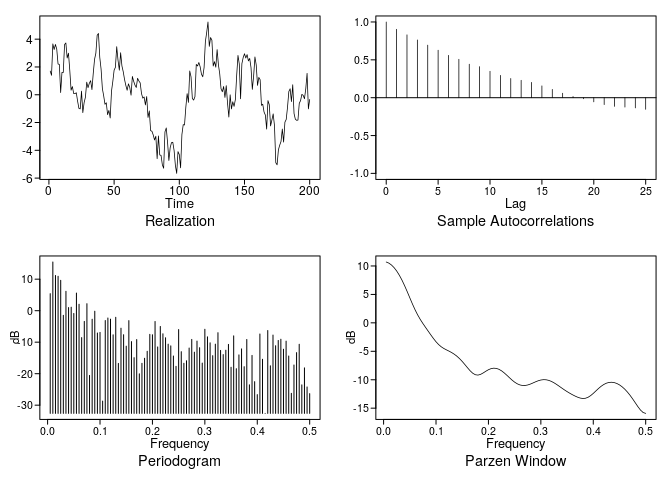<!-- -->

    ## $autplt
    ##  [1]  1.00000000  0.90328849  0.83029697  0.76279175  0.69432932
    ##  [6]  0.62716568  0.55886696  0.50736493  0.44242081  0.41011397
    ## [11]  0.34918793  0.29441838  0.25353721  0.22947438  0.20196654
    ## [16]  0.15599949  0.10936778  0.05895996  0.01548007 -0.01400389
    ## [21] -0.05487474 -0.09119984 -0.11463959 -0.12411298 -0.13476057
    ## [26] -0.15351515
    ## 
    ## $freq
    ##   [1] 0.005 0.010 0.015 0.020 0.025 0.030 0.035 0.040 0.045 0.050 0.055
    ##  [12] 0.060 0.065 0.070 0.075 0.080 0.085 0.090 0.095 0.100 0.105 0.110
    ##  [23] 0.115 0.120 0.125 0.130 0.135 0.140 0.145 0.150 0.155 0.160 0.165
    ##  [34] 0.170 0.175 0.180 0.185 0.190 0.195 0.200 0.205 0.210 0.215 0.220
    ##  [45] 0.225 0.230 0.235 0.240 0.245 0.250 0.255 0.260 0.265 0.270 0.275
    ##  [56] 0.280 0.285 0.290 0.295 0.300 0.305 0.310 0.315 0.320 0.325 0.330
    ##  [67] 0.335 0.340 0.345 0.350 0.355 0.360 0.365 0.370 0.375 0.380 0.385
    ##  [78] 0.390 0.395 0.400 0.405 0.410 0.415 0.420 0.425 0.430 0.435 0.440
    ##  [89] 0.445 0.450 0.455 0.460 0.465 0.470 0.475 0.480 0.485 0.490 0.495
    ## [100] 0.500
    ## 
    ## $db
    ##   [1]   5.4042208  15.4572617  11.1701583  10.9150291   9.6355399
    ##   [6]  -1.4705925   6.1529688   0.9878404   1.1052502  -0.8889813
    ##  [11]   5.5937035   2.0426959  -8.5451017  -3.4069999   2.2140252
    ##  [16] -20.5545510  -2.7183531  -0.1754935  -7.0903241  -6.8999141
    ##  [21] -28.7064468  -3.1290576  -2.3221614  -2.6827401  -7.6668722
    ##  [26]  -2.1028398 -16.7506943  -5.5604414  -7.6298162 -11.2694735
    ##  [31]  -3.1540104  -9.8208932 -14.9160887  -9.1728926 -20.0529147
    ##  [36] -16.7100999 -15.1058548 -12.8901973  -7.5218654  -7.6491642
    ##  [41]  -3.4351425 -11.5147623  -5.0134907  -7.3353201  -8.5942917
    ##  [46] -10.6353591 -11.1761833 -14.3903962 -17.6702054  -5.9942351
    ##  [51] -13.0215213 -16.7027322 -15.8914305 -11.8608675  -9.1282150
    ##  [56] -13.1757655  -9.6578300 -11.7549579 -16.6355878  -5.9029623
    ##  [61]  -8.3051773 -10.2088360 -14.2794870 -10.6322114  -6.9891512
    ##  [66] -12.6141591 -13.9384782 -12.5514525 -10.7069168 -17.9594560
    ##  [71]  -7.9916918 -18.4228235 -14.0407294 -12.1268150 -17.7861931
    ##  [76]  -9.1454947 -23.5393492 -14.2036353 -22.5311399 -26.6517325
    ##  [81]  -7.4032042 -15.4265517 -32.6083428  -6.2968579 -17.5009479
    ##  [86]  -7.7414899 -11.1296632  -9.4509305  -9.0646881 -12.2407472
    ##  [91]  -9.6664841 -14.3920748 -26.2453859 -17.2472451 -13.3139511
    ##  [96] -10.6653725 -23.5510231 -18.1520999 -24.2213984 -26.3355533
    ## 
    ## $dbz
    ##   [1]  10.6999899  10.5027539  10.1726000   9.7080924   9.1087072
    ##   [6]   8.3765076   7.5185612   6.5501504   5.4983755   4.4045841
    ##  [11]   3.3222735   2.3065351   1.3957088   0.5956369  -0.1198491
    ##  [16]  -0.7910181  -1.4498341  -2.1054080  -2.7412215  -3.3234925
    ##  [21]  -3.8182206  -4.2098570  -4.5105067  -4.7540837  -4.9818066
    ##  [26]  -5.2297898  -5.5236580  -5.8785210  -6.3005472  -6.7872381
    ##  [31]  -7.3250310  -7.8844816  -8.4157118  -8.8505518  -9.1196465
    ##  [36]  -9.1836574  -9.0576452  -8.8051497  -8.5080345  -8.2386210
    ##  [41]  -8.0478434  -7.9653941  -8.0039324  -8.1629147  -8.4308871
    ##  [46]  -8.7866698  -9.2004859  -9.6362358 -10.0556711 -10.4239549
    ##  [51] -10.7145886 -10.9115600 -11.0086085 -11.0078171 -10.9195283
    ##  [56] -10.7630571 -10.5659383 -10.3604700 -10.1786312 -10.0474801
    ##  [61]  -9.9863407 -10.0058135 -10.1079803 -10.2871914 -10.5311784
    ##  [66] -10.8225949 -11.1412748 -11.4673396 -11.7847018 -12.0837383
    ##  [71] -12.3615925 -12.6192481 -12.8559657 -13.0630629 -13.2199068
    ##  [76] -13.2953876 -13.2571271 -13.0863298 -12.7899005 -12.4008677
    ##  [81] -11.9670973 -11.5370164 -11.1501712 -10.8341812 -10.6057562
    ##  [86] -10.4732035 -10.4389852 -10.5018400 -10.6584474 -10.9047284
    ##  [91] -11.2368049 -11.6514818 -12.1459072 -12.7158500 -13.3518321
    ##  [96] -14.0323241 -14.7140342 -15.3227933 -15.7563404 -15.9151792

``` r
plotts.sample.wge(xm9)
```

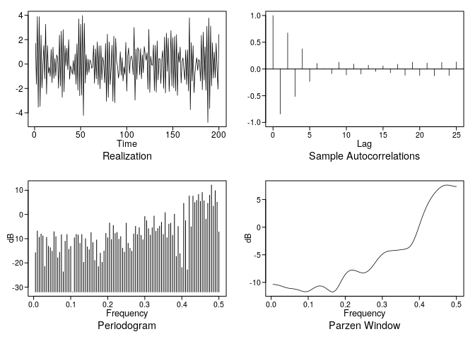<!-- -->

    ## $autplt
    ##  [1]  1.000000000 -0.842024953  0.673719859 -0.513901159  0.377895988
    ##  [6] -0.233944652  0.104576714  0.006886677 -0.087388116  0.125880071
    ## [11] -0.110840381  0.093060896 -0.093415690  0.071472460 -0.046796511
    ## [16]  0.058468779 -0.069624653  0.089948185 -0.117984596  0.127832032
    ## [21] -0.121527866  0.111794844 -0.128463066  0.124401758 -0.122301039
    ## [26]  0.131832662
    ## 
    ## $freq
    ##   [1] 0.005 0.010 0.015 0.020 0.025 0.030 0.035 0.040 0.045 0.050 0.055
    ##  [12] 0.060 0.065 0.070 0.075 0.080 0.085 0.090 0.095 0.100 0.105 0.110
    ##  [23] 0.115 0.120 0.125 0.130 0.135 0.140 0.145 0.150 0.155 0.160 0.165
    ##  [34] 0.170 0.175 0.180 0.185 0.190 0.195 0.200 0.205 0.210 0.215 0.220
    ##  [45] 0.225 0.230 0.235 0.240 0.245 0.250 0.255 0.260 0.265 0.270 0.275
    ##  [56] 0.280 0.285 0.290 0.295 0.300 0.305 0.310 0.315 0.320 0.325 0.330
    ##  [67] 0.335 0.340 0.345 0.350 0.355 0.360 0.365 0.370 0.375 0.380 0.385
    ##  [78] 0.390 0.395 0.400 0.405 0.410 0.415 0.420 0.425 0.430 0.435 0.440
    ##  [89] 0.445 0.450 0.455 0.460 0.465 0.470 0.475 0.480 0.485 0.490 0.495
    ## [100] 0.500
    ## 
    ## $db
    ##   [1] -15.7781993  -6.8325004  -9.4047331  -8.0832105  -8.8209470
    ##   [6] -21.4586852  -9.4213829 -13.1321217 -13.7326298 -15.1398921
    ##  [11]  -7.1240180  -9.1132540 -17.8672115 -15.6271635  -8.3694891
    ##  [16] -23.6875152 -11.0425296  -8.2690925 -14.3667187 -13.1861394
    ##  [21] -31.9856343  -9.6446108  -8.1866806  -8.4664692 -11.8856611
    ##  [26]  -8.2438442 -19.7668922  -9.9641221 -13.3789414 -14.5430602
    ##  [31]  -7.4983426 -11.5910000 -18.9594083 -10.5141814 -21.5441409
    ##  [36] -15.9494804 -19.7450633 -15.0663228  -7.7843268  -9.5992807
    ##  [41]  -3.5035549 -10.3172984  -4.5241176  -7.8226364  -7.3865657
    ##  [46] -10.2084084  -9.1291025 -13.9347711 -15.5102940  -3.5681454
    ##  [51] -11.8460197 -13.9603446 -15.1421961  -8.0517190  -4.9132683
    ##  [56]  -8.2912499  -5.4470579  -8.6013687 -10.4230638  -0.8149164
    ##  [61]  -2.5617014  -5.8384400  -8.5158238  -5.4604535  -0.6557616
    ##  [66]  -6.9251012  -5.7945383  -4.8276998  -3.1947007  -8.2160980
    ##  [71]   0.7650419  -9.5959297  -4.0121681  -3.6109998  -8.5983246
    ##  [76]   0.1171040 -17.3159663  -4.9398645 -16.1359817 -21.9062095
    ##  [81]   4.5922959  -2.5598675 -22.8580581   7.6499075  -5.0821428
    ##  [86]   7.5927742   4.9419418   5.8114438   8.2637779   5.4146708
    ##  [91]   9.0836013   5.6670948  -1.9461796   4.6187791   7.9362841
    ##  [96]  12.1423152   3.4123534   9.8391789   5.1193394  -7.1800550
    ## 
    ## $dbz
    ##   [1] -10.3493866 -10.3806379 -10.4345871 -10.5118152 -10.6097500
    ##   [6] -10.7213180 -10.8353281 -10.9390549 -11.0225295 -11.0828325
    ##  [11] -11.1260755 -11.1656359 -11.2171555 -11.2922619 -11.3930617
    ##  [16] -11.5088762 -11.6164741 -11.6850916 -11.6864089 -11.6063018
    ##  [21] -11.4519816 -11.2498803 -11.0362110 -10.8465687 -10.7093110
    ##  [26] -10.6433369 -10.6584349 -10.7560427 -10.9287816 -11.1577784
    ##  [31] -11.4078593 -11.6231803 -11.7302259 -11.6572467 -11.3682396
    ##  [36] -10.8869367 -10.2862989  -9.6540085  -9.0637310  -8.5645912
    ##  [41]  -8.1827981  -7.9268825  -7.7923127  -7.7645679  -7.8211203
    ##  [46]  -7.9331225  -8.0675255  -8.1899951  -8.2684167  -8.2762689
    ##  [51]  -8.1951461  -8.0162621  -7.7412252  -7.3821244  -6.9604045
    ##  [56]  -6.5040750  -6.0436373  -5.6078376  -5.2202776  -4.8972872
    ##  [61]  -4.6469119  -4.4687249  -4.3543604  -4.2889631  -4.2538719
    ##  [66]  -4.2305469  -4.2049222  -4.1704884  -4.1283383  -4.0835466
    ##  [71]  -4.0388059  -3.9871038  -3.9054892  -3.7527778  -3.4755451
    ##  [76]  -3.0255821  -2.3833400  -1.5711384  -0.6445554   0.3300106
    ##  [81]   1.2947038   2.2087344   3.0485437   3.8044225   4.4764613
    ##  [86]   5.0707697   5.5960432   6.0604930   6.4694091   6.8238202
    ##  [91]   7.1206121   7.3540887   7.5185552   7.6113164   7.6355131
    ##  [96]   7.6022533   7.5313154   7.4494026   7.3850598   7.3607485
