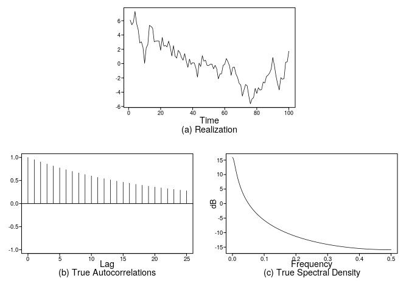
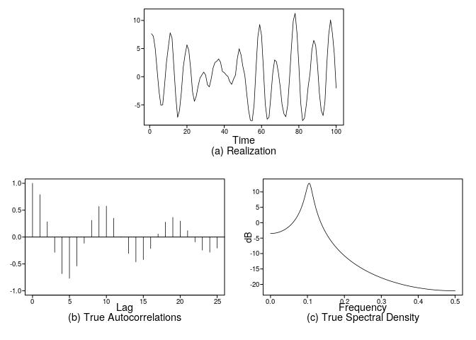
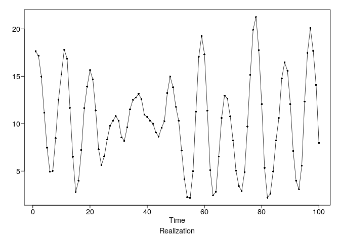

homework\_4
================
Stuart Miller
February 3, 2020

# Problem 3.2

Plot the following for the two models listed below

1.  A realization
2.  The theoretical autocorrelations
3.  The theoretical spectral density

Then find the theoretical mean and varaince (assuming a white noise
variance of 1) and the mean and varaince of the realization.

\[
X_t - 0.95 X_{t-1} = a_t
\]

Generate a realization and plot the true autocorrelations and spectral
density.

``` r
x <- plotts.true.wge(phi = 0.95)
```

<!-- -->

This AR model is in 0 mean form. Since the expectation value of the mean
of an AR process is the mean, the theoretical mean is 0. The theoretical
variance is given by

\[
\sigma_X = \frac{\sigma_a^2}{1 - \phi_1^2}
\]

Then the theoretical varaince is

``` r
1 / (1 - 0.95^2)
```

    ## [1] 10.25641

The mean and variance of the realization are

``` r
var(x$data)
```

    ## [1] 7.612985

``` r
mean(x$data)
```

    ## [1] 0.1143844

\[
(X_t - 10) - 1.5 (X_{t-1} - 10) +0.9 (X_t - 10) = a_t
\]

Generate a zero-mean realization and plot the true autocorrelations and
spectral density.

``` r
x <- plotts.true.wge(phi = c(1.5, -0.9))
```

<!-- -->

Plot the realization with the correct mean offset.

``` r
x10 <- x$data+10
plotts.wge(x$data+10)
```

<!-- -->

Since the expectation value of the mean of an AR process is the mean,
the theoretical mean is 10. The theoretical variance is given by

\[
\sigma_X = \frac{\sigma_a^2}{1 - \phi_1 \rho_1 - \phi_1 \rho_2}
\]

Then the theoretical varaince is

``` r
1 / (1 - 1.5 * x$aut1[2] + 0.9 * x$aut1[3])
```

    ## [1] 13.97059

The mean and variance of the realization are

``` r
var(x10)
```

    ## [1] 22.97921

``` r
mean(x10)
```

    ## [1] 10.33907

# Problem 3.3

Sections a, b, and d only.

Determine if the following models are stationary. Explain the answer.

\[
X_t - 1.55 X_{t-1} + X_{t-2} - 0.25 X_{t-3} = a_t
\]

This model is stationary because all of the roots are outside the unit
circle.

``` r
factor.wge(phi = c(1.55, -1, 0.25))
```

    ## 
    ## Coefficients of Original polynomial:  
    ## 1.5500 -1.0000 0.2500 
    ## 
    ## Factor                 Roots                Abs Recip    System Freq 
    ## 1-0.9877B+0.4446B^2    1.1107+-1.0076i      0.6668       0.1173
    ## 1-0.5623B              1.7785               0.5623       0.0000
    ##   
    ## 

\[
X_t -2 X_{t-1} + 1.76 X_{t-2} - 1.6 X_{t-1} + 0.77 X_{t-4} = a_t
\]

Since this AR process has a root inthe unit circle, it is not
stationary.

``` r
factor.wge(phi = c(2, -1.76, 1.6, -0.77))
```

    ## 
    ## Coefficients of Original polynomial:  
    ## 2.0000 -1.7600 1.6000 -0.7700 
    ## 
    ## Factor                 Roots                Abs Recip    System Freq 
    ## 1-1.1977B              0.8349               1.1977       0.0000
    ## 1+0.0012B+0.8001B^2   -8e-04+-1.1180i      0.8945       0.2501
    ## 1-0.8035B              1.2446               0.8035       0.0000
    ##   
    ## 

\[
X_t - 1.9 X_{t-1} + 2.3 X_{t-2} - 2 X_{t-1} + 1.2 X_{t-4} -0.4 X_{t-5} = a_t
\]

Since all the roots are outside the unit circle, this model is
stationary.

``` r
factor.wge(c(1.9, -2.3, 2, -1.2, 0.4))
```

    ## 
    ## Coefficients of Original polynomial:  
    ## 1.9000 -2.3000 2.0000 -1.2000 0.4000 
    ## 
    ## Factor                 Roots                Abs Recip    System Freq 
    ## 1+0.0080B+0.7888B^2   -0.0050+-1.1259i      0.8882       0.2507
    ## 1-1.1206B+0.6440B^2    0.8700+-0.8921i      0.8025       0.1270
    ## 1-0.7873B              1.2701               0.7873       0.0000
    ##   
    ##
