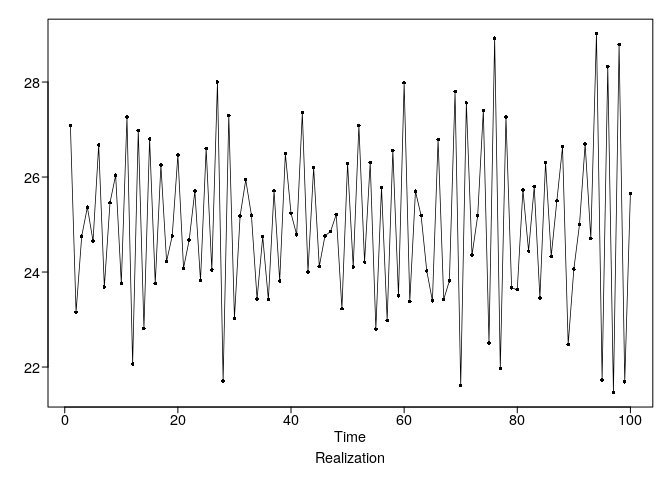

homwork\_5
================
Stuart Miller
February 3, 2020

# Problem 3.1

Plot the following for the two models listed below

1.  A realization
2.  The theoretical autocorrelations
3.  The theoretical spectral density

Then find the theoretical mean and varaince (assuming a white noise
variance of 1) and the mean and varaince of the realization.

\[
X_t - 25 = a_t - 0.95 a_{t-1} + 0.9 a_{t-2} - 0.855a_{a-3}
\]

Generate a realization and plot the true autocorrelations and spectral
density.

``` r
x <- plotts.true.wge(theta = c(0.95, -.9, .855))
```

<!-- -->

``` r
x25 = x$data + 25
```

Replot the realization with the correct mean

``` r
plotts.wge(x25)
```

<!-- -->

The the mean is 25 and the theoretical variance is given by

\[
\sigma^2 = \sigma_a^2(1 + \theta_1^2 + \theta_2^2 + \theta_3^2)
\]

Assuming the white noise variance is 1, we have

``` r
1 + 0.95^2 + 0.9^2 + 0.855^2
```

    ## [1] 3.443525

The mean and variance are calculated as follows

``` r
mean(x25)
```

    ## [1] 25.01627

``` r
var(x25)
```

    ## [1] 3.208455

# Problem 3.3

All moving average models are stationary regardless of were the roots
are located.

# Problem 3.6

For the following model

  - find the order of the model
  - write out the equation in operator form
  - determine if the model is stationary and invertable

\[
X_t - X_{t-1} + 0.26 X_{t-2} +0.64 X_{t-3} -0.576 X_{t-4} = a_t - 2.4a_{t-1} + 2.18 a_{t-2} - 0.72 a_{t-3}
\]

Factor the equation on both sides

``` r
factor.wge(c(1, -0.26, -0.64, 0.576))
```

    ## 
    ## Coefficients of Original polynomial:  
    ## 1.0000 -0.2600 -0.6400 0.5760 
    ## 
    ## Factor                 Roots                Abs Recip    System Freq 
    ## 1-1.0000B+0.9000B^2    0.5556+-0.8958i      0.9487       0.1616
    ## 1-0.8000B              1.2500               0.8000       0.0000
    ## 1+0.8000B             -1.2500               0.8000       0.5000
    ##   
    ## 

``` r
factor.wge(c(2.4, -2.18, 0.72))
```

    ## 
    ## Coefficients of Original polynomial:  
    ## 2.4000 -2.1800 0.7200 
    ## 
    ## Factor                 Roots                Abs Recip    System Freq 
    ## 1-1.6000B+0.9000B^2    0.8889+-0.5666i      0.9487       0.0903
    ## 1-0.8000B              1.2500               0.8000       0.0000
    ##   
    ## 

Based on the factoring above, the factor \((1-0.8B)\) will cancel out.
So this is an ARMA(3,2) model,

This model can be expressed as

\[
(1-B+0.9B^2)(1+0.8B) X_t = (1-1.6B+0.9B^2) a_t
\]

The factor tables show that all roots are outside of the unit circle.
Thus, the model is stationary and invertable.

# Problem 3.7

## Part A

The factor table for the model

``` r
factor.wge(c(0.1, -0.5, -.08, 0.24))
```

    ## 
    ## Coefficients of Original polynomial:  
    ## 0.1000 -0.5000 -0.0800 0.2400 
    ## 
    ## Factor                 Roots                Abs Recip    System Freq 
    ## 1-0.1455B+0.8048B^2    0.0904+-1.1110i      0.8971       0.2371
    ## 1+0.5693B             -1.7565               0.5693       0.5000
    ## 1-0.5238B              1.9091               0.5238       0.0000
    ##   
    ## 

Since all the roots of the AR process are outside the unit circle, it is
stationary. Since this is an AR model it is invertable.

The true spectral density and autocorrelations

``` r
x <- plotts.true.wge(phi = c(0.1, -0.5, -.08, 0.24))
```

<!-- -->

The roots indicate a dominate peak at \(f=0.237\) and some presence at
\(f=0\) and \(f=0.5\). There is some evidence in the period of
oscillation (4) in the autocorrelations.

## Part B

AR factor table

``` r
factor.wge(c(1.3, -0.4))
```

    ## 
    ## Coefficients of Original polynomial:  
    ## 1.3000 -0.4000 
    ## 
    ## Factor                 Roots                Abs Recip    System Freq 
    ## 1-0.8000B              1.2500               0.8000       0.0000
    ## 1-0.5000B              2.0000               0.5000       0.0000
    ##   
    ## 

MA factor table

``` r
factor.wge(c(1.9))
```

    ## 
    ## Coefficients of Original polynomial:  
    ## 1.9000 
    ## 
    ## Factor                 Roots                Abs Recip    System Freq 
    ## 1-1.9000B              0.5263               1.9000       0.0000
    ##   
    ## 

This process is stationary because all of the roots of the AR process
are outside the unit circle. However, the MA component contains a root
inside the unit circle. Thus the process is not invertable.

## Part C

The AR factor table

``` r
factor.wge(c(1.9))
```

    ## 
    ## Coefficients of Original polynomial:  
    ## 1.9000 
    ## 
    ## Factor                 Roots                Abs Recip    System Freq 
    ## 1-1.9000B              0.5263               1.9000       0.0000
    ##   
    ## 

MA factor table

``` r
factor.wge(c(1.3, -0.4))
```

    ## 
    ## Coefficients of Original polynomial:  
    ## 1.3000 -0.4000 
    ## 
    ## Factor                 Roots                Abs Recip    System Freq 
    ## 1-0.8000B              1.2500               0.8000       0.0000
    ## 1-0.5000B              2.0000               0.5000       0.0000
    ##   
    ## 

The process is not stationary because the AR component has a root inside
the unit circle. However, the process is invertable because the roots of
the MA components are outside the unit circle.

## Part D

The AR factor table

``` r
factor.wge(c(2.95, -3.87, 2.82, -0.92))
```

    ## 
    ## Coefficients of Original polynomial:  
    ## 2.9500 -3.8700 2.8200 -0.9200 
    ## 
    ## Factor                 Roots                Abs Recip    System Freq 
    ## 1-1.9484B+0.9695B^2    1.0049+-0.1475i      0.9846       0.0232
    ## 1-1.0016B+0.9490B^2    0.5278+-0.8805i      0.9742       0.1641
    ##   
    ## 

MA factor table

``` r
factor.wge(c(0.9))
```

    ## 
    ## Coefficients of Original polynomial:  
    ## 0.9000 
    ## 
    ## Factor                 Roots                Abs Recip    System Freq 
    ## 1-0.9000B              1.1111               0.9000       0.0000
    ##   
    ## 

The process is both stationary and invertable because all the roots are
outside the unit circle.

The true spectral density and autocorrelations

``` r
x <- plotts.true.wge(phi = c(2.95, -3.87, 2.82, -0.92), theta = c(0.9))
```

<!-- -->

## Part E

The AR factor table

``` r
factor.wge(c(1, 0.49, -0.9, 0.369))
```

    ## 
    ## Coefficients of Original polynomial:  
    ## 1.0000 0.4900 -0.9000 0.3690 
    ## 
    ## Factor                 Roots                Abs Recip    System Freq 
    ## 1+0.9487B             -1.0541               0.9487       0.5000
    ## 1-0.9487B              1.0541               0.9487       0.0000
    ## 1-1.0000B+0.4100B^2    1.2195+-0.9756i      0.6403       0.1074
    ##   
    ## 

MA factor table

``` r
factor.wge(c(-1, -1, -0.75))
```

    ## 
    ## Coefficients of Original polynomial:  
    ## -1.0000 -1.0000 -0.7500 
    ## 
    ## Factor                 Roots                Abs Recip    System Freq 
    ## 1+0.1443B+0.8765B^2   -0.0823+-1.0650i      0.9362       0.2623
    ## 1+0.8557B             -1.1687               0.8557       0.5000
    ##   
    ## 

This model is stationary and invertable because all the roots of the
characteristic equations are outside of the unit circle.

The AR process has dominate roots at 0 and 0.5. We expect to see peaks
in the spectral density at these points. The MA process has a dominate
root at 0.2623. We would expect to see a minimum in the spectral density
at this
point.

``` r
x <- plotts.true.wge(phi = c(1, 0.49, -0.9, 0.369), theta = c(-1, -1, -0.75))
```

<!-- -->

# Problem 3.8

## Part A

The following MA process is not invertable because it has roots inside
the unit circle.

``` r
factor.wge(c(0.5, 5))
```

    ## 
    ## Coefficients of Original polynomial:  
    ## 0.5000 5.0000 
    ## 
    ## Factor                 Roots                Abs Recip    System Freq 
    ## 1-2.5000B              0.4000               2.5000       0.0000
    ## 1+2.0000B             -0.5000               2.0000       0.5000
    ##   
    ## 

``` r
true.arma.aut.wge(theta = c(0.5, 5), lag.max = 2, plot = F)
```

    ## $acf
    ## [1]  1.00000000  0.07619048 -0.19047619
    ## 
    ## $acv
    ## [1] 26.25  2.00 -5.00

``` r
mult.wge(.4, -0.5)
```

    ## $char.poly
    ## 1 + 0.1*x - 0.2*x^2 
    ## 
    ## $model.coef
    ## [1] -0.1  0.2

An invertable MA process with the same autocorrelations is shown below.

``` r
factor.wge(c(-0.1, 0.2))
```

    ## 
    ## Coefficients of Original polynomial:  
    ## -0.1000 0.2000 
    ## 
    ## Factor                 Roots                Abs Recip    System Freq 
    ## 1+0.5000B             -2.0000               0.5000       0.5000
    ## 1-0.4000B              2.5000               0.4000       0.0000
    ##   
    ## 

``` r
true.arma.aut.wge(theta = c(-0.1, 0.2), lag.max = 2, plot = F)
```

    ## $acf
    ## [1]  1.00000000  0.07619048 -0.19047619
    ## 
    ## $acv
    ## [1]  1.05  0.08 -0.20

## Part B

The following MA model is not invertable because the roots are inside
the unit circle.

``` r
factor.wge(c(2, -1.5))
```

    ## 
    ## Coefficients of Original polynomial:  
    ## 2.0000 -1.5000 
    ## 
    ## Factor                 Roots                Abs Recip    System Freq 
    ## 1-2.0000B+1.5000B^2    0.6667+-0.4714i      1.2247       0.0980
    ##   
    ## 

``` r
true.arma.aut.wge(theta = c(2, -1.5), lag.max = 2, plot = F)
```

    ## $acf
    ## [1]  1.0000000 -0.6896552  0.2068966
    ## 
    ## $acv
    ## [1]  7.25 -5.00  1.50

An invertable MA process with the same autocorrelations is shown below.

``` r
factor.wge(c(-1.3333, -0.66667))
```

    ## 
    ## Coefficients of Original polynomial:  
    ## -1.3333 -0.6667 
    ## 
    ## Factor                 Roots                Abs Recip    System Freq 
    ## 1+1.3333B+0.6667B^2   -1.0000+-0.7071i      0.8165       0.4020
    ##   
    ## 

``` r
true.arma.aut.wge(theta = c(-1.33333, -0.66667), lag.max = 2, plot = F)
```

    ## $acf
    ## [1] 1.0000000 0.6896558 0.2068979
    ## 
    ## $acv
    ## [1] 3.222218 2.222221 0.666670

# Problem 3.11

AR Factor Table

``` r
factor.wge(c(1, 0.49, -0.9, 0.369))
```

    ## 
    ## Coefficients of Original polynomial:  
    ## 1.0000 0.4900 -0.9000 0.3690 
    ## 
    ## Factor                 Roots                Abs Recip    System Freq 
    ## 1+0.9487B             -1.0541               0.9487       0.5000
    ## 1-0.9487B              1.0541               0.9487       0.0000
    ## 1-1.0000B+0.4100B^2    1.2195+-0.9756i      0.6403       0.1074
    ##   
    ## 

MA Factor Table

``` r
factor.wge(c(-1, -1, -0.75))
```

    ## 
    ## Coefficients of Original polynomial:  
    ## -1.0000 -1.0000 -0.7500 
    ## 
    ## Factor                 Roots                Abs Recip    System Freq 
    ## 1+0.1443B+0.8765B^2   -0.0823+-1.0650i      0.9362       0.2623
    ## 1+0.8557B             -1.1687               0.8557       0.5000
    ##   
    ## 

Based on the factor tables above, this is a stationary, invertable
process

The first 10 \(\psi\)s are shown
below.

``` r
psi.weights.wge(phi = c(1, 0.49, -0.9, 0.369), theta = c(-1, -1, -0.75), lag.max = 10)
```

    ##  [1] 2.000000 3.490000 4.320000 4.599100 4.312900 3.966269 3.534480
    ##  [8] 3.293410 3.047123 2.943415

# Problem 3.13i

``` r
factor.wge(c(2.2, -2.1, 0.8))
```

    ## 
    ## Coefficients of Original polynomial:  
    ## 2.2000 -2.1000 0.8000 
    ## 
    ## Factor                 Roots                Abs Recip    System Freq 
    ## 1-1.3685B+0.9621B^2    0.7112+-0.7305i      0.9809       0.1271
    ## 1-0.8315B              1.2026               0.8315       0.0000
    ##   
    ## 

Based on the factor table, fit an AR(3) and examine two additive
components. As expected the dominate behavior comes from the pair of
complex roots. The AR(1) provides minimal impact on the realization.

``` r
X = gen.arma.wge(n = 100, phi = c(2.2, -2.1, 0.8), plot = F, sn = 42)
factor.comp.wge(X, p = 3, ncomp = 2)
```

    ## 
    ## Coefficients of Original polynomial:  
    ## 2.2000 -2.1017 0.7944 
    ## 
    ## Factor                 Roots                Abs Recip    System Freq 
    ## 1-1.3821B+0.9713B^2    0.7115+-0.7234i      0.9855       0.1263
    ## 1-0.8179B              1.2226               0.8179       0.0000
    ##   
    ## 

<!-- -->

    ## $ncomp
    ## [1] 2
    ## 
    ## $x.comp
    ##      [,1] [,2]      [,3]      [,4]      [,5]      [,6]      [,7]      [,8]
    ## [1,]    0    0 -1.784282  3.196867  8.157818  5.185724  2.535222 -2.323126
    ## [2,]    0    0 -3.824303 -3.287923 -5.288424 -2.122833 -2.380030 -1.282878
    ##            [,9]      [,10]     [,11]       [,12]    [,13]    [,14]
    ## [1,] -4.8690053 -4.0375701 -2.255035  5.27619467 6.288857 5.647725
    ## [2,] -0.8887881 -0.9330539  2.335607 -0.09218807 2.115727 2.051977
    ##          [,15]      [,16]     [,17]      [,18]      [,19]     [,20]
    ## [1,] 2.0340046 -4.6185690 -9.138161 -6.2328496 -0.1366943  4.080766
    ## [2,] 0.5677128  0.8278767  2.241565  0.6766466 -1.4087359 -1.177200
    ##         [,21]     [,22]     [,23]     [,24]     [,25]     [,26]     [,27]
    ## [1,] 5.312269 5.4553094  3.227722 -2.539029 -8.126125 -9.006219 -4.682459
    ## [2,] 0.864616 0.7265444 -1.663274 -3.366248 -3.973736 -4.487945 -4.340640
    ##          [,28]     [,29]    [,30]     [,31]      [,32]     [,33]     [,34]
    ## [1,]  2.479668 10.336937 12.30268  4.624874 -3.8095195 -9.742913 -5.613690
    ## [2,] -3.002134 -3.767802 -5.08576 -2.353708 -0.8186745  1.722317 -2.177961
    ##          [,35]     [,36]    [,37]      [,38]    [,39]      [,40]
    ## [1,] -1.848893 2.2389239 7.159922  9.6333038 3.607409 -2.1569329
    ## [2,] -2.064725 0.4504705 1.466195 -0.2670214 1.767611  0.3417499
    ##           [,41]      [,42]      [,43]    [,44]     [,45]    [,46]
    ## [1,] -8.0048292 -10.789103 -4.2794666 2.972027 9.9733960 11.28876
    ## [2,] -0.2364864   1.957643  0.4147257 1.307102 0.2002494 -2.56107
    ##          [,47]     [,48]      [,49]      [,50]     [,51]     [,52]
    ## [1,]  3.334414 -6.615597 -13.373385 -11.734422 -2.847085  8.144144
    ## [2,] -2.923657 -3.758498  -3.814346  -4.300696 -4.788571 -5.262273
    ##           [,53]     [,54]     [,55]      [,56]      [,57]     [,58]
    ## [1,] 12.4367096 14.842825  5.958066 -6.8346636 -15.387950 -11.08386
    ## [2,] -0.9976072 -3.223252 -2.526448 -0.5165172   2.933055   1.95439
    ##          [,59]     [,60]     [,61]     [,62]      [,63]      [,64]
    ## [1,] -1.613887 12.090204 12.921231 9.5191171 -0.9798115 -10.199189
    ## [2,]  3.042534 -1.383763  1.775562 0.7826577  1.0691725  -0.589928
    ##            [,65]      [,66]      [,67]    [,68]     [,69]    [,70]
    ## [1,] -15.3522874 -12.217564 -0.4129184 16.50659 19.296352 9.630745
    ## [2,]  -0.1961393   2.524999  5.5318415  1.59386  2.506781 5.808871
    ##          [,71]      [,72]      [,73]      [,74]     [,75]    [,76]
    ## [1,] -3.140770 -14.754039 -18.090482 -12.267799 0.1513339 13.61659
    ## [2,]  5.606045   4.978783   3.454756   3.167291 4.1397998  3.91401
    ##          [,77]     [,78]     [,79]      [,80]      [,81]      [,82]
    ## [1,] 18.657618 12.365520 -2.981351 -15.159568 -19.412597 -13.929538
    ## [2,]  3.938099  3.661839  5.313362   4.159575   2.858019   3.571576
    ##         [,83]     [,84]    [,85]     [,86]     [,87]      [,88]      [,89]
    ## [1,] 1.114533 15.003145 19.54056 10.365513 -4.411251 -13.259877 -16.641566
    ## [2,] 2.504581  1.707981  1.08180  3.736639  6.832842   4.601475   3.844948
    ##           [,90]       [,91]     [,92]     [,93]     [,94]     [,95]
    ## [1,] -10.483417  1.82365884 11.953759 12.510668 5.2386935 -4.739179
    ## [2,]   2.499843 -0.01970276 -2.455583 -1.792279 0.4942672  3.918460
    ##           [,96]     [,97]     [,98]     [,99]    [,100]
    ## [1,] -6.9721624 -8.633167 -6.020189  1.346782  5.479752
    ## [2,] -0.2070784 -1.553725 -2.282571 -5.626932 -6.360333
