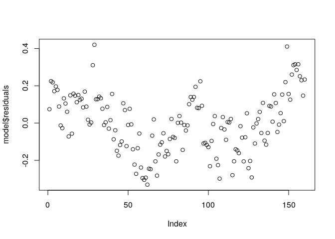
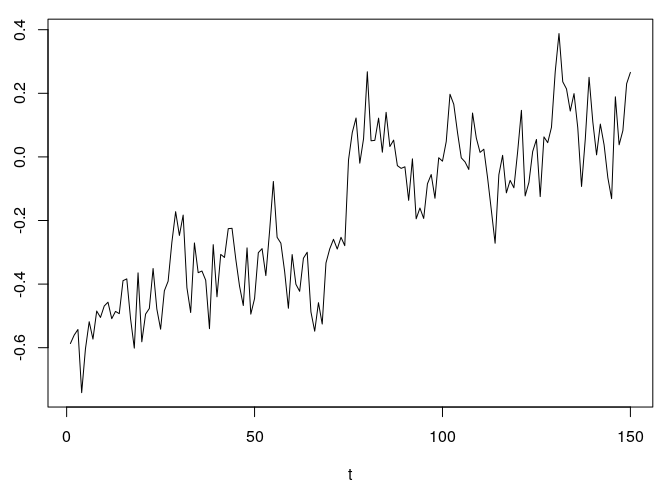
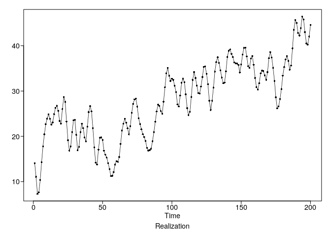

homework\_6
================
Stuart Miller
February 9, 2020

# Homework 6

## Problem 5.1

### Part A

Plot the data.

``` r
plotts.wge(hadley)
```

<!-- -->

### Part B

Fit a regression model as `hadley` ~ `time`.

``` r
time <- seq_along(hadley)
model <- lm(hadley ~ time)
summary(model)
```

    ## 
    ## Call:
    ## lm(formula = hadley ~ time)
    ## 
    ## Residuals:
    ##      Min       1Q   Median       3Q      Max 
    ## -0.33041 -0.11126 -0.00045  0.11489  0.42004 
    ## 
    ## Coefficients:
    ##               Estimate Std. Error t value Pr(>|t|)    
    ## (Intercept) -0.5257370  0.0251087  -20.94   <2e-16 ***
    ## time         0.0044378  0.0002705   16.40   <2e-16 ***
    ## ---
    ## Signif. codes:  0 '***' 0.001 '**' 0.01 '*' 0.05 '.' 0.1 ' ' 1
    ## 
    ## Residual standard error: 0.1581 on 158 degrees of freedom
    ## Multiple R-squared:   0.63,  Adjusted R-squared:  0.6277 
    ## F-statistic: 269.1 on 1 and 158 DF,  p-value: < 2.2e-16

### Part C

Find and plot the residuals for the linear model.

``` r
plot(model$residuals)
```

<!-- -->

### Part D

The residuals could have come from a stationary model. Constant mean
apepars to be reasonable. The varaince appears to be constant. The
autocorrelation for the first half of the data and the second half of
the data are very similar.

``` r
resid.size <- length(model$residuals)
acf(model$residuals[1:resid.size/2])
```

<!-- -->

``` r
acf(model$residuals[resid.size/2:resid.size])
```

<!-- -->

### Part E

The autocorrelations of `hadley` are more slowly damping than the
residuals. There is some suggestion of oscillatory behavior, but it is
not strong.

The autocorrelations of the residuals of the linear model fall off much
more rapidly. Additionally, there is stronger evidence of oscillator
behavior.

``` r
plotts.sample.wge(hadley)
```

<!-- -->

    ## $autplt
    ##  [1] 1.0000000 0.8820605 0.8128813 0.7852494 0.7752263 0.7331609 0.7031676
    ##  [8] 0.6727347 0.6463440 0.6061416 0.5928766 0.5630748 0.5107994 0.4681787
    ## [15] 0.4733601 0.4398667 0.4210580 0.4237071 0.4311625 0.3969888 0.3609513
    ## [22] 0.3374603 0.3103957 0.2803260 0.2720408 0.2699888
    ## 
    ## $freq
    ##  [1] 0.00625 0.01250 0.01875 0.02500 0.03125 0.03750 0.04375 0.05000
    ##  [9] 0.05625 0.06250 0.06875 0.07500 0.08125 0.08750 0.09375 0.10000
    ## [17] 0.10625 0.11250 0.11875 0.12500 0.13125 0.13750 0.14375 0.15000
    ## [25] 0.15625 0.16250 0.16875 0.17500 0.18125 0.18750 0.19375 0.20000
    ## [33] 0.20625 0.21250 0.21875 0.22500 0.23125 0.23750 0.24375 0.25000
    ## [41] 0.25625 0.26250 0.26875 0.27500 0.28125 0.28750 0.29375 0.30000
    ## [49] 0.30625 0.31250 0.31875 0.32500 0.33125 0.33750 0.34375 0.35000
    ## [57] 0.35625 0.36250 0.36875 0.37500 0.38125 0.38750 0.39375 0.40000
    ## [65] 0.40625 0.41250 0.41875 0.42500 0.43125 0.43750 0.44375 0.45000
    ## [73] 0.45625 0.46250 0.46875 0.47500 0.48125 0.48750 0.49375 0.50000
    ## 
    ## $db
    ##  [1]  15.6406277   6.9663349  11.4519758   4.9039650   5.8095493
    ##  [6]   0.7497216   1.2656980   3.2714654  -2.4224515  -3.7680781
    ## [11]  -8.0695697  -6.8828614 -10.7966800  -5.2373541  -5.4691137
    ## [16]  -3.9185057  -1.2629891  -2.7934508  -3.8694639 -11.7394793
    ## [21]  -5.8785895 -11.0836710 -13.0939538  -9.0398846  -8.8781437
    ## [26]  -4.4500294  -1.6718928  -6.3097544 -10.1693957 -12.0420959
    ## [31]  -2.6866746  -9.0346526  -4.6371360  -3.9441557 -24.5082614
    ## [36]  -6.8827269 -10.0574136  -4.5783960 -33.4513372  -9.1629302
    ## [41] -18.2399755 -16.2014361  -8.3864503  -2.5310922  -1.8715639
    ## [46]  -6.1300440 -13.4501334 -14.5603648 -12.5245260  -9.3365900
    ## [51] -11.7565738 -21.7713422 -13.8847538 -33.7143697 -16.7637159
    ## [56]  -4.0081984  -8.3820592 -21.9875069 -20.9652306  -6.8569397
    ## [61]  -8.6105785 -14.9899050 -12.9796915 -16.3862529 -17.5863889
    ## [66] -17.1215665  -9.0393960  -9.3576101  -6.1680763 -16.7637722
    ## [71] -10.1554283 -20.1881983 -15.7094014 -14.7789416  -9.8255110
    ## [76] -13.9634314  -9.6372063 -19.4677971  -6.5193886  -4.1014890
    ## 
    ## $dbz
    ##  [1]  11.1574793  10.7497675  10.0709630   9.1239540   7.9170528
    ##  [6]   6.4697586   4.8219048   3.0452743   1.2509382  -0.4228378
    ## [11]  -1.8511241  -2.9638815  -3.7471525  -4.2223165  -4.4485015
    ## [16]  -4.5298080  -4.5895238  -4.7279154  -4.9962392  -5.3903865
    ## [21]  -5.8547199  -6.2964961  -6.6194320  -6.7700446  -6.7620602
    ## [26]  -6.6554910  -6.5157026  -6.3885340  -6.2979388  -6.2542954
    ## [31]  -6.2630466  -6.3293659  -6.4583001  -6.6513066  -6.9004338
    ## [36]  -7.1817895  -7.4516810  -7.6518137  -7.7295269  -7.6672792
    ## [41]  -7.4990865  -7.2978130  -7.1457088  -7.1112343  -7.2400281
    ## [46]  -7.5542069  -8.0523992  -8.7060918  -9.4518158 -10.1856684
    ## [51] -10.7781359 -11.1261061 -11.2150093 -11.1240635 -10.9680423
    ## [56] -10.8410002 -10.7973205 -10.8565184 -11.0128724 -11.2425330
    ## [61] -11.5082780 -11.7648759 -11.9681502 -12.0878733 -12.1190835
    ## [66] -12.0837866 -12.0205370 -11.9678235 -11.9490273 -11.9626176
    ## [71] -11.9786721 -11.9446522 -11.8047676 -11.5293943 -11.1358399
    ## [76] -10.6825612 -10.2434807  -9.8841822  -9.6511128  -9.5706205

``` r
plotts.sample.wge(model$residuals)
```

<!-- -->

    ## $autplt
    ##  [1]  1.00000000  0.72756788  0.56564743  0.52397481  0.53612982
    ##  [6]  0.46526334  0.42603917  0.39656613  0.38700664  0.33716908
    ## [11]  0.33380081  0.29091460  0.21433524  0.15892538  0.19405827
    ## [16]  0.15591365  0.12919194  0.15564610  0.19445877  0.13105678
    ## [21]  0.06907000  0.02707135 -0.01325635 -0.06915329 -0.07226182
    ## [26] -0.05808824
    ## 
    ## $freq
    ##  [1] 0.00625 0.01250 0.01875 0.02500 0.03125 0.03750 0.04375 0.05000
    ##  [9] 0.05625 0.06250 0.06875 0.07500 0.08125 0.08750 0.09375 0.10000
    ## [17] 0.10625 0.11250 0.11875 0.12500 0.13125 0.13750 0.14375 0.15000
    ## [25] 0.15625 0.16250 0.16875 0.17500 0.18125 0.18750 0.19375 0.20000
    ## [33] 0.20625 0.21250 0.21875 0.22500 0.23125 0.23750 0.24375 0.25000
    ## [41] 0.25625 0.26250 0.26875 0.27500 0.28125 0.28750 0.29375 0.30000
    ## [49] 0.30625 0.31250 0.31875 0.32500 0.33125 0.33750 0.34375 0.35000
    ## [57] 0.35625 0.36250 0.36875 0.37500 0.38125 0.38750 0.39375 0.40000
    ## [65] 0.40625 0.41250 0.41875 0.42500 0.43125 0.43750 0.44375 0.45000
    ## [73] 0.45625 0.46250 0.46875 0.47500 0.48125 0.48750 0.49375 0.50000
    ## 
    ## $db
    ##  [1]  14.02556890  10.48633311   9.97170186  -0.25125984   2.94455700
    ##  [6]  -8.10154440   2.08891533   4.70435483  -7.94975956  -7.26889855
    ## [11]   0.34239899  -9.32833063  -3.64613479  -4.60299876  -3.24376056
    ## [16]  -0.77870523   1.14170193   1.62750342  -0.25632516 -25.40310937
    ## [21]  -0.41118037  -5.26949734 -15.35595893  -4.24572643  -6.14698841
    ## [26]  -0.92521391   0.19169866  -4.74206191 -10.87353258  -2.73683785
    ## [31]  -0.53533624  -7.68012626  -1.02723181   0.09994786  -9.73851016
    ## [36]  -0.70307250 -11.23692574   0.13998961 -13.03801986  -4.43528587
    ## [41] -14.08940895  -6.06629510  -7.87923182   0.38092126   0.78265787
    ## [46]  -2.12447219 -14.72030913 -16.45804614  -9.42528170  -6.28580141
    ## [51]  -6.52828895  -9.38361986 -12.58550336 -15.06279697 -11.81658297
    ## [56]  -1.51317132  -6.97969137 -16.63871608 -26.37570415  -4.85107943
    ## [61]  -6.40193109 -18.40489537  -7.11432394  -8.34054096 -12.66586674
    ## [66] -27.19716314  -7.51959736  -7.87551980  -3.55800626 -18.73529218
    ## [71]  -9.65013789  -9.76473251 -13.05722035  -9.23939878  -7.17485894
    ## [76] -12.08569517  -7.87768597  -9.46758485  -3.69387671  -1.44647997
    ## 
    ## $dbz
    ##  [1]  9.4310397  9.1218265  8.6116723  7.9098315  7.0322680  6.0047429
    ##  [7]  4.8664092  3.6726411  2.4946318  1.4127921  0.5028684 -0.1820512
    ## [13] -0.6270854 -0.8617693 -0.9524035 -0.9824499 -1.0302651 -1.1531196
    ## [19] -1.3793316 -1.7054436 -2.0963300 -2.4906007 -2.8168762 -3.0211306
    ## [25] -3.0902122 -3.0517287 -2.9514209 -2.8294088 -2.7105652 -2.6079617
    ## [31] -2.5310914 -2.4917312 -2.5042465 -2.5809198 -2.7249129 -2.9237030
    ## [37] -3.1458771 -3.3451211 -3.4748620 -3.5105453 -3.4659269 -3.3899583
    ## [43] -3.3473711 -3.3982033 -3.5858994 -3.9328532 -4.4380958 -5.0733144
    ## [49] -5.7774213 -6.4566887 -7.0046294 -7.3474589 -7.4856738 -7.4877926
    ## [55] -7.4434063 -7.4223548 -7.4613904 -7.5686848 -7.7332545 -7.9335600
    ## [61] -8.1441544 -8.3407062 -8.5038889 -8.6223607 -8.6944862 -8.7278990
    ## [67] -8.7361464 -8.7326596 -8.7234937 -8.7011062 -8.6421543 -8.5128164
    ## [73] -8.2832406 -7.9459027 -7.5256818 -7.0735944 -6.6498132 -6.3080786
    ## [79] -6.0876911 -6.0117218

## Problem 5.2

### Part A

Generate 3 realizations for the following model. Do any of the models
appear to have a linear trend?

The first model appears to have a negative linear trend.

\[
X_t - 0.66 X_{t-1} + 0.02 X_{t-2} - 0.10 X_{t-3} - 0.24 X_{t-4} = a_t
\]

``` r
phi <- c(0.66, -0.02, 0.1, 0.24)
x1 <- gen.arma.wge(n = 150, phi = phi, plot = T, sn = 1)
```

<!-- -->

``` r
x2 <- gen.arma.wge(n = 150, phi = phi, plot = T, sn = 42)
```

<!-- -->

``` r
x3 <- gen.arma.wge(n = 150, phi = phi, plot = T, sn = 35)
```

<!-- -->

### Part B

Plot 4 realizations for the following model and compare to the hadley
realization.

The forth realization looks similar to the hadley realization. The
trends appear to be strong in the other realizations.

\[
X_t = -0.526 + 0.0044t + Z_t
\]

Where

\[
(1 - 0.614 B  + 0.044 B^2 - 0.077 B^3 - 0.0206 B^4)  Z_t = 0
\]

``` r
phi <- c(0.614, -0.044, 0.077, 0.0206)
x1 <- gen.sigplusnoise.wge(n = 150, b0 = -0.526, b1 = 0.0044,
                           phi = phi, sn = 1, vara = 0.01)
```

<!-- --><!-- -->

``` r
x2 <- gen.sigplusnoise.wge(n = 150, b0 = -0.526, b1 = 0.0044,
                           phi = phi, sn = 42, vara = 0.01)
```

<!-- --><!-- -->

``` r
x3 <- gen.sigplusnoise.wge(n = 150, b0 = -0.526, b1 = 0.0044,
                           phi = phi, sn = 37, vara = 0.01)
```

<!-- --><!-- -->

``` r
x4 <- gen.sigplusnoise.wge(n = 150, b0 = -0.526, b1 = 0.0044,
                           phi = phi, sn = 35, vara = 0.01)
```

<!-- --><!-- -->

## Problem 5.3 (a, b, d)

For the following models generate a realziation and discuss the
observable featrues. Additionalyl identify if the model is

  - Stationary
  - Non-stationary
  - Seasonal (and non-stationary)

\[
\left(1- 1.2B + 0.8 B^2 \right) (1-B) X_t = a_t
\]

\[
\left(1- 1.2B + 0.8 B^2 \right) (1-B)^2 X_t = a_t
\]

\[
\left(1- 1.2B + 0.8 B^2 \right) (1-B)^2 \left( 1 - B^4 \right)
\left(1 + B + B^2 \right) X_t = a_t
\]

### Realizations

``` r
phi = c(1.2, -0.8)
gen.aruma.wge(n = 200, phi = phi, d = 1, sn = 3)
```

<!-- -->

    ##   [1] 14.031881 11.055455  7.290494  7.617737 10.356970 14.295117 17.794171
    ##   [8] 20.450522 22.674299 23.920214 24.854143 23.854474 22.576056 23.058103
    ##  [15] 24.893868 26.292452 26.740361 25.608397 23.391109 22.799833 26.019669
    ##  [22] 28.647336 27.623845 23.254968 19.154204 16.839541 17.736235 20.900541
    ##  [29] 23.549855 23.649654 20.327711 16.943666 17.703156 20.905110 22.782546
    ##  [36] 21.802678 19.774807 18.896547 22.141564 25.367320 26.699974 25.521486
    ##  [43] 21.779659 17.569816 14.179112 13.755466 17.045188 19.689052 19.772732
    ##  [50] 19.219228 16.815546 15.935028 15.307981 14.077489 12.745950 11.216857
    ##  [57] 11.296661 12.126094 13.785553 14.494045 14.360403 15.446864 18.310759
    ##  [64] 21.290693 22.777473 23.862010 23.009205 21.780365 20.434657 22.247084
    ##  [71] 25.193934 27.162842 28.137480 28.322859 26.556646 23.986957 22.717563
    ##  [78] 21.561672 20.477126 19.846083 18.954902 17.466218 16.832988 16.937243
    ##  [85] 17.294456 18.923850 20.897565 23.236189 25.497015 27.004490 26.691472
    ##  [92] 25.573947 24.961937 27.657781 30.847339 33.886239 35.123117 33.393436
    ##  [99] 32.209835 32.726181 32.447821 31.150404 29.790177 27.036588 26.591062
    ## [106] 29.019777 31.806112 32.733978 31.950022 29.294680 26.204192 24.681915
    ## [113] 25.431104 28.717751 32.456566 34.179724 32.876585 31.212960 29.559788
    ## [120] 29.471132 30.990225 33.099502 35.336363 35.445623 33.784353 31.508247
    ## [127] 27.871258 25.806077 27.860145 30.781096 34.302493 36.395953 37.476964
    ## [134] 36.241597 34.580210 32.993177 31.733294 31.869533 34.353885 37.540136
    ## [141] 38.873972 39.177688 38.171923 37.533265 36.312107 36.120633 36.064336
    ## [148] 35.770575 34.096605 35.842149 38.062830 39.525568 39.598675 37.637722
    ## [155] 35.486528 35.131565 37.192361 37.713926 35.788341 32.894004 30.895767
    ## [162] 30.307715 31.720929 33.922928 34.524067 34.398177 33.429489 32.462538
    ## [169] 34.204368 37.264710 38.576050 37.416489 35.140389 32.224847 28.617712
    ## [176] 26.151322 26.611751 28.216327 30.457850 33.386095 35.301384 36.954360
    ## [183] 37.683768 36.665666 34.702538 35.649605 39.427958 43.546545 45.687496
    ## [190] 45.030130 42.835951 42.237464 43.890464 46.442666 45.784456 43.000649
    ## [197] 40.522793 40.211256 42.030721 44.574101

``` r
gen.aruma.wge(n = 200, phi = phi, d = 2, sn = 3)
```

<!-- -->

    ##   [1] 1375.901 1386.957 1394.247 1401.865 1412.222 1426.517 1444.311
    ##   [8] 1464.762 1487.436 1511.356 1536.210 1560.065 1582.641 1605.699
    ##  [15] 1630.593 1656.885 1683.626 1709.234 1732.625 1755.425 1781.445
    ##  [22] 1810.092 1837.716 1860.971 1880.125 1896.965 1914.701 1935.601
    ##  [29] 1959.151 1982.801 2003.129 2020.072 2037.775 2058.680 2081.463
    ##  [36] 2103.266 2123.041 2141.937 2164.079 2189.446 2216.146 2241.667
    ##  [43] 2263.447 2281.017 2295.196 2308.951 2325.997 2345.686 2365.458
    ##  [50] 2384.678 2401.493 2417.428 2432.736 2446.814 2459.560 2470.777
    ##  [57] 2482.073 2494.199 2507.985 2522.479 2536.839 2552.286 2570.597
    ##  [64] 2591.888 2614.665 2638.527 2661.536 2683.317 2703.751 2725.998
    ##  [71] 2751.192 2778.355 2806.493 2834.815 2861.372 2885.359 2908.077
    ##  [78] 2929.638 2950.115 2969.962 2988.916 3006.383 3023.216 3040.153
    ##  [85] 3057.447 3076.371 3097.269 3120.505 3146.002 3173.006 3199.698
    ##  [92] 3225.272 3250.234 3277.892 3308.739 3342.625 3377.748 3411.142
    ##  [99] 3443.352 3476.078 3508.526 3539.676 3569.466 3596.503 3623.094
    ## [106] 3652.114 3683.920 3716.654 3748.604 3777.898 3804.103 3828.784
    ## [113] 3854.216 3882.933 3915.390 3949.570 3982.446 4013.659 4043.219
    ## [120] 4072.690 4103.680 4136.780 4172.116 4207.562 4241.346 4272.854
    ## [127] 4300.726 4326.532 4354.392 4385.173 4419.475 4455.871 4493.348
    ## [134] 4529.590 4564.170 4597.163 4628.897 4660.766 4695.120 4732.660
    ## [141] 4771.534 4810.712 4848.884 4886.417 4922.729 4958.850 4994.914
    ## [148] 5030.685 5064.781 5100.623 5138.686 5178.212 5217.811 5255.448
    ## [155] 5290.935 5326.066 5363.259 5400.973 5436.761 5469.655 5500.551
    ## [162] 5530.858 5562.579 5596.502 5631.026 5665.425 5698.854 5731.317
    ## [169] 5765.521 5802.786 5841.362 5878.778 5913.919 5946.143 5974.761
    ## [176] 6000.912 6027.524 6055.741 6086.198 6119.584 6154.886 6191.840
    ## [183] 6229.524 6266.190 6300.892 6336.542 6375.970 6419.516 6465.204
    ## [190] 6510.234 6553.070 6595.307 6639.198 6685.640 6731.425 6774.426
    ## [197] 6814.948 6855.160 6897.190 6941.764

``` r
md <- gen.aruma.wge(n = 200, phi = phi, d = 1, s= 4, lambda = c(-1,-1), sn = 3)
```

<!-- -->

### Part A

Since this model has a root on the unit circle, it is non-stationary.
The realization exhibits a psuedo-periodic behavior, which is consistent
with the complex root in the AR porition of the model.

``` r
factor.wge(phi = phi)
```

    ## 
    ## Coefficients of Original polynomial:  
    ## 1.2000 -0.8000 
    ## 
    ## Factor                 Roots                Abs Recip    System Freq 
    ## 1-1.2000B+0.8000B^2    0.7500+-0.8292i      0.8944       0.1330
    ##   
    ## 

### Part B

The realization almost appears to be a linear trend. This model has two
roots on the unit circle, which dominate the realiztion behavior.

### Part D

This model contains a quarterly seasonal factor, 2 roots on the unit
circle, and addtional non-stationary factors. The model is dominated by
the roots on the unit circle. The quarterly oscillatory behavior is also
expressed.

``` r
model.d <- mult.wge(phi,c(1,1),c(rep(0,3),1),c(-1,-1))
factor.wge(model.d$model.coef)
```

    ## 
    ## Coefficients of Original polynomial:  
    ## 1.2000 0.2000 0.8000 0.4000 -0.8000 0.6000 -0.8000 0.6000 -0.4000 -0.8000 
    ## 
    ## Factor                 Roots                Abs Recip    System Freq 
    ## 1-1.6180B              0.6180               1.6180       0.0000
    ## 1+1.0000B             -1.0000               1.0000       0.5000
    ## 1+1.0000B+1.0000B^2   -0.5000+-0.8660i      1.0000       0.3333
    ## 1-1.0000B              1.0000               1.0000       0.0000
    ## 1+0.0000B+1.0000B^2    0.0000+-1.0000i      1.0000       0.2500
    ## 1-1.2000B+0.8000B^2    0.7500+-0.8292i      0.8944       0.1330
    ## 1+0.6180B             -1.6180               0.6180       0.5000
    ##   
    ## 

``` r
plotts.sample.wge(md)
```

<!-- -->

    ## $autplt
    ##  [1] 1.0000000 0.9813966 0.9639612 0.9512430 0.9368218 0.9192595 0.9029060
    ##  [8] 0.8889002 0.8753205 0.8588114 0.8413109 0.8282296 0.8156845 0.7980122
    ## [15] 0.7812838 0.7692959 0.7557436 0.7389902 0.7234077 0.7103006 0.6972902
    ## [22] 0.6816232 0.6652352 0.6529859 0.6410860 0.6243561
    ## 
    ## $freq
    ##   [1] 0.005 0.010 0.015 0.020 0.025 0.030 0.035 0.040 0.045 0.050 0.055
    ##  [12] 0.060 0.065 0.070 0.075 0.080 0.085 0.090 0.095 0.100 0.105 0.110
    ##  [23] 0.115 0.120 0.125 0.130 0.135 0.140 0.145 0.150 0.155 0.160 0.165
    ##  [34] 0.170 0.175 0.180 0.185 0.190 0.195 0.200 0.205 0.210 0.215 0.220
    ##  [45] 0.225 0.230 0.235 0.240 0.245 0.250 0.255 0.260 0.265 0.270 0.275
    ##  [56] 0.280 0.285 0.290 0.295 0.300 0.305 0.310 0.315 0.320 0.325 0.330
    ##  [67] 0.335 0.340 0.345 0.350 0.355 0.360 0.365 0.370 0.375 0.380 0.385
    ##  [78] 0.390 0.395 0.400 0.405 0.410 0.415 0.420 0.425 0.430 0.435 0.440
    ##  [89] 0.445 0.450 0.455 0.460 0.465 0.470 0.475 0.480 0.485 0.490 0.495
    ## [100] 0.500
    ## 
    ## $db
    ##   [1]  17.8937885  11.4274938   8.1264357   5.8766552   4.1740841
    ##   [6]   2.3736648   0.9120182   0.1554638  -1.2038992  -2.0716513
    ##  [11]  -2.8797620  -3.5377323  -4.2092317  -4.9490367  -5.6122606
    ##  [16]  -6.0545149  -6.3621488  -7.1464782  -7.5062589  -7.9752032
    ##  [21]  -8.4902798  -8.6560068  -9.0399333  -9.3626966  -9.7364816
    ##  [26] -10.2212989 -10.3208682 -10.9384448 -10.9472095 -11.4512627
    ##  [31] -11.7449297 -12.0916207 -11.7787382 -11.9225739 -12.3919408
    ##  [36] -12.5968279 -12.8809053 -13.1606167 -13.5314555 -13.6539355
    ##  [41] -13.8674886 -13.8957476 -13.9437822 -14.0479427 -14.6000471
    ##  [46] -15.1173680 -15.2567068 -15.4763995 -16.5219009  -5.6174199
    ##  [51] -13.6820258 -14.4889120 -15.2153745 -15.8734749 -15.2299113
    ##  [56] -15.8809193 -15.9066372 -15.8206407 -16.1997737 -16.1560067
    ##  [61] -16.1812855 -15.6432898 -16.5394290 -15.8893854 -15.6921802
    ##  [66] -13.6164811 -13.3042908 -17.9874899 -16.9458941 -17.0739590
    ##  [71] -17.0453388 -16.9793233 -17.1874304 -17.4650027 -17.5310395
    ##  [76] -17.3303664 -17.4432196 -17.5318738 -17.6745837 -17.6836244
    ##  [81] -17.7201104 -17.6902653 -17.7252764 -17.8432512 -17.8637441
    ##  [86] -17.8501336 -17.8975055 -18.0303592 -18.0232697 -17.9037805
    ##  [91] -17.8946052 -18.1447169 -17.8718451 -18.1313889 -18.0511050
    ##  [96] -17.8581384 -17.9227146 -17.7492523 -17.8728914 -35.5731015
    ## 
    ## $dbz
    ##   [1]  12.6235910  12.2434640  11.6055270  10.7035053   9.5295587
    ##   [6]   8.0761913   6.3407844   4.3358156   2.1099543  -0.2168993
    ##  [11]  -2.4268578  -4.2663278  -5.6283812  -6.6225783  -7.3990197
    ##  [16]  -7.9998331  -8.3947691  -8.5983020  -8.7163699  -8.8876780
    ##  [21]  -9.2123608  -9.7250292 -10.3965841 -11.1463370 -11.8686199
    ##  [26] -12.4793290 -12.9564800 -13.3333835 -13.6515671 -13.9238346
    ##  [31] -14.1363150 -14.2787551 -14.3715465 -14.4643766 -14.6111450
    ##  [36] -14.8442057 -15.1617185 -15.5284299 -15.8870701 -16.1770058
    ##  [41] -16.3520135 -16.3873111 -16.2763380 -16.0286375 -15.6740221
    ##  [46] -15.2643174 -14.8644571 -14.5373142 -14.3318817 -14.2786974
    ##  [51] -14.3904015 -14.6640621 -15.0831639 -15.6184708 -16.2277974
    ##  [56] -16.8556224 -17.4351851 -17.8976257 -18.1908518 -18.3009387
    ##  [61] -18.2593667 -18.1279785 -17.9736725 -17.8498051 -17.7898084
    ##  [66] -17.8090973 -17.9100317 -18.0867052 -18.3280336 -18.6186845
    ##  [71] -18.9384275 -19.2616829 -19.5597648 -19.8073002 -19.9908693
    ##  [76] -20.1143113 -20.1959996 -20.2593005 -20.3222961 -20.3921980
    ##  [81] -20.4660390 -20.5359085 -20.5952264 -20.6424245 -20.6803030
    ##  [86] -20.7123899 -20.7395329 -20.7593331 -20.7686763 -20.7672974
    ##  [91] -20.7595476 -20.7529131 -20.7542688 -20.7663673 -20.7867095
    ##  [96] -20.8093302 -20.8282649 -20.8404644 -20.8463515 -20.8479583

## Problem 5.5

### Part A

The factored model is

\[
(1-B)^2 (1 + B + B^2)(1 - B + 0.5 B^2) = 1-1.7B+0.8B^2
\]

There are no canceling factors, the model is an ARUMA(2,4,2).

#### AR Factor Table

``` r
factor.wge(c(3, -4.5, 5, -4, 2, -0.5))
```

    ## 
    ## Coefficients of Original polynomial:  
    ## 3.0000 -4.5000 5.0000 -4.0000 2.0000 -0.5000 
    ## 
    ## Factor                 Roots                Abs Recip    System Freq 
    ## 1-1.0000B              1.0000               1.0000       0.0000
    ## 1+0.0000B+1.0000B^2    0.0000+-1.0000i      1.0000       0.2500
    ## 1-1.0000B              1.0000               1.0000       0.0000
    ## 1-1.0000B+0.5000B^2    1.0000+-1.0000i      0.7071       0.1250
    ##   
    ## 

#### MA Factor Table

``` r
factor.wge(c(1.7,-0.8))
```

    ## 
    ## Coefficients of Original polynomial:  
    ## 1.7000 -0.8000 
    ## 
    ## Factor                 Roots                Abs Recip    System Freq 
    ## 1-1.7000B+0.8000B^2    1.0625+-0.3480i      0.8944       0.0504
    ##   
    ## 

### Part B

The factored model is

\[
(1-B) (1 + B + 0.8B^2) (1 + 0.5 B^2) (1 -0.5B) = 0
\]

There are no canceling factors, the model is an ARUMA(5,1,0).

#### AR Factor Table

``` r
factor.wge(c(0.5, -0.3, 0.95, -0.3, 0.35, -0.2))
```

    ## 
    ## Coefficients of Original polynomial:  
    ## 0.5000 -0.3000 0.9500 -0.3000 0.3500 -0.2000 
    ## 
    ## Factor                 Roots                Abs Recip    System Freq 
    ## 1-1.0000B              1.0000               1.0000       0.0000
    ## 1+1.0000B+0.8000B^2   -0.6250+-0.9270i      0.8944       0.3444
    ## 1+0.0000B+0.5000B^2    0.0000+-1.4142i      0.7071       0.2500
    ## 1-0.5000B              2.0000               0.5000       0.0000
    ##   
    ## 

#### MA Factor Table

There are no MA factors

### Part C

The factored model is

\[
(1+B) (1-1.5B+1B^2) (1-1B+0.8B^2) (1+0.5B^2) = (1+0.9B^2)
\]

There are no canceling factors, the model is an ARUMA(4,3,2).

#### AR Factor Table

``` r
factor.wge(c(1.5, -1.3, -0.35, 1, - 1.35 , 0.7, -0.4))
```

    ## 
    ## Coefficients of Original polynomial:  
    ## 1.5000 -1.3000 -0.3500 1.0000 -1.3500 0.7000 -0.4000 
    ## 
    ## Factor                 Roots                Abs Recip    System Freq 
    ## 1+1.0000B             -1.0000               1.0000       0.5000
    ## 1-1.5000B+1.0000B^2    0.7500+-0.6614i      1.0000       0.1150
    ## 1-1.0000B+0.8000B^2    0.6250+-0.9270i      0.8944       0.1556
    ## 1+0.0000B+0.5000B^2    0.0000+-1.4142i      0.7071       0.2500
    ##   
    ## 

#### MA Factor Table

``` r
factor.wge(c(0, -0.9))
```

    ## 
    ## Coefficients of Original polynomial:  
    ## 0.0000 -0.9000 
    ## 
    ## Factor                 Roots                Abs Recip    System Freq 
    ## 1+0.0000B+0.9000B^2    0.0000+-1.0541i      0.9487       0.2500
    ##   
    ## 

### Part D

The factored model is

\[
(1-B)^2 (1+B) (1+B+B^2) (1+0.5B) = (1+0.9B) (1-0.9B)
\]

There are no canceling factors, the model is an ARUMA(1,5,2).

#### AR Factor Table

``` r
factor.wge(c(0.5, 0.5, 0, 1, -0.5, -0.5))
```

    ## 
    ## Coefficients of Original polynomial:  
    ## 0.5000 0.5000 0.0000 1.0000 -0.5000 -0.5000 
    ## 
    ## Factor                 Roots                Abs Recip    System Freq 
    ## 1-1.0000B              1.0000               1.0000       0.0000
    ## 1+1.0000B             -1.0000               1.0000       0.5000
    ## 1+0.0000B+1.0000B^2    0.0000+-1.0000i      1.0000       0.2500
    ## 1-1.0000B              1.0000               1.0000       0.0000
    ## 1+0.5000B             -2.0000               0.5000       0.5000
    ##   
    ## 

#### MA Factor Table

``` r
factor.wge(c(0, 0.81))
```

    ## 
    ## Coefficients of Original polynomial:  
    ## 0.0000 0.8100 
    ## 
    ## Factor                 Roots                Abs Recip    System Freq 
    ## 1+0.9000B             -1.1111               0.9000       0.5000
    ## 1-0.9000B              1.1111               0.9000       0.0000
    ##   
    ## 

## Problem 5.7

### Part A

The roots of unit are

  - \(\pm 1\)
  - \(-0.5000 \pm 0.8660i\)
  - \(0.5000 \pm 0.8660i\)

<!-- end list -->

``` r
factor.wge(c(rep(0,5),1))
```

    ## 
    ## Coefficients of Original polynomial:  
    ## 0.0000 0.0000 0.0000 0.0000 0.0000 1.0000 
    ## 
    ## Factor                 Roots                Abs Recip    System Freq 
    ## 1+1.0000B             -1.0000               1.0000       0.5000
    ## 1+1.0000B+1.0000B^2   -0.5000+-0.8660i      1.0000       0.3333
    ## 1-1.0000B+1.0000B^2    0.5000+-0.8660i      1.0000       0.1667
    ## 1-1.0000B              1.0000               1.0000       0.0000
    ##   
    ## 

### Part B and Part D

There is clear evidence of psuedo-periodic behavior. The
autocorrelations do not match what would be expected from a theoretical
prespective, but the strongest autocorrelations occur at intervals of 6,
which is the expected behavior. The frequencies shown in the Parzen are
similar to the ones in the factor table.

``` r
x <- gen.aruma.wge(n = 120, s = 6, sn = 6)
```

<!-- -->

``` r
plotts.sample.wge(x)
```

<!-- -->

    ## $autplt
    ##  [1]  1.0000000 -0.3665373 -0.4619233  0.7198086 -0.4549125 -0.3742854
    ##  [7]  0.9380868 -0.3473056 -0.4319451  0.6813856 -0.4404600 -0.3494660
    ## [13]  0.8812489 -0.3319192 -0.4003563  0.6465991 -0.4275466 -0.3260751
    ## [19]  0.8268197 -0.3164253 -0.3723927  0.6098669 -0.4067575 -0.3075795
    ## [25]  0.7643696 -0.2941204
    ## 
    ## $freq
    ##  [1] 0.008333333 0.016666667 0.025000000 0.033333333 0.041666667
    ##  [6] 0.050000000 0.058333333 0.066666667 0.075000000 0.083333333
    ## [11] 0.091666667 0.100000000 0.108333333 0.116666667 0.125000000
    ## [16] 0.133333333 0.141666667 0.150000000 0.158333333 0.166666667
    ## [21] 0.175000000 0.183333333 0.191666667 0.200000000 0.208333333
    ## [26] 0.216666667 0.225000000 0.233333333 0.241666667 0.250000000
    ## [31] 0.258333333 0.266666667 0.275000000 0.283333333 0.291666667
    ## [36] 0.300000000 0.308333333 0.316666667 0.325000000 0.333333333
    ## [41] 0.341666667 0.350000000 0.358333333 0.366666667 0.375000000
    ## [46] 0.383333333 0.391666667 0.400000000 0.408333333 0.416666667
    ## [51] 0.425000000 0.433333333 0.441666667 0.450000000 0.458333333
    ## [56] 0.466666667 0.475000000 0.483333333 0.491666667 0.500000000
    ## 
    ## $db
    ##  [1] -11.8486618 -11.4384662 -15.8907321 -12.9442363 -16.0058841
    ##  [6] -25.3974220 -18.0089708 -31.7774134 -16.6673483 -30.6676768
    ## [11] -21.4386391 -18.1115898 -20.3261617 -19.5048417 -16.3497436
    ## [16] -22.4567444 -10.3453248 -18.3358871   0.2947902   7.1396011
    ## [21]  -5.0894638  -9.8170701 -14.7258378 -25.2965614 -21.7793754
    ## [26] -31.9805909 -20.5472345 -28.1409343 -17.0445460 -32.9357239
    ## [31] -19.1347637 -26.9072421 -20.3503085 -14.9355519 -14.5042612
    ## [36] -11.6926971 -14.2124142  -8.6659517  -4.2400986  16.9112625
    ## [41]   1.9334138  -7.2685877  -8.2517110 -13.5833988 -13.0141272
    ## [46] -19.3769810 -16.1528929 -16.9877577 -17.7152926 -15.7087542
    ## [51] -15.0978112 -20.7690536 -19.6094501 -16.9158832 -27.1802407
    ## [56] -10.6074314 -15.0316969 -33.8848537  -6.5358480  -0.1128640
    ## 
    ## $dbz
    ##  [1] -10.11263801 -10.45537476 -11.00305511 -11.71350038 -12.51173442
    ##  [6] -13.27902356 -13.87059339 -14.18463269 -14.21037404 -13.93180616
    ## [11] -13.16917101 -11.68949345  -9.60133416  -7.32936044  -5.23077853
    ## [16]  -3.47735013  -2.12680385  -1.18930478  -0.65956761  -0.53005611
    ## [21]  -0.79660517  -1.46154755  -2.53586730  -4.03834833  -5.98102862
    ## [26]  -8.30477498 -10.68648419 -12.33307109 -12.61285728 -11.68280298
    ## [31]  -9.52888277  -6.34758204  -2.94661634   0.11255835   2.65907722
    ## [36]   4.68280853   6.21357651   7.28303654   7.91484112   8.12275259
    ## [41]   7.91052572   7.27173402   6.18897341   4.63229678   2.55725002
    ## [46]  -0.09506567  -3.38433706  -7.29281597 -11.41145687 -14.45747745
    ## [51] -15.56720238 -15.43124081 -14.36738184 -12.67737377 -10.94743069
    ## [56]  -9.51696171  -8.45950066  -7.74781260  -7.33996231  -7.20724021

### Part C

The true autocorrelations have a magnitude of 1 and occur periodically
in intervals of 6. There are frequencies shown in true spectral density
match the frequencies shown in the factor table.

``` r
plotts.true.wge(phi = c(rep(0,5),0.9999))
```

<!-- -->

    ## $data
    ## Time Series:
    ## Start = 1 
    ## End = 100 
    ## Frequency = 1 
    ##   [1] -63.552340  24.624715 -34.242819  95.985186  -3.606675  18.194451
    ##   [7] -63.584202  24.804856 -34.806960  95.981193  -4.776005  18.880572
    ##  [13] -62.059738  25.430495 -33.396210  96.506880  -5.413229  19.061715
    ##  [19] -61.886396  25.266447 -34.379451  97.329905  -5.650148  19.326455
    ##  [25] -62.184606  25.542429 -34.005823  96.683306  -5.317326  18.197395
    ##  [31] -62.097500  25.315987 -34.867387  97.965906  -4.956607  17.744106
    ##  [37] -61.276292  24.562411 -34.605590  97.460735  -4.735481  17.787505
    ##  [43] -60.760680  23.761306 -36.335380  96.167618  -4.606354  17.116505
    ##  [49] -60.373620  24.779989 -37.288875  95.176468  -4.863460  15.369036
    ##  [55] -59.808454  24.815154 -37.571118  96.257755  -5.654442  14.712635
    ##  [61] -61.910438  26.289262 -37.417520  96.315944  -5.258722  14.884684
    ##  [67] -63.301374  26.010743 -39.443748  96.604543  -4.751072  17.324142
    ##  [73] -63.813110  26.237036 -40.801067  96.150325  -4.881933  17.259366
    ##  [79] -63.495605  25.729364 -38.696684  97.792002  -4.172253  16.649498
    ##  [85] -65.036721  24.244584 -37.467988  98.869289  -3.507883  16.322113
    ##  [91] -66.849157  24.574952 -38.209632  97.959159  -4.128526  16.781622
    ##  [97] -66.572395  23.212414 -38.600140  97.186482
    ## 
    ## $aut1
    ##  [1] 1.0000000 0.0000000 0.0000000 0.0000000 0.0000000 0.0000000 0.9999000
    ##  [8] 0.0000000 0.0000000 0.0000000 0.0000000 0.0000000 0.9998000 0.0000000
    ## [15] 0.0000000 0.0000000 0.0000000 0.0000000 0.9997000 0.0000000 0.0000000
    ## [22] 0.0000000 0.0000000 0.0000000 0.9996001 0.0000000
    ## 
    ## $acv
    ##  [1] 5000.25    0.00    0.00    0.00    0.00    0.00 4999.75    0.00
    ##  [9]    0.00    0.00    0.00    0.00 4999.25    0.00    0.00    0.00
    ## [17]    0.00    0.00 4998.75    0.00    0.00    0.00    0.00    0.00
    ## [25] 4998.25    0.00
    ## 
    ## $spec
    ##   [1]  43.01008 -14.53466 -20.54908 -24.06061 -26.54496 -28.46461 -30.02554
    ##   [8] -31.33762 -32.46643 -33.45426 -34.32998 -35.11417 -35.82201 -36.46504
    ##  [15] -37.05220 -37.59057 -38.08586 -38.54273 -38.96501 -39.35591 -39.71815
    ##  [22] -40.05402 -40.36548 -40.65422 -40.92172 -41.16924 -41.39788 -41.60862
    ##  [29] -41.80230 -41.97968 -42.14139 -42.28803 -42.42008 -42.53798 -42.64212
    ##  [36] -42.73282 -42.81036 -42.87496 -42.92683 -42.96612 -42.99293 -43.00734
    ##  [43] -43.00940 -42.99911 -42.97643 -42.94132 -42.89366 -42.83332 -42.76012
    ##  [50] -42.67383 -42.57421 -42.46093 -42.33364 -42.19192 -42.03529 -41.86321
    ##  [57] -41.67504 -41.47007 -41.24750 -41.00639 -40.74568 -40.46417 -40.16046
    ##  [64] -39.83293 -39.47972 -39.09865 -38.68716 -38.24222 -37.76021 -37.23677
    ##  [71] -36.66658 -36.04307 -35.35797 -34.60070 -33.75747 -32.80973 -31.73181
    ##  [78] -30.48667 -29.01808 -27.23448 -24.97141 -21.88504 -17.03183  -4.99412
    ##  [85] -11.01398 -18.96797 -23.04145 -25.79446 -27.87199 -29.53709 -30.92325
    ##  [92] -32.10757 -33.13866 -34.04913 -34.86191 -35.59377 -36.25730 -36.86222
    ##  [99] -37.41616 -37.92525 -38.39446 -38.82788 -39.22892 -39.60044 -39.94486
    ## [106] -40.26426 -40.56041 -40.83483 -41.08888 -41.32370 -41.54031 -41.73959
    ## [113] -41.92232 -42.08919 -42.24079 -42.37765 -42.50023 -42.60892 -42.70406
    ## [120] -42.78596 -42.85485 -42.91095 -42.95441 -42.98537 -43.00391 -43.01008
    ## [127] -43.00391 -42.98537 -42.95441 -42.91095 -42.85485 -42.78596 -42.70406
    ## [134] -42.60892 -42.50023 -42.37765 -42.24079 -42.08919 -41.92232 -41.73959
    ## [141] -41.54031 -41.32370 -41.08888 -40.83483 -40.56041 -40.26426 -39.94486
    ## [148] -39.60044 -39.22892 -38.82788 -38.39446 -37.92525 -37.41616 -36.86222
    ## [155] -36.25730 -35.59377 -34.86191 -34.04913 -33.13866 -32.10757 -30.92325
    ## [162] -29.53709 -27.87199 -25.79446 -23.04145 -18.96797 -11.01398  -4.99412
    ## [169] -17.03183 -21.88504 -24.97141 -27.23448 -29.01808 -30.48667 -31.73181
    ## [176] -32.80973 -33.75747 -34.60070 -35.35797 -36.04307 -36.66658 -37.23677
    ## [183] -37.76021 -38.24222 -38.68716 -39.09865 -39.47972 -39.83293 -40.16046
    ## [190] -40.46417 -40.74568 -41.00639 -41.24750 -41.47007 -41.67504 -41.86321
    ## [197] -42.03529 -42.19192 -42.33364 -42.46093 -42.57421 -42.67383 -42.76012
    ## [204] -42.83332 -42.89366 -42.94132 -42.97643 -42.99911 -43.00940 -43.00734
    ## [211] -42.99293 -42.96612 -42.92683 -42.87496 -42.81036 -42.73282 -42.64212
    ## [218] -42.53798 -42.42008 -42.28803 -42.14139 -41.97968 -41.80230 -41.60862
    ## [225] -41.39788 -41.16924 -40.92172 -40.65422 -40.36548 -40.05402 -39.71815
    ## [232] -39.35591 -38.96501 -38.54273 -38.08586 -37.59057 -37.05220 -36.46504
    ## [239] -35.82201 -35.11417 -34.32998 -33.45426 -32.46643 -31.33762 -30.02554
    ## [246] -28.46461 -26.54496 -24.06061 -20.54908 -14.53466  43.01008

### Part D
