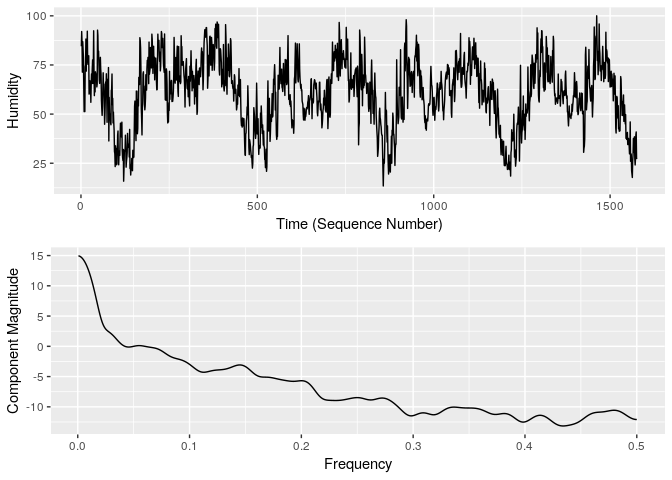

Live Session Assignment 2
================
Stuart Miller
January 8, 2020

## Assignment 2

1.  Generate the spectral density for your realization.

<!-- end list -->

``` r
series <- data %>% ggplot(aes(y = humidity, x = seq)) +
  geom_line() +
  xlab('Time (Sequence Number)') +
  ylab('Humidity')

spectrum <- as.data.frame(parzen.wge(data[, 'humidity'], plot = F))

spec.dens <- spectrum %>% ggplot(aes(y = pzgram, x = freq)) +
  geom_line() +
  xlab('Frequency') +
  ylab('Component Magnitude')

grid.arrange(series, spec.dens)
```

<!-- -->

2.  Indicate which frequencies, if any, appear to be in your series
    and/or if there is evidence of wandering behavior.

There are no clear frequencies present based on the spectral density
plot. The sample frequency spectrum starts high at 0, then quickly
decrease in magnitude in the first few frequency components, followed by
a steady decrease as the frequency increases. This is indicative of
aperiodic or wandering behavior.

3.  Comment on how the information from your spectral density is
    relevant to your series. (For example, if the data is seasonal on an
    annual basis and recorded on a monthly basis, then you would expect
    to see a peak in the spectral density at 1/12 = .083.)

The resulting spectral density plot is not surprising. Visually, the
realization appears to have some period nature, which is expected since
it is weather data (typically seasonality is observed). However, this
period, approximately 1/375 = 0.0027, is very close to zero. It could be
the case that more samples would be necessary to provide sufficient
resolution for the frequency component to diverge from zero.
