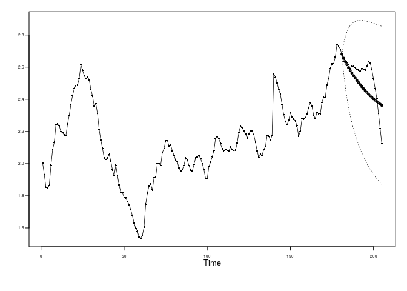

Live\_Session\_Assignment\_9
================
Stuart Miller
February 29, 2020

# Live Session Assignment 9

## Fit an AR(2) to the data using the maximum likelihood estimates like you did in the Concept Check question.

``` r
# fit an AR2 with max likelihood est
est.mle <- est.ar.wge(data$Price)
```

    ## 
    ## Coefficients of Original polynomial:  
    ## 1.3812 -0.4077 
    ## 
    ## Factor                 Roots                Abs Recip    System Freq 
    ## 1-0.9536B              1.0487               0.9536       0.0000
    ## 1-0.4276B              2.3386               0.4276       0.0000
    ##   
    ##   
    ## 
    ## Coefficients of Original polynomial:  
    ## 1.3812 -0.4077 
    ## 
    ## Factor                 Roots                Abs Recip    System Freq 
    ## 1-0.9536B              1.0487               0.9536       0.0000
    ## 1-0.4276B              2.3386               0.4276       0.0000
    ##   
    ## 

## Fit and AR(2) to the data using the Burg estimates. Display and describe.

``` r
# fit an AR2 with max likelihood est
est.burg <- est.ar.wge(data$Price, type = 'burg')
```

    ## 
    ## Coefficients of Original polynomial:  
    ## 1.3814 -0.4058 
    ## 
    ## Factor                 Roots                Abs Recip    System Freq 
    ## 1-0.9575B              1.0444               0.9575       0.0000
    ## 1-0.4239B              2.3592               0.4239       0.0000
    ##   
    ## 

## Find the ASE for the maximum likelihood fit by forecasting the last 24 weeks of the series.

``` r
fore.mle <- fore.arma.wge(data$Price, phi = est.mle$phi, 
                          n.ahead = 24, lastn = T)
```

<!-- -->

``` r
fore.mle.mse <- mean( (data$Price[(205-24+1):205] - fore.mle$f)^2 )
fore.mle.mse
```

    ## [1] 0.01461187

## Find the ASE for the Burg fit by forecasting the last 24 weeks of the series.

``` r
fore.burg <- fore.arma.wge(data$Price, phi = est.burg$phi,
                           n.ahead = 24, lastn = T)
```

<!-- -->

``` r
fore.burg.mse <- mean( (data$Price[(205-24+1):205] - fore.burg$f)^2 )
fore.burg.mse
```

    ## [1] 0.01309828

## Which model would you choose?

The two model appear to have about the same performance on the data. I
do not see any reason to chose one over the other. I will chose the ML
estimate in this case as the default option.
