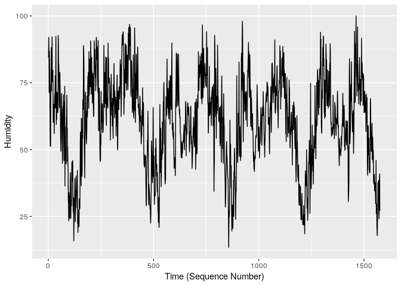
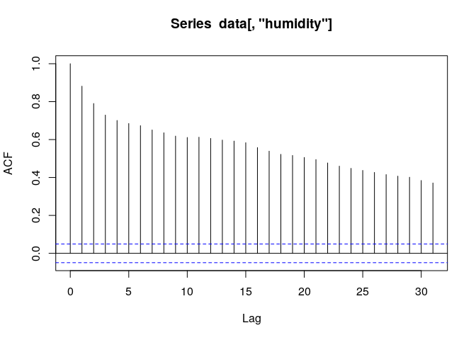
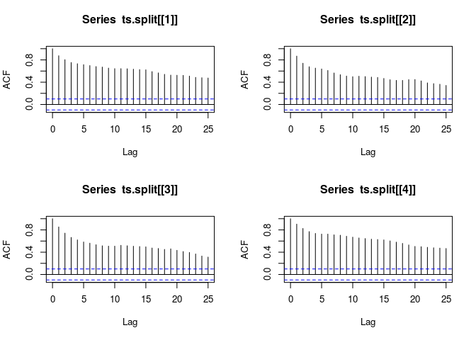

Live Session Assignments
================
Stuart Miller
January 2, 2020

# Live Session Assignments

## Assignment 1

1.  For live session, find an example of time-series data. Write a brief
    one- to three-sentence description.

I chose a climate dataset from kaggle. The data can be downloaded from
Kaggle
[here](https://www.kaggle.com/sumanthvrao/daily-climate-time-series-data).

This is a time series of humidity from Delhi, India taken from
01/01/2013 to
04/24/2017.

``` r
data1 <- read.csv('./daily-climate-time-series-data/DailyDelhiClimateTest.csv')
data2 <- read.csv('./daily-climate-time-series-data/DailyDelhiClimateTrain.csv')
data <- rbind(data2, data1)

data['seq'] <- seq_along(data[, 'humidity'])

data %>% ggplot(aes(y = humidity, x = seq)) +
  geom_line() +
  xlab('Time (Sequence Number)') +
  ylab('Humidity')
```

<!-- -->

2.  In your data set, identify x1, x2, and x3.

The first three data points are

84.5, 92.0, and 87.0

``` r
data[seq(1,3), 'humidity']
```

    ## [1] 84.5 92.0 87.0

3.  Using your time series that you selected, would you be able to
    obtain another realization?

This is climate data from a specific city over a specific time period.
So it would not be possible to obtain another realization.

4.  With respect to your time series, does it appear that the assumption
    of constant mean of the distribution of each Xt is reasonable?

The mean does appear to be constant. There is (possibly seasonal)
movement, but it appears to oscillate over a constant mean.

5.  With respect to your time series, does it appear that the assumption
    of constant variance of the distribution of each Xt is reasonable?

The assumption of constant mean seems reasonable. The variation along
the movement does not seem to vary with time.

6.  Provide the ACF for your time series. Is your time series
    stationary?

The ACF plot for the whole time series is shown in the top image. The
ACF falls off quickly in the first few lags, then falls off gradually as
the lags increase. The data was split into 4 equal length segments and
the ACF plots were produced (bottom). These 4 plots exhibit fairly
similar characteristics. There is only a small amount of deviation
between the 4 ACF plots.

There does not appear to be strong evidence that this time series is not
stationary.

``` r
acf(data[, 'humidity'])
```

<!-- -->

``` r
ts <- data[, 'humidity']
ts.split <- split(ts, ceiling(seq_along(ts)/(length(ts)/4)))

par(mfrow=c(2,2))
acf(ts.split[[1]])
acf(ts.split[[2]])
acf(ts.split[[3]])
acf(ts.split[[4]])
```

<!-- -->
